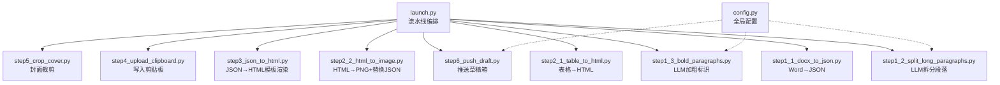
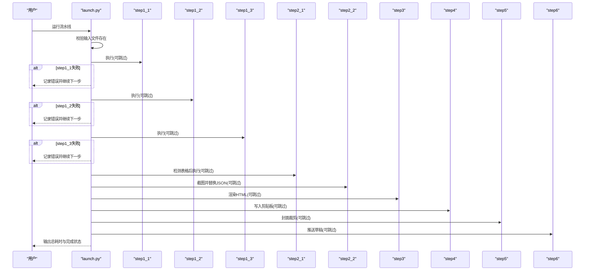
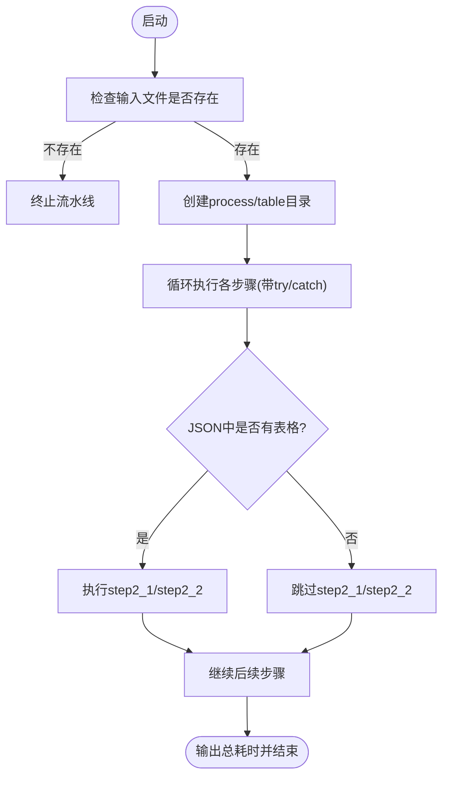
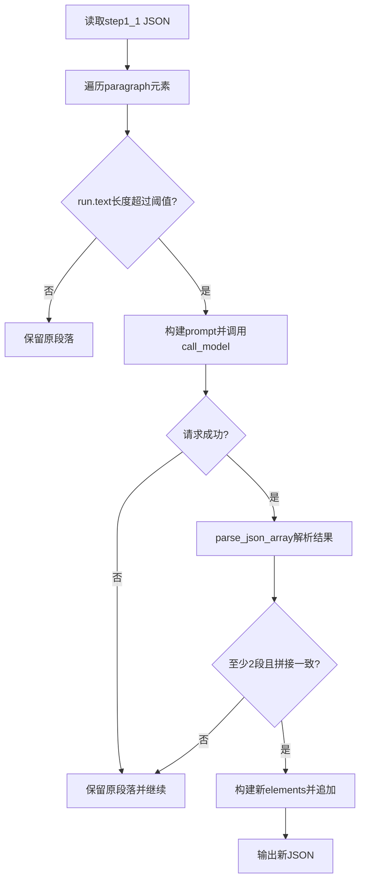
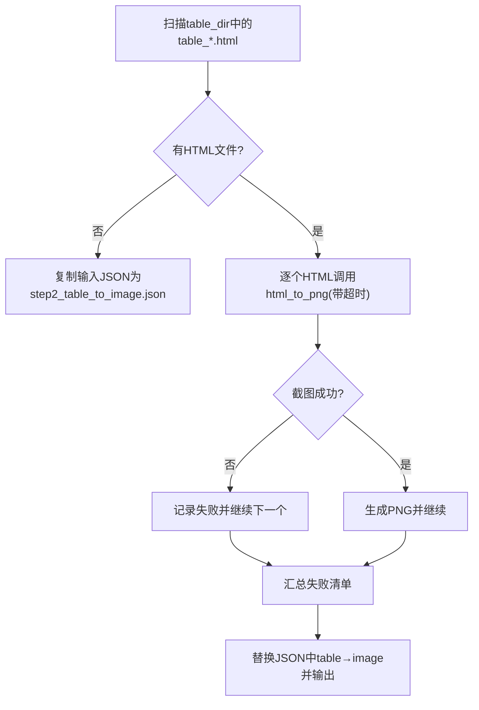
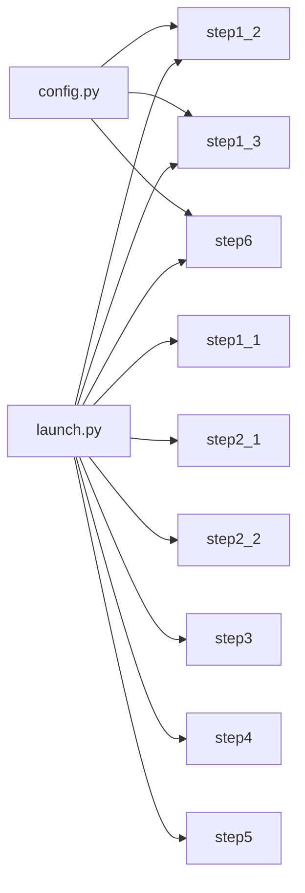

# 错误处理策略

<cite>
**本文引用的文件**   
- [launch.py](file://launch.py)
- [config.py](file://config.py)
- [step1_1_docx_to_json.py](file://step1_1_docx_to_json.py)
- [step1_2_split_long_paragraphs.py](file://step1_2_split_long_paragraphs.py)
- [step1_3_bold_paragraphs.py](file://step1_3_bold_paragraphs.py)
- [step2_1_table_to_html.py](file://step2_1_table_to_html.py)
- [step2_2_html_to_image.py](file://step2_2_html_to_image.py)
- [step3_json_to_html.py](file://step3_json_to_html.py)
- [step4_upload_clipboard.py](file://step4_upload_clipboard.py)
- [step5_crop_cover.py](file://step5_crop_cover.py)
- [step6_push_draft.py](file://step6_push_draft.py)
</cite>

## 目录
1. [简介](#简介)
2. [项目结构](#项目结构)
3. [核心组件](#核心组件)
4. [架构总览](#架构总览)
5. [详细组件分析](#详细组件分析)
6. [依赖关系分析](#依赖关系分析)
7. [性能与稳定性考量](#性能与稳定性考量)
8. [故障排查指南](#故障排查指南)
9. [结论](#结论)

## 简介
本文件系统化梳理 content_board 的错误处理策略，覆盖流水线级别的异常捕获、文件不存在检查、模块导入错误、运行时异常、步骤失败传播与恢复策略、日志与调试输出、用户友好提示及常见错误场景的预防方案。目标是帮助读者快速定位问题、理解系统行为并提升整体稳定性与用户体验。

## 项目结构
content_board 采用“按步骤拆分”的脚本式流水线架构：
- 入口编排：launch.py 负责顺序调用各步骤，提供跳过开关与进度打印。
- 步骤脚本：step1_x/step2_x/step3/step4/step5/step6 各自实现单一职责，输入输出通过 process 目录下的中间文件传递。
- 配置集中：config.py 管理 API、重试次数、阈值等全局参数。
- 模板资源：html_template 下存放 HTML 模板供渲染步骤使用。

图表来源
- [launch.py:42-193](file://launch.py#L42-L193)
- [config.py:1-39](file://config.py#L1-L39)

章节来源
- [launch.py:1-201](file://launch.py#L1-L201)
- [config.py:1-39](file://config.py#L1-L39)

## 核心组件
- 流水线编排器（launch.py）
  - 统一入口，负责路径派生、目录创建、步骤执行、进度与耗时统计。
  - 对每个步骤进行 try/catch 包裹，确保单步失败不影响后续步骤继续执行。
  - 支持 SKIP 标志跳过任意步骤，便于断点续跑与回归测试。
- 步骤脚本（step1_x/step2_x/step3/step4/step5/step6）
  - 每个步骤独立校验输入文件存在性，缺失则打印错误并退出当前步骤。
  - 对外部依赖（如 requests、Selenium、OpenCV）的异常进行捕获与降级处理。
  - 输出结构化日志（[INFO]/[WARN]/[ERROR]/[DONE]），便于诊断。
- 配置中心（config.py）
  - 集中定义 API URL、请求头、最大重试次数、令牌上限、段落拆分阈值等。
  - 为 LLM 相关步骤提供统一的超时与重试策略基础。

章节来源
- [launch.py:42-193](file://launch.py#L42-L193)
- [step1_1_docx_to_json.py:190-226](file://step1_1_docx_to_json.py#L190-L226)
- [step1_2_split_long_paragraphs.py:80-103](file://step1_2_split_long_paragraphs.py#L80-L103)
- [step1_3_bold_paragraphs.py:73-96](file://step1_3_bold_paragraphs.py#L73-L96)
- [step2_2_html_to_image.py:40-101](file://step2_2_html_to_image.py#L40-L101)
- [step4_upload_clipboard.py:371-431](file://step4_upload_clipboard.py#L371-L431)
- [step5_crop_cover.py:133-172](file://step5_crop_cover.py#L133-L172)
- [step6_push_draft.py:42-56](file://step6_push_draft.py#L42-L56)

## 架构总览
下图展示从入口到各步骤的调用链与关键错误处理点。

图表来源
- [launch.py:42-193](file://launch.py#L42-L193)

章节来源
- [launch.py:42-193](file://launch.py#L42-L193)

## 详细组件分析

### 流水线编排层（launch.py）
- 文件不存在检查
  - 在入口处校验输入 Word 文件是否存在，不存在则直接终止整个流水线。
- 步骤级异常隔离
  - 每个步骤调用均被 try/catch 包裹，捕获异常后仅记录错误并继续执行后续步骤，避免“一步错、全盘停”。
- 动态 JSON 选择与回退
  - 根据是否跳过 step1_2/step1_3，自动选择 active_json；若没有表格元素，自动跳过 step2_1/step2_2。
- 进度与耗时统计
  - 打印步骤序号、开始/结束分隔线、总耗时，便于跟踪与复盘。
- 跳过机制
  - 通过 SKIP_STEPX 控制是否执行某一步骤，方便局部修复与回归验证。

图表来源
- [launch.py:42-193](file://launch.py#L42-L193)

章节来源
- [launch.py:42-193](file://launch.py#L42-L193)

### 步骤1.1：Word → JSON（step1_1_docx_to_json.py）
- 输入校验
  - 检查 .docx 文件存在性与后缀名，不满足则打印错误并退出。
- 解析与输出
  - 解析段落、表格、图片，生成 elements 列表并保存 JSON。
- 错误处理
  - 文件不存在或格式不支持时立即终止，防止下游步骤读取无效数据。
- 日志与诊断
  - 输出解析元素数量与类型统计，便于确认解析结果。

章节来源
- [step1_1_docx_to_json.py:190-226](file://step1_1_docx_to_json.py#L190-L226)

### 步骤1.2：LLM 拆分过长段落（step1_2_split_long_paragraphs.py）
- 外部依赖与重试
  - 使用 requests 调用大模型，封装 call_model 函数，内置 MAX_RETRIES 次指数退避重试。
- 响应解析健壮性
  - parse_json_array 支持多种返回格式（纯数组、代码块包裹、正则提取），提高容错率。
- 一致性校验
  - 拼接拆分结果与原文对比，不一致则保留原段落，保证内容完整性。
- 失败降级
  - 模型调用失败或结果无效时，保留原始段落并继续处理，不中断流水线。
- 日志与诊断
  - 打印拆分前后文本长度、调用次数、失败原因，辅助定位问题。

图表来源
- [step1_2_split_long_paragraphs.py:80-103](file://step1_2_split_long_paragraphs.py#L80-L103)
- [step1_2_split_long_paragraphs.py:106-140](file://step1_2_split_long_paragraphs.py#L106-L140)
- [step1_2_split_long_paragraphs.py:198-301](file://step1_2_split_long_paragraphs.py#L198-L301)

章节来源
- [step1_2_split_long_paragraphs.py:80-103](file://step1_2_split_long_paragraphs.py#L80-L103)
- [step1_2_split_long_paragraphs.py:106-140](file://step1_2_split_long_paragraphs.py#L106-L140)
- [step1_2_split_long_paragraphs.py:198-301](file://step1_2_split_long_paragraphs.py#L198-L301)

### 步骤1.3：LLM 添加总结性加粗（step1_3_bold_paragraphs.py）
- 外部依赖与重试
  - 同样使用 call_model 封装，具备重试与超时保护。
- 响应解析健壮性
  - parse_json_object 支持多种返回格式，增强鲁棒性。
- 应用加粗逻辑
  - apply_bold_to_paragraph 精确匹配目标文字位置，将对应 runs 标记 bold，保持原文不变。
- 失败降级
  - 模型调用失败或无合适加粗内容时，跳过该组处理，不中断流水线。
- 日志与诊断
  - 打印分组信息、加粗结果、跳过原因，便于审计。

章节来源
- [step1_3_bold_paragraphs.py:73-96](file://step1_3_bold_paragraphs.py#L73-L96)
- [step1_3_bold_paragraphs.py:99-133](file://step1_3_bold_paragraphs.py#L99-L133)
- [step1_3_bold_paragraphs.py:146-201](file://step1_3_bold_paragraphs.py#L146-L201)
- [step1_3_bold_paragraphs.py:207-330](file://step1_3_bold_paragraphs.py#L207-L330)

### 步骤2.1：表格 → HTML（step2_1_table_to_html.py）
- 输入校验
  - 检查 JSON 文件存在性，不存在则终止。
- 空表处理
  - 未找到表格元素时输出提示信息并安全返回。
- 模板加载
  - 模板文件缺失会导致异常，建议在部署前校验模板存在性。
- 日志与诊断
  - 输出表格数量、行列数、生成结果，便于核对。

章节来源
- [step2_1_table_to_html.py:74-118](file://step2_1_table_to_html.py#L74-L118)

### 步骤2.2：HTML → PNG + JSON 替换（step2_2_html_to_image.py）
- 环境依赖
  - 需要安装 Selenium 与 Chrome，并在 headless 模式下运行。
- 截图超时保护
  - html_to_png 使用线程定时器强制终止卡死的 Chrome/chromedriver 进程，避免阻塞。
- 失败收集与继续
  - 单个 HTML 截图失败会被记录，但流程继续执行，最终汇总成功/失败数量。
- JSON 替换
  - 将 table 元素替换为 image 引用，输出 step2_table_to_image.json，供下游使用。
- 无表格回退
  - 若无任何 table HTML，直接将输入 JSON 复制为 step2_table_to_image.json，保障下游可用。

图表来源
- [step2_2_html_to_image.py:40-101](file://step2_2_html_to_image.py#L40-L101)
- [step2_2_html_to_image.py:120-173](file://step2_2_html_to_image.py#L120-L173)
- [step2_2_html_to_image.py:175-211](file://step2_2_html_to_image.py#L175-L211)

章节来源
- [step2_2_html_to_image.py:40-101](file://step2_2_html_to_image.py#L40-L101)
- [step2_2_html_to_image.py:120-173](file://step2_2_html_to_image.py#L120-L173)
- [step2_2_html_to_image.py:175-211](file://step2_2_html_to_image.py#L175-L211)

### 步骤3：JSON → HTML 模板渲染（step3_json_to_html.py）
- 输入校验
  - 检查 JSON 文件存在性，不存在则终止。
- 模板渲染
  - 读取模板并替换占位符，生成完整 HTML。
- 错误处理
  - 模板缺失或 JSON 结构异常会抛出异常，建议在上层捕获并给出明确提示。
- 日志与诊断
  - 输出最终 HTML 路径，便于人工核查。

章节来源
- [step3_json_to_html.py:121-142](file://step3_json_to_html.py#L121-L142)

### 步骤4：写入剪贴板（step4_upload_clipboard.py）
- 输入校验
  - 检查 HTML 文件存在性，不存在则终止。
- 剪贴板写入
  - 使用 Windows API 写入多格式数据，包含 HTML Format、CF_UNICODETEXT、CF_TEXT 等。
- 异常处理
  - 打开剪贴板失败会重试多次，仍失败则终止；内存分配或设置失败会记录并跳过对应格式。
- 图片内嵌
  - 本地图片转 base64 data URI，缺失图片会警告并保留原标签，避免中断。
- 日志与诊断
  - 输出各格式大小、嵌入图片大小，便于评估剪贴板体积与兼容性。

章节来源
- [step4_upload_clipboard.py:436-475](file://step4_upload_clipboard.py#L436-L475)
- [step4_upload_clipboard.py:371-431](file://step4_upload_clipboard.py#L371-L431)
- [step4_upload_clipboard.py:194-222](file://step4_upload_clipboard.py#L194-L222)

### 步骤5：封面裁剪（step5_crop_cover.py）
- 图片查找
  - 在文章实例目录下查找第一张图片，找不到则跳过。
- 比例裁剪与压缩
  - 按 2.35:1 比例裁剪，JPEG 质量二分搜索压缩，非 JPEG 则逐步缩小分辨率以满足大小限制。
- 异常处理
  - 无法读取图片时抛出异常，上层应捕获并给出明确提示。
- 日志与诊断
  - 输出原图尺寸、裁剪后尺寸、文件大小，便于判断是否符合平台要求。

章节来源
- [step5_crop_cover.py:133-172](file://step5_crop_cover.py#L133-L172)
- [step5_crop_cover.py:174-196](file://step5_crop_cover.py#L174-L196)

### 步骤6：推送草稿箱（step6_push_draft.py）
- 认证与上传
  - 获取 access_token，上传永久素材（封面图），失败则抛出异常。
- 标题与摘要
  - 从 step1_1 JSON 提取一级标题，超长截断；从正文 JSON 提取金句摘要，超限截断。
- 网络异常处理
  - 所有网络请求均使用 raise_for_status，失败时抛出异常，由上层捕获并终止。
- 缓存优化
  - 封面 media_id 缓存至文件，避免重复上传。
- 日志与诊断
  - 输出各字段长度、摘要、media_id，便于调试与复核。

章节来源
- [step6_push_draft.py:42-56](file://step6_push_draft.py#L42-L56)
- [step6_push_draft.py:62-79](file://step6_push_draft.py#L62-L79)
- [step6_push_draft.py:105-127](file://step6_push_draft.py#L105-L127)
- [step6_push_draft.py:276-397](file://step6_push_draft.py#L276-L397)

## 依赖关系分析
- 内部依赖
  - launch.py 依赖所有 step 脚本，并通过 process 目录下的中间文件传递数据。
  - step1_2/step1_3/step6 依赖 config.py 中的 API_URL、HEADERS、MAX_RETRIES、MAX_TOKENS 等。
- 外部依赖
  - requests：用于 LLM 与微信公众号 API 调用。
  - selenium + Chrome：用于 HTML 截图。
  - opencv-python/numpy：用于图片裁剪与压缩。
  - python-docx：用于解析 Word 文档。
- 潜在耦合点
  - 模板文件路径硬编码，需确保部署时模板存在。
  - 剪贴板写入依赖 Windows API，跨平台不可用。
  - 截图依赖系统已安装 Chrome 与 chromedriver。

图表来源
- [config.py:1-39](file://config.py#L1-L39)
- [launch.py:42-193](file://launch.py#L42-L193)

章节来源
- [config.py:1-39](file://config.py#L1-L39)
- [launch.py:42-193](file://launch.py#L42-L193)

## 性能与稳定性考量
- 网络请求
  - 统一使用 MAX_RETRIES 与指数退避，降低瞬时失败影响。
  - 合理设置 timeout，避免长时间阻塞。
- 截图性能
  - headless 模式与窗口移出屏幕减少 UI 开销；超时保护避免进程泄漏。
- 图片压缩
  - JPEG 质量二分搜索与非 JPEG 缩放策略平衡画质与体积，满足平台限制。
- 内存与剪贴板
  - 大量图片 base64 内嵌会增加剪贴板体积，必要时可考虑外链或分片策略。
- 文件 IO
  - 中间文件命名规范，便于断点续跑与回溯。

## 故障排查指南
- 常见问题与定位
  - 文件不存在：各步骤入口均有存在性检查，查看 [ERROR] 日志确认具体缺失文件。
  - 模块导入错误：检查依赖是否安装（requests、selenium、opencv-python、python-docx）。
  - 网络请求失败：查看 [WARN] 重试日志与最终失败原因，确认 API_KEY、网络连通性。
  - 截图超时：观察 [TIMEOUT] 日志，检查 Chrome/chromedriver 是否正常启动。
  - 剪贴板写入失败：关注 [ERROR] 与 [WARN] 输出，确认权限与格式数据有效性。
  - 模板缺失：确认 html_template 目录与文件名正确。
- 用户友好提示
  - 所有关键节点均输出 [INFO]/[WARN]/[ERROR]/[DONE] 级别日志，便于快速定位。
  - 步骤级异常隔离，单步失败不会导致整条流水线崩溃。
- 预防措施
  - 在部署前校验模板与依赖环境。
  - 定期更新 Chrome/chromedriver 版本，避免兼容性问题。
  - 对长文本与大图进行预处理，避免超出上下文窗口或平台限制。

章节来源
- [launch.py:42-193](file://launch.py#L42-L193)
- [step1_2_split_long_paragraphs.py:80-103](file://step1_2_split_long_paragraphs.py#L80-L103)
- [step2_2_html_to_image.py:40-101](file://step2_2_html_to_image.py#L40-L101)
- [step4_upload_clipboard.py:371-431](file://step4_upload_clipboard.py#L371-L431)
- [step5_crop_cover.py:133-172](file://step5_crop_cover.py#L133-L172)
- [step6_push_draft.py:42-56](file://step6_push_draft.py#L42-L56)

## 结论
content_board 的错误处理策略以“步骤级隔离 + 健壮的外部依赖封装 + 明确的日志输出”为核心，既保证了单步失败的自愈能力，又提供了充分的诊断信息。通过合理的重试、超时保护、降级回退与用户友好的提示，系统在复杂环境下仍能保持稳定运行。建议在生产环境中进一步引入结构化日志与告警机制，以提升可观测性与运维效率。