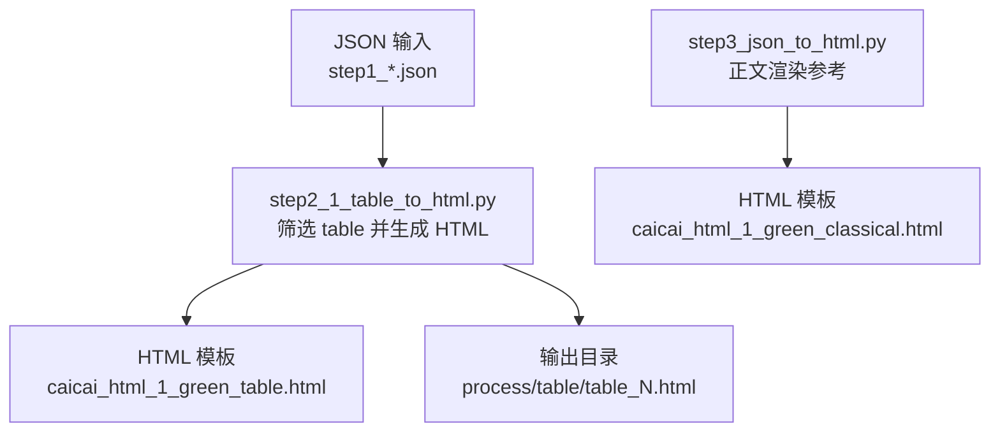
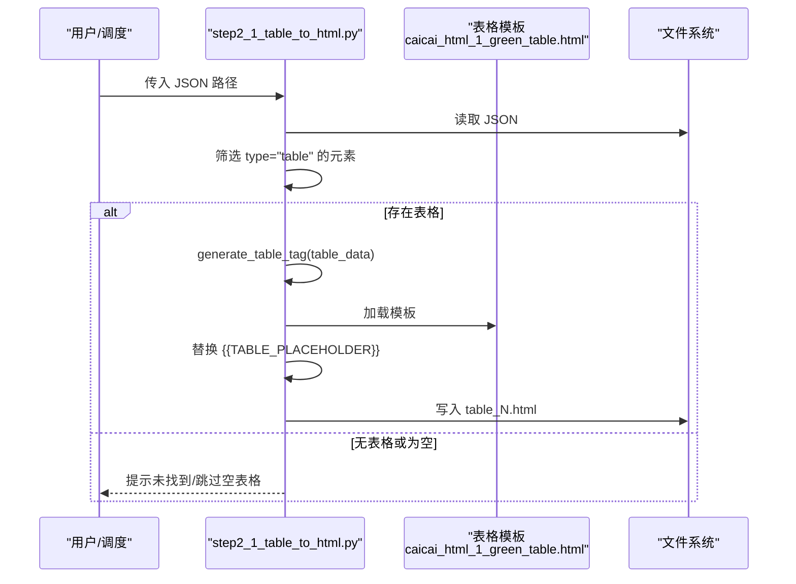
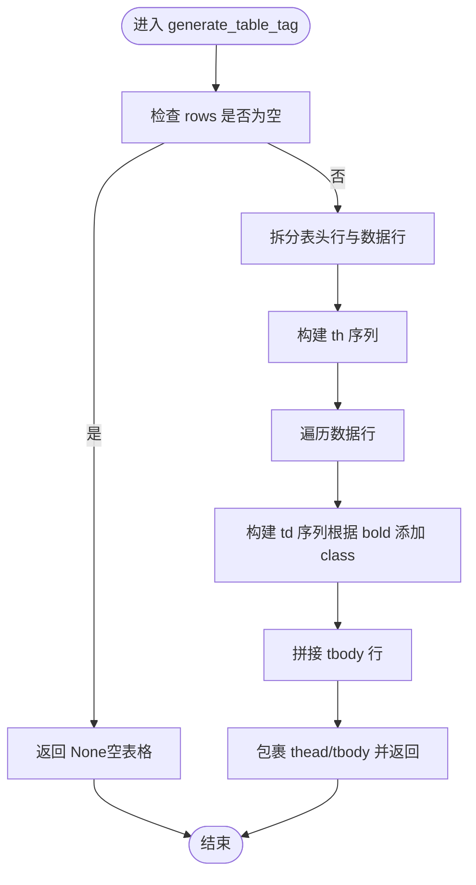
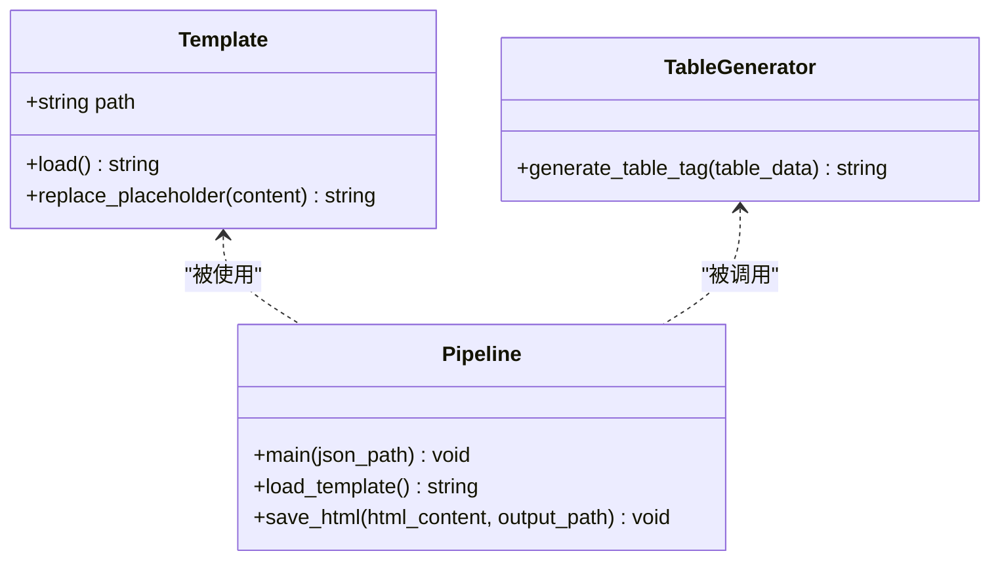
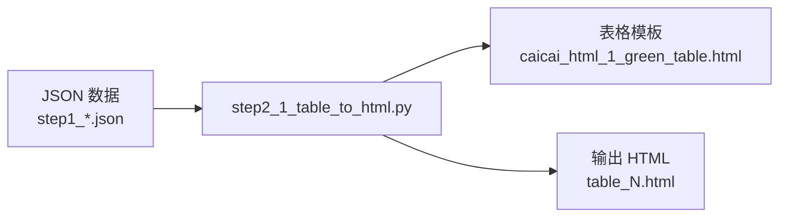

# 表格 HTML 转换

<cite>
**本文引用的文件**   
- [step2_1_table_to_html.py](file://step2_1_table_to_html.py)
- [step3_json_to_html.py](file://step3_json_to_html.py)
- [caicai_html_1_green_table.html](file://html_template/caicai_html_1_green_table.html)
- [caicai_html_1_green_classical.html](file://html_template/caicai_html_1_green_classical.html)
- [config.py](file://config.py)
- [content_20260708_1/.../step1_3_bold_paragraphs.json](file://content_instance/content_20260708_1/process/step1_3_bold_paragraphs.json)
- [content_20260708_1/.../table/table_1.html](file://content_instance/content_20260708_1/process/table/table_1.html)
</cite>

## 目录
1. [简介](#简介)
2. [项目结构](#项目结构)
3. [核心组件](#核心组件)
4. [架构总览](#架构总览)
5. [详细组件分析](#详细组件分析)
6. [依赖关系分析](#依赖关系分析)
7. [性能考虑](#性能考虑)
8. [故障排查指南](#故障排查指南)
9. [结论](#结论)
10. [附录：自定义与扩展示例](#附录自定义与扩展示例)

## 简介
本技术文档聚焦于“表格 HTML 转换”功能，覆盖从 JSON 数据结构中提取表格元素、生成独立表格 HTML 的完整流程。重点包括：
- 表格数据验证、行列统计与单元格内容处理算法
- HTML 模板系统与占位符替换机制、表头与表体分离逻辑、样式继承规则
- generate_table_tag 函数的实现细节（含单元格加粗样式）
- 错误处理机制与空表格跳过逻辑
- 兼容性处理与性能优化策略
- 如何自定义表格样式与扩展功能

## 项目结构
与表格 HTML 转换直接相关的代码与资源如下：
- step2_1_table_to_html.py：读取 step1 JSON，筛选 table 元素，按绿色主题模板生成独立 HTML 文件
- html_template/caicai_html_1_green_table.html：表格专用模板，包含 CSS 样式与行高同步脚本
- content_instance/*/process/step1_*.json：上游 JSON 数据源，包含 elements 数组及 table 元素
- content_instance/*/process/table/table_N.html：生成的表格 HTML 输出
- step3_json_to_html.py：正文渲染（非表格），用于对比理解模板与占位符机制

图表来源
- [step2_1_table_to_html.py:1-125](file://step2_1_table_to_html.py#L1-L125)
- [caicai_html_1_green_table.html:1-81](file://html_template/caicai_html_1_green_table.html#L1-L81)
- [step3_json_to_html.py:1-149](file://step3_json_to_html.py#L1-L149)
- [caicai_html_1_green_classical.html:1-278](file://html_template/caicai_html_1_green_classical.html#L1-L278)

章节来源
- [step2_1_table_to_html.py:1-125](file://step2_1_table_to_html.py#L1-L125)
- [caicai_html_1_green_table.html:1-81](file://html_template/caicai_html_1_green_table.html#L1-L81)
- [step3_json_to_html.py:1-149](file://step3_json_to_html.py#L1-L149)
- [caicai_html_1_green_classical.html:1-278](file://html_template/caicai_html_1_green_classical.html#L1-L278)

## 核心组件
- 表格提取与生成器：step2_1_table_to_html.py
  - 负责读取 JSON、筛选 table 元素、调用 generate_table_tag 生成 <table> 片段、填充模板占位符并落盘
- 表格模板：caicai_html_1_green_table.html
  - 提供全局样式、表格样式（表头/表体/斑马纹/加粗）、以及行高同步脚本
- 正文模板（对比参考）：caicai_html_1_green_classical.html
  - 展示 {{BODY_PLACEHOLDER}} 占位符与正文渲染流程，便于理解模板系统

章节来源
- [step2_1_table_to_html.py:33-68](file://step2_1_table_to_html.py#L33-L68)
- [caicai_html_1_green_table.html:16-56](file://html_template/caicai_html_1_green_table.html#L16-L56)
- [caicai_html_1_green_classical.html:186-210](file://html_template/caicai_html_1_green_classical.html#L186-L210)

## 架构总览
下图展示了从 JSON 到最终 HTML 的关键步骤与交互：

图表来源
- [step2_1_table_to_html.py:74-118](file://step2_1_table_to_html.py#L74-L118)
- [caicai_html_1_green_table.html:59-62](file://html_template/caicai_html_1_green_table.html#L59-L62)

## 详细组件分析

### 表格数据模型与解析
- JSON 中的 table 元素结构要点
  - row_count：行数
  - col_count：列数
  - data：二维数组，data[0] 为表头行，data[1:] 为数据行
  - 每个单元格为对象，包含 text 与 bold 字段
- 解析与校验
  - 通过遍历 elements 列表，筛选 type == "table" 的元素
  - 若 rows 为空，则视为空表格并跳过
  - 使用 row_count 与 col_count 进行日志记录（不强制校验一致性）

章节来源
- [content_20260708_1/.../step1_3_bold_paragraphs.json:411-433](file://content_instance/content_20260708_1/process/step1_3_bold_paragraphs.json#L411-L433)
- [step2_1_table_to_html.py:88-92](file://step2_1_table_to_html.py#L88-L92)
- [step2_1_table_to_html.py:99-101](file://step2_1_table_to_html.py#L99-L101)

### 表格 HTML 生成算法（generate_table_tag）
- 输入：单个 table 元素（包含 data 二维数组）
- 处理逻辑
  - 取第一行作为表头，其余行作为表体
  - 表头：将每个单元格的 text 包裹在 <th> 中
  - 表体：逐行生成 <tr>，每格生成 <td>；当 cell.bold 为真时添加 class="bold"
  - 返回完整的 <table><thead>...</thead><tbody>...</tbody></table> 片段
- 复杂度
  - 时间 O(R*C)，R 为行数，C 为列数
  - 空间 O(1) 额外（字符串拼接为主）

图表来源
- [step2_1_table_to_html.py:39-68](file://step2_1_table_to_html.py#L39-L68)

章节来源
- [step2_1_table_to_html.py:39-68](file://step2_1_table_to_html.py#L39-L68)

### HTML 模板系统与占位符替换
- 表格模板 caicai_html_1_green_table.html
  - 包含 <style> 定义的全局与表格样式
  - 在 body 内预留 {{TABLE_PLACEHOLDER}} 占位符
  - 内置脚本在页面加载后统一 tbody 各行高度，提升视觉对齐
- 占位符替换
  - 主函数加载模板文本，用生成的 <table> 片段替换 {{TABLE_PLACEHOLDER}}
  - 输出到 process/table/table_N.html

图表来源
- [step2_1_table_to_html.py:33-36](file://step2_1_table_to_html.py#L33-L36)
- [step2_1_table_to_html.py:96-114](file://step2_1_table_to_html.py#L96-L114)
- [caicai_html_1_green_table.html:59-62](file://html_template/caicai_html_1_green_table.html#L59-L62)

章节来源
- [step2_1_table_to_html.py:33-36](file://step2_1_table_to_html.py#L33-L36)
- [step2_1_table_to_html.py:96-114](file://step2_1_table_to_html.py#L96-L114)
- [caicai_html_1_green_table.html:59-62](file://html_template/caicai_html_1_green_table.html#L59-L62)

### 表头与表体分离逻辑
- 表头：data[0] 对应 <thead><tr>...</tr></thead>
- 表体：data[1:] 对应 <tbody>...</tbody>
- 该逻辑确保语义化结构与样式正确应用（如斑马纹、加粗等）

章节来源
- [step2_1_table_to_html.py:45-67](file://step2_1_table_to_html.py#L45-L67)

### 样式继承与渲染规则
- 表格模板样式
  - 表头：居中、加粗、背景色、边框
  - 表体：居中、边框、奇偶行背景色交替
  - 单元格加粗：通过 class="bold" 控制
- 正文模板（对比参考）
  - 标题、正文、高亮 span、图片等样式定义
  - 占位符 {{BODY_PLACEHOLDER}} 由 step3_json_to_html.py 替换

章节来源
- [caicai_html_1_green_table.html:27-55](file://html_template/caicai_html_1_green_table.html#L27-L55)
- [caicai_html_1_green_classical.html:97-137](file://html_template/caicai_html_1_green_classical.html#L97-L137)

### 输出格式规范
- 输出目录：与 JSON 同级的 process/table/
- 文件名：table_{n}.html，n 从 1 开始递增
- 内容：完整 HTML 文档，包含 <head> 样式与 <body> 表格内容

章节来源
- [step2_1_table_to_html.py:79-82](file://step2_1_table_to_html.py#L79-L82)
- [step2_1_table_to_html.py:111-116](file://step2_1_table_to_html.py#L111-L116)

### 错误处理与空表格跳过
- 文件不存在：打印错误并退出
- 未找到表格：打印信息并返回
- 空表格：打印警告并跳过当前表格

章节来源
- [step2_1_table_to_html.py:74-77](file://step2_1_table_to_html.py#L74-L77)
- [step2_1_table_to_html.py:88-92](file://step2_1_table_to_html.py#L88-L92)
- [step2_1_table_to_html.py:103-106](file://step2_1_table_to_html.py#L103-L106)

### 兼容性处理
- 表格行高同步脚本：在浏览器加载完成后计算最大行高并统一设置，避免跨浏览器差异导致的行高不一致问题
- 路径兼容：正文渲染中对图片路径做正斜杠标准化（表格模块不涉及图片路径）

章节来源
- [caicai_html_1_green_table.html:64-78](file://html_template/caicai_html_1_green_table.html#L64-L78)
- [step3_json_to_html.py:71-78](file://step3_json_to_html.py#L71-L78)

## 依赖关系分析
- 模块间依赖
  - step2_1_table_to_html.py 依赖模板文件与 JSON 数据
  - 模板文件仅作为静态资源被读取与替换
- 外部依赖
  - Python 标准库：json、os、sys
  - 无第三方库依赖

图表来源
- [step2_1_table_to_html.py:18-21](file://step2_1_table_to_html.py#L18-L21)
- [step2_1_table_to_html.py:26-27](file://step2_1_table_to_html.py#L26-L27)
- [step2_1_table_to_html.py:84-86](file://step2_1_table_to_html.py#L84-L86)

章节来源
- [step2_1_table_to_html.py:18-21](file://step2_1_table_to_html.py#L18-L21)
- [step2_1_table_to_html.py:26-27](file://step2_1_table_to_html.py#L26-L27)
- [step2_1_table_to_html.py:84-86](file://step2_1_table_to_html.py#L84-L86)

## 性能考虑
- 时间复杂度
  - 表格生成 O(R*C)，整体线性于单元格数量
- I/O 优化
  - 模板只读一次，多次替换复用
  - 批量写入各 table_N.html
- 内存占用
  - 以字符串拼接为主，适合中小规模表格
- 建议
  - 超大表格可考虑分块生成或使用流式写入
  - 对大量表格场景，可并行处理（注意文件锁与目录创建）

[本节为通用指导，无需特定文件引用]

## 故障排查指南
- JSON 文件不存在
  - 现象：程序报错并退出
  - 处理：确认输入路径是否正确
- 未找到表格元素
  - 现象：提示未找到表格
  - 处理：检查 JSON 中是否存在 type="table" 的元素
- 空表格被跳过
  - 现象：提示空表格并跳过
  - 处理：检查 table.data 是否为空数组
- 样式异常
  - 现象：表格样式不符合预期
  - 处理：检查模板 CSS 是否被覆盖或冲突；确认 class="bold" 是否正确应用

章节来源
- [step2_1_table_to_html.py:74-77](file://step2_1_table_to_html.py#L74-L77)
- [step2_1_table_to_html.py:88-92](file://step2_1_table_to_html.py#L88-L92)
- [step2_1_table_to_html.py:103-106](file://step2_1_table_to_html.py#L103-L106)
- [caicai_html_1_green_table.html:52-55](file://html_template/caicai_html_1_green_table.html#L52-L55)

## 结论
本方案通过清晰的 JSON 数据模型与模板占位符机制，实现了从结构化数据到高质量表格 HTML 的稳定转换。generate_table_tag 函数以简洁高效的算法完成表头/表体分离与单元格样式处理，配合模板 CSS 与行高同步脚本，确保了跨浏览器的良好表现。错误处理与空表格跳过逻辑增强了鲁棒性，同时提供了可扩展的样式与功能接口。

[本节为总结，无需特定文件引用]

## 附录：自定义与扩展示例

### 自定义表格样式
- 修改模板 CSS
  - 调整表头背景色、字体大小、边框颜色等
  - 新增斑马纹或悬停效果
- 示例位置
  - 表格模板样式区域：[caicai_html_1_green_table.html:16-56](file://html_template/caicai_html_1_green_table.html#L16-L56)

章节来源
- [caicai_html_1_green_table.html:16-56](file://html_template/caicai_html_1_green_table.html#L16-L56)

### 扩展单元格样式（除加粗外）
- 在 generate_table_tag 中扩展条件判断
  - 例如：根据 cell 的其他属性（如 align、color）生成更多 class
- 参考实现位置
  - 单元格 class 注入逻辑：[step2_1_table_to_html.py:56-59](file://step2_1_table_to_html.py#L56-L59)

章节来源
- [step2_1_table_to_html.py:56-59](file://step2_1_table_to_html.py#L56-L59)

### 自定义模板占位符
- 如需在同一页面嵌入多个表格，可在模板中增加多个占位符并在主循环中分别替换
- 参考占位符用法
  - 表格模板占位符：[caicai_html_1_green_table.html:59-62](file://html_template/caicai_html_1_green_table.html#L59-L62)
  - 正文模板占位符（对比）：[caicai_html_1_green_classical.html:207-209](file://html_template/caicai_html_1_green_classical.html#L207-L209)

章节来源
- [caicai_html_1_green_table.html:59-62](file://html_template/caicai_html_1_green_table.html#L59-L62)
- [caicai_html_1_green_classical.html:207-209](file://html_template/caicai_html_1_green_classical.html#L207-L209)

### 集成到流水线
- 单独运行
  - 修改 main 入口处的 json_path 指向目标 JSON
  - 参考：[step2_1_table_to_html.py:121-124](file://step2_1_table_to_html.py#L121-L124)
- 与其他步骤协作
  - 表格生成后，可由后续步骤（如图片转图、正文合并）继续处理

章节来源
- [step2_1_table_to_html.py:121-124](file://step2_1_table_to_html.py#L121-L124)