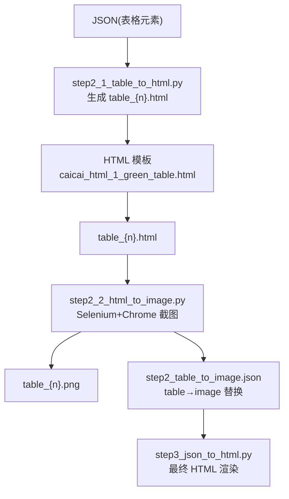
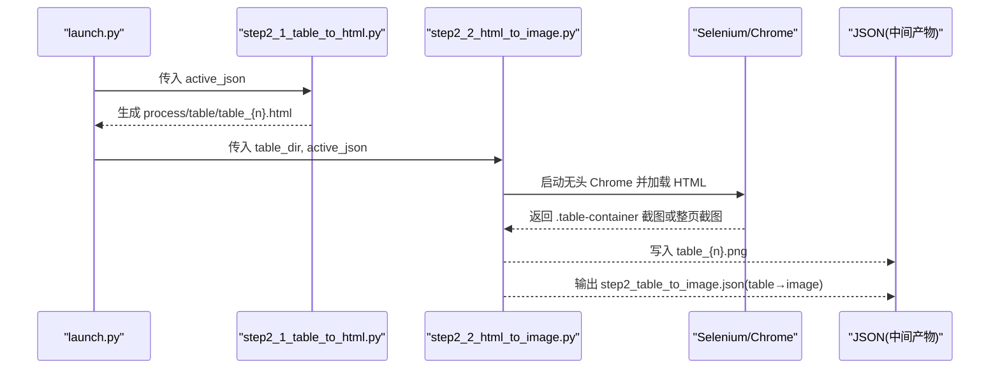
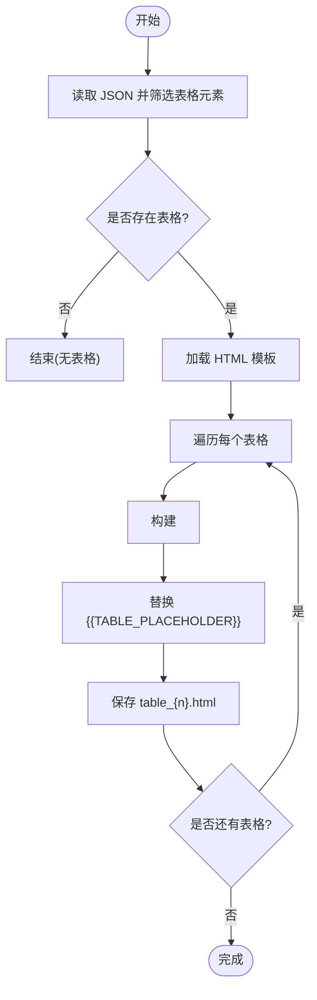
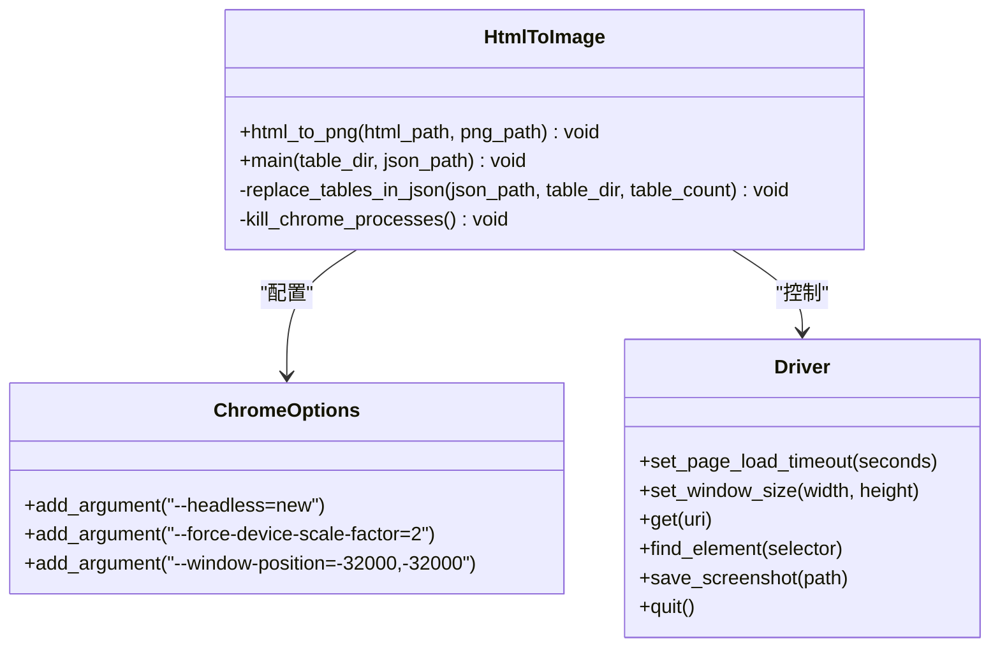
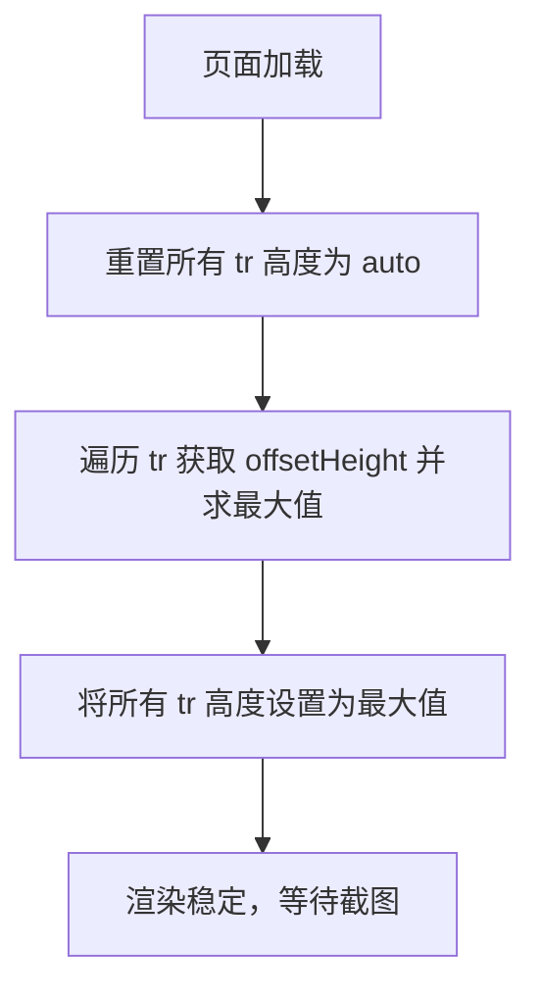

# 表格图像生成

<cite>
**本文引用的文件**
- [step2_1_table_to_html.py](file://step2_1_table_to_html.py)
- [step2_2_html_to_image.py](file://step2_2_html_to_image.py)
- [caicai_html_1_green_table.html](file://html_template/caicai_html_1_green_table.html)
- [launch.py](file://launch.py)
- [config.py](file://config.py)
- [step3_json_to_html.py](file://step3_json_to_html.py)
</cite>

## 目录
1. [简介](#简介)
2. [项目结构](#项目结构)
3. [核心组件](#核心组件)
4. [架构总览](#架构总览)
5. [详细组件分析](#详细组件分析)
6. [依赖与跨平台兼容性](#依赖与跨平台兼容性)
7. [性能与质量优化](#性能与质量优化)
8. [常见问题与排障](#常见问题与排障)
9. [结论](#结论)
10. [附录：配置与示例路径](#附录配置与示例路径)

## 简介
本技术文档聚焦“表格图像生成”能力，覆盖从结构化数据到最终图像的完整流程：将 Word 中的表格解析为 JSON，再渲染为带样式的 HTML，使用浏览器引擎进行无头截图生成 PNG，并将结果回写至中间 JSON 供后续步骤使用。文档重点解释：
- 浏览器引擎选择与页面渲染配置
- 截图参数设置（分辨率、缩放、窗口尺寸）
- 图像处理算法（行高同步、容器裁剪、格式输出）
- 主要处理函数与关键配置项
- 自定义图像质量与格式的扩展点
- 跨平台兼容性与依赖管理
- 常见问题的定位与解决策略

## 项目结构
与表格图像生成直接相关的代码与资源分布如下：
- step2_1_table_to_html.py：从 JSON 提取表格并生成独立 HTML 文件
- html_template/caicai_html_1_green_table.html：绿色主题表格模板（含 CSS 与行高同步脚本）
- step2_2_html_to_image.py：基于 Selenium + Chrome 的无头截图与 JSON 替换逻辑
- launch.py：一键流水线编排，串联各步骤
- config.py：全局配置（与图片生成间接相关）
- step3_json_to_html.py：后续渲染步骤，引用生成的图片路径

图表来源
- [step2_1_table_to_html.py:1-125](file://step2_1_table_to_html.py#L1-L125)
- [caicai_html_1_green_table.html:1-81](file://html_template/caicai_html_1_green_table.html#L1-L81)
- [step2_2_html_to_image.py:1-218](file://step2_2_html_to_image.py#L1-L218)
- [step3_json_to_html.py:1-149](file://step3_json_to_html.py#L1-L149)

章节来源
- [step2_1_table_to_html.py:1-125](file://step2_1_table_to_html.py#L1-L125)
- [step2_2_html_to_image.py:1-218](file://step2_2_html_to_image.py#L1-L218)
- [caicai_html_1_green_table.html:1-81](file://html_template/caicai_html_1_green_table.html#L1-L81)
- [launch.py:1-201](file://launch.py#L1-L201)
- [config.py:1-39](file://config.py#L1-L39)
- [step3_json_to_html.py:1-149](file://step3_json_to_html.py#L1-L149)

## 核心组件
- 表格 HTML 生成器：读取 JSON 中的表格数据，按模板生成每个表格的独立 HTML 文件，首行作为表头，其余行作为表体，支持单元格加粗样式。
- 无头截图引擎：使用 Selenium 驱动 Chrome 无头模式加载 HTML，设置高清缩放因子与窗口尺寸，优先截取表格容器区域，失败时回退为整页截图；内置超时保护与进程清理。
- JSON 替换器：将原 JSON 中的 table 元素顺序替换为 image 引用，保持后续渲染链路一致。
- 模板与样式：绿色主题表格模板提供字体、背景、边框、斑马纹等样式，并通过内联脚本实现行高同步，确保截图一致性。

章节来源
- [step2_1_table_to_html.py:39-68](file://step2_1_table_to_html.py#L39-L68)
- [step2_2_html_to_image.py:40-116](file://step2_2_html_to_image.py#L40-L116)
- [caicai_html_1_green_table.html:16-56](file://html_template/caicai_html_1_green_table.html#L16-L56)

## 架构总览
下图展示了从 JSON 到 PNG 的关键调用链路与数据流：

图表来源
- [launch.py:121-141](file://launch.py#L121-L141)
- [step2_1_table_to_html.py:74-118](file://step2_1_table_to_html.py#L74-L118)
- [step2_2_html_to_image.py:120-173](file://step2_2_html_to_image.py#L120-L173)

## 详细组件分析

### 组件一：表格 HTML 生成器（step2_1_table_to_html.py）
职责
- 读取 JSON 中 type=table 的元素
- 以模板 caicai_html_1_green_table.html 为基础，将 {{TABLE_PLACEHOLDER}} 替换为 <table>...</table>
- 输出到 process/table/table_{n}.html

关键实现要点
- 表头与表体拆分：第一行作为 thead，其余行作为 tbody
- 单元格加粗：根据 bold 字段添加 class="bold"
- 输出目录：process/table/

图表来源
- [step2_1_table_to_html.py:74-118](file://step2_1_table_to_html.py#L74-L118)
- [step2_1_table_to_html.py:39-68](file://step2_1_table_to_html.py#L39-L68)

章节来源
- [step2_1_table_to_html.py:1-125](file://step2_1_table_to_html.py#L1-L125)

### 组件二：HTML → PNG 截图引擎（step2_2_html_to_image.py）
职责
- 对每个 table_{n}.html 执行无头截图，输出 table_{n}.png
- 将 JSON 中的 table 元素替换为 image 引用，输出 step2_table_to_image.json

浏览器引擎选择与渲染配置
- 引擎：Selenium + Chrome（headless=new）
- 关键选项：
  - 禁用 GPU、沙箱、扩展、后台网络、默认应用、同步、翻译、音频
  - 强制设备缩放因子 force-device-scale-factor=2（提升清晰度）
  - 窗口位置移出屏幕，避免干扰
  - 隐藏 chromedriver 控制台窗口
- 页面加载与窗口：
  - 页面加载超时限制
  - 固定窗口尺寸 1600x900

截图策略
- 优先查找 .table-container 并仅截取该容器区域
- 若未找到容器，则回退为整页截图

超时与进程管理
- 线程定时器监控截图耗时，超过阈值后强制终止 chrome.exe 与 chromedriver.exe
- 截图完成后统一清理残留进程

图表来源
- [step2_2_html_to_image.py:40-116](file://step2_2_html_to_image.py#L40-L116)
- [step2_2_html_to_image.py:175-211](file://step2_2_html_to_image.py#L175-L211)

章节来源
- [step2_2_html_to_image.py:1-218](file://step2_2_html_to_image.py#L1-L218)

### 组件三：表格模板与样式（caicai_html_1_green_table.html）
职责
- 定义表格整体样式（字体、背景、边框、斑马纹、加粗）
- 通过内联脚本在页面加载后统一 tbody 各行高度，保证截图一致性

关键点
- 字体族包含微软雅黑、苹方、Noto Sans SC，提高中文显示稳定性
- 表头背景色与边框颜色形成对比
- 行高同步脚本：先重置为 auto，计算最大行高后再统一设置，避免截断

图表来源
- [caicai_html_1_green_table.html:64-78](file://html_template/caicai_html_1_green_table.html#L64-L78)

章节来源
- [caicai_html_1_green_table.html:1-81](file://html_template/caicai_html_1_green_table.html#L1-L81)

### 组件四：JSON 替换器（step2_2_html_to_image.py）
职责
- 按顺序将 JSON 中的 table 元素替换为 image 类型
- 构造相对路径 image_path，便于后续渲染

规则
- 仅替换前 N 个 table（N 为成功截图数量）
- 输出 step2_table_to_image.json 到同目录

章节来源
- [step2_2_html_to_image.py:175-211](file://step2_2_html_to_image.py#L175-L211)

## 依赖与跨平台兼容性
- Python 依赖
  - selenium：用于驱动浏览器进行无头截图
- 系统依赖
  - Chrome 浏览器：需已安装且可被 Selenium 发现
  - Windows 下使用 taskkill 终止进程（非 Windows 平台需适配）
- 可选优化
  - 在无头环境建议启用 --disable-gpu 与 --no-sandbox
  - 服务器环境建议增加 --disable-dev-shm-usage 以避免共享内存问题

章节来源
- [step2_2_html_to_image.py:28-31](file://step2_2_html_to_image.py#L28-L31)
- [step2_2_html_to_image.py:103-115](file://step2_2_html_to_image.py#L103-L115)

## 性能与质量优化
- 分辨率与清晰度
  - 使用 force-device-scale-factor=2 提升像素密度，获得更清晰的表格线条与文字
- 渲染稳定性
  - 固定窗口尺寸 1600x900，减少布局抖动
  - 行高同步脚本确保表格行高一致，避免部分行被截断
- 超时保护
  - 针对复杂页面或外部资源加载缓慢场景，设置超时并在超时后强制终止进程，防止阻塞
- 截图范围
  - 优先截取 .table-container，减少无关内容，降低文件大小与渲染时间
- 批量处理
  - 失败重试与间隔等待，提高鲁棒性

章节来源
- [step2_2_html_to_image.py:44-56](file://step2_2_html_to_image.py#L44-L56)
- [step2_2_html_to_image.py:74-88](file://step2_2_html_to_image.py#L74-L88)
- [caicai_html_1_green_table.html:64-78](file://html_template/caicai_html_1_green_table.html#L64-L78)

## 常见问题与排障
- 字体缺失导致排版异常
  - 现象：中文显示为方块或英文字体
  - 排查：确认模板字体族包含常用中文字体；必要时在系统中安装对应字体
  - 参考：模板字体族定义
- 样式丢失或错位
  - 现象：表头颜色、斑马纹、边框不生效
  - 排查：检查 CSS 是否被正确注入；确认 .table-container 存在；验证行高同步脚本是否执行
  - 参考：模板样式与脚本
- 截图空白或内容不完整
  - 现象：PNG 为空或只截取到部分表格
  - 排查：确认 .table-container 选择器匹配；如不存在，将回退为整页截图；检查页面加载超时
  - 参考：截图策略与超时处理
- 超时或进程残留
  - 现象：运行卡住或遗留 chrome/chromedriver 进程
  - 排查：调整超时阈值；确认超时回调触发；手动清理残留进程
  - 参考：超时监控与进程清理
- 跨平台差异
  - 现象：Linux/服务器环境下无法启动 Chrome 或崩溃
  - 排查：安装 headless Chrome；启用 --no-sandbox、--disable-dev-shm-usage；确保可用虚拟帧缓冲
  - 参考：Chrome 选项与进程管理

章节来源
- [caicai_html_1_green_table.html:9-14](file://html_template/caicai_html_1_green_table.html#L9-L14)
- [caicai_html_1_green_table.html:16-56](file://html_template/caicai_html_1_green_table.html#L16-L56)
- [caicai_html_1_green_table.html:64-78](file://html_template/caicai_html_1_green_table.html#L64-L78)
- [step2_2_html_to_image.py:44-56](file://step2_2_html_to_image.py#L44-L56)
- [step2_2_html_to_image.py:74-94](file://step2_2_html_to_image.py#L74-L94)
- [step2_2_html_to_image.py:103-115](file://step2_2_html_to_image.py#L103-L115)

## 结论
本方案通过“JSON → HTML → 无头截图 → PNG”的链路，实现了表格的高保真图像化输出。借助模板化的样式与行高同步脚本，保证了视觉一致性；通过 Selenium + Chrome 的无头渲染与高清缩放，提升了清晰度；通过超时保护与进程清理，增强了鲁棒性。后续可根据业务需求扩展更多图像质量与格式选项。

## 附录：配置与示例路径
- 关键可调参数（位于 step2_2_html_to_image.py）
  - CHROME_TIMEOUT：截图超时秒数
  - 窗口尺寸：set_window_size(1600, 900)
  - 缩放因子：force-device-scale-factor=2
- 模板路径（位于 step2_1_table_to_html.py）
  - TEMPLATE_PATH：指向 html_template/caicai_html_1_green_table.html
- 示例输入/输出路径（位于各脚本 __main__ 块）
  - JSON 输入路径：content_instance/content_20260708_1/process/step1_3_bold_paragraphs.json
  - 表格目录：content_instance/content_20260708_1/process/table
  - 输出 JSON：process/step2_table_to_image.json
  - 输出 HTML：process/step3_json_to_html.html

章节来源
- [step2_2_html_to_image.py:33-34](file://step2_2_html_to_image.py#L33-L34)
- [step2_2_html_to_image.py:76-78](file://step2_2_html_to_image.py#L76-L78)
- [step2_1_table_to_html.py:26-27](file://step2_1_table_to_html.py#L26-L27)
- [step2_1_table_to_html.py:122-124](file://step2_1_table_to_html.py#L122-L124)
- [step2_2_html_to_image.py:214-217](file://step2_2_html_to_image.py#L214-L217)
- [step3_json_to_html.py:145-148](file://step3_json_to_html.py#L145-L148)