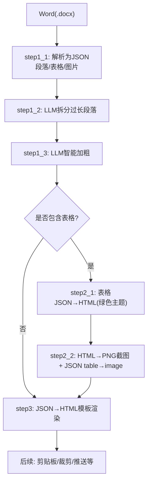
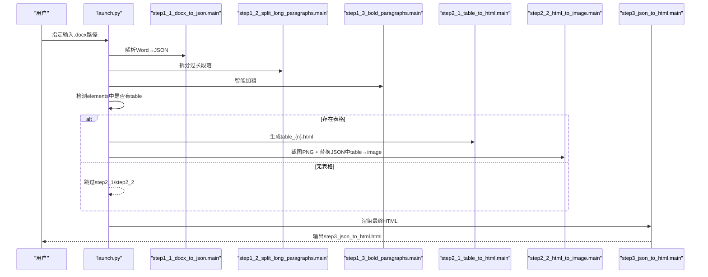
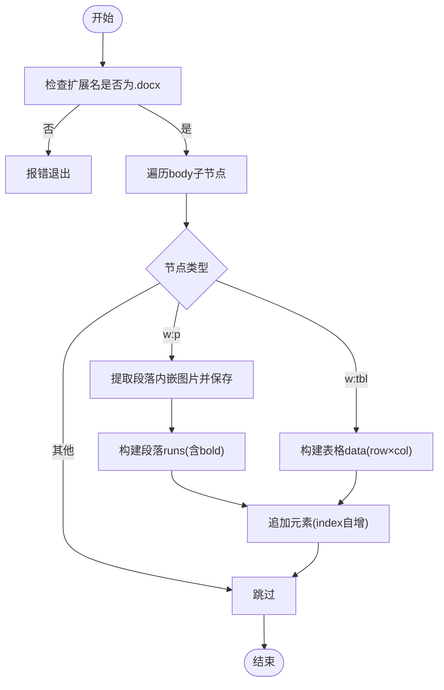
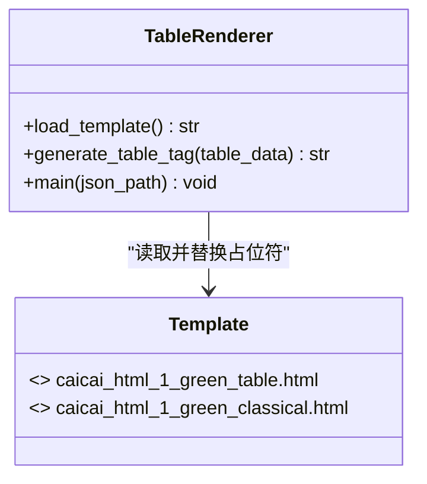
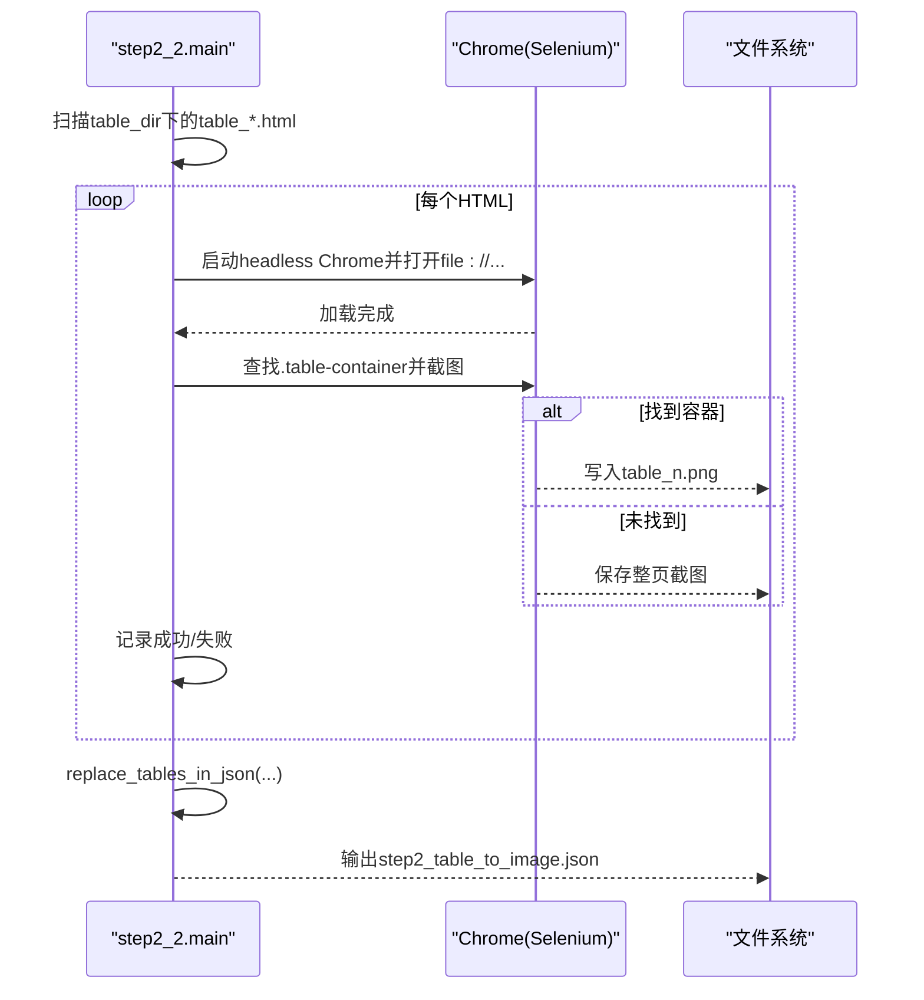
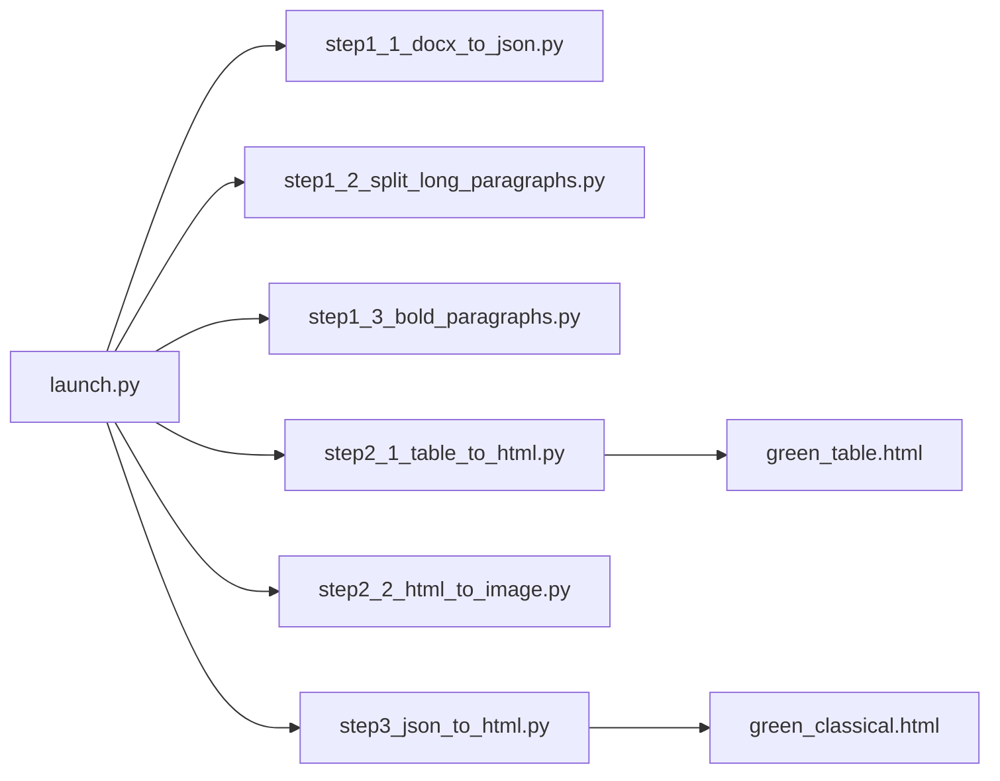

# 表格处理系统

<cite>
**本文引用的文件**
- [config.py](file://config.py)
- [launch.py](file://launch.py)
- [step1_1_docx_to_json.py](file://step1_1_docx_to_json.py)
- [step1_2_split_long_paragraphs.py](file://step1_2_split_long_paragraphs.py)
- [step1_3_bold_paragraphs.py](file://step1_3_bold_paragraphs.py)
- [step2_1_table_to_html.py](file://step2_1_table_to_html.py)
- [step2_2_html_to_image.py](file://step2_2_html_to_image.py)
- [step3_json_to_html.py](file://step3_json_to_html.py)
- [caicai_html_1_green_table.html](file://html_template/caicai_html_1_green_table.html)
- [caicai_html_1_green_classical.html](file://html_template/caicai_html_1_green_classical.html)
</cite>

## 目录
1. [简介](#简介)
2. [项目结构](#项目结构)
3. [核心组件](#核心组件)
4. [架构总览](#架构总览)
5. [详细组件分析](#详细组件分析)
6. [依赖关系分析](#依赖关系分析)
7. [性能与质量优化](#性能与质量优化)
8. [故障排查指南](#故障排查指南)
9. [结论](#结论)
10. [附录：配置项与输出格式](#附录配置项与输出格式)

## 简介
本系统面向“Word 文档 → 剪贴板/公众号”的自动化流水线，重点解决复杂排版中的表格处理问题。系统从 Word 解析出结构化 JSON（段落、表格、图片），对长段落进行语义拆分并智能加粗，随后将表格渲染为独立 HTML，使用无头浏览器截图生成高质量 PNG，再将 JSON 中表格元素替换为图片引用，最终合成完整文章 HTML 模板并支持后续剪贴板与推送流程。

## 项目结构
- 入口编排：launch.py 串联各步骤，自动检测是否存在表格以决定是否执行表格相关步骤。
- 数据中间态：process 目录下按步骤命名 JSON/HTML/PNG，便于断点调试与回滚。
- 模板：html_template 下提供绿色主题表格模板与正文模板。

图表来源
- [launch.py:42-193](file://launch.py#L42-L193)
- [step1_1_docx_to_json.py:145-184](file://step1_1_docx_to_json.py#L145-L184)
- [step2_1_table_to_html.py:74-118](file://step2_1_table_to_html.py#L74-L118)
- [step2_2_html_to_image.py:120-172](file://step2_2_html_to_image.py#L120-L172)
- [step3_json_to_html.py:121-142](file://step3_json_to_html.py#L121-L142)

章节来源
- [launch.py:1-201](file://launch.py#L1-L201)

## 核心组件
- 文档解析器：从 .docx 提取段落、表格、内嵌图片，识别标题层级与 run 级加粗。
- 文本增强器：调用大模型进行段落拆分与总结性加粗标注。
- 表格处理器：将 JSON 表格渲染为带样式的 HTML，首行作为表头，其余为表体；单元格 bold 映射到样式类。
- 图像转换器：基于 Selenium + Chrome 无头模式截图，生成高清 PNG，并将 JSON 中 table 元素替换为 image 引用。
- 页面合成器：将段落、标题、图片渲染到经典绿色主题模板，生成最终 HTML。

章节来源
- [step1_1_docx_to_json.py:75-184](file://step1_1_docx_to_json.py#L75-L184)
- [step1_2_split_long_paragraphs.py:198-301](file://step1_2_split_long_paragraphs.py#L198-L301)
- [step1_3_bold_paragraphs.py:207-330](file://step1_3_bold_paragraphs.py#L207-L330)
- [step2_1_table_to_html.py:39-118](file://step2_1_table_to_html.py#L39-L118)
- [step2_2_html_to_image.py:40-172](file://step2_2_html_to_image.py#L40-L172)
- [step3_json_to_html.py:84-142](file://step3_json_to_html.py#L84-L142)

## 架构总览
下图展示了端到端的数据流与控制流，包括关键函数与模板占位符替换位置。

图表来源
- [launch.py:112-155](file://launch.py#L112-L155)
- [step1_1_docx_to_json.py:190-226](file://step1_1_docx_to_json.py#L190-L226)
- [step1_2_split_long_paragraphs.py:198-301](file://step1_2_split_long_paragraphs.py#L198-L301)
- [step1_3_bold_paragraphs.py:207-330](file://step1_3_bold_paragraphs.py#L207-L330)
- [step2_1_table_to_html.py:74-118](file://step2_1_table_to_html.py#L74-L118)
- [step2_2_html_to_image.py:120-172](file://step2_2_html_to_image.py#L120-L172)
- [step3_json_to_html.py:121-142](file://step3_json_to_html.py#L121-L142)

## 详细组件分析

### 表格数据提取算法（从 JSON 识别与处理）
- 数据结构约定
  - 段落：type=paragraph，heading_level∈{null,1,2}，runs=[{text,bold}]
  - 表格：type=table，row_count,col_count,data=[[{text,bold}]]
  - 图片：type=image，file_name,image_path
- 解析策略
  - 遍历 docx body 顺序，优先插入段落内嵌图片，再插入段落或表格，保持原始顺序。
  - 标题识别：以 # 和 ## 前缀判断 heading_level，去除前缀后统一 runs 的 bold=false。
  - 表格解析：逐行逐单元格提取 text 与首个非空 run 的 bold 状态。
- 复杂度
  - 时间 O(N+R+C)，N 为段落数，R 为表格行数，C 为列数；空间与输出规模线性增长。
- 错误处理
  - 仅支持 .docx；不存在则退出；空段落过滤；异常捕获避免中断。

图表来源
- [step1_1_docx_to_json.py:145-184](file://step1_1_docx_to_json.py#L145-L184)
- [step1_1_docx_to_json.py:75-139](file://step1_1_docx_to_json.py#L75-L139)

章节来源
- [step1_1_docx_to_json.py:190-226](file://step1_1_docx_to_json.py#L190-L226)

### HTML 转换逻辑（表格样式、合并与响应式适配）
- 模板与占位符
  - 表格模板：caicai_html_1_green_table.html，占位符 {{TABLE_PLACEHOLDER}} 被替换为 <table>...</table>。
  - 正文模板：caicai_html_1_green_classical.html，占位符 {{BODY_PLACEHOLDER}} 被替换为正文片段。
- 表格渲染规则
  - 第一行作为 <thead>，其余行作为 <tbody>。
  - 单元格 bold=true 时添加 class="bold"，由 CSS 控制字体粗细。
  - 行高同步脚本：在 tbody 内计算最大行高并统一设置，保证截图一致性。
- 单元格合并
  - 当前实现未解析跨行/跨列合并属性，按行列矩阵展开渲染。若需支持合并，可在 step1_1 解析阶段记录 rowSpan/colSpan，并在 step2_1 生成 <td rowspan/colspan>。
- 响应式布局
  - 表格宽度 auto，容器 inline-block；截图固定窗口尺寸，适合生成静态图。
  - 正文模板限制最大宽度，适配移动端阅读体验。

图表来源
- [step2_1_table_to_html.py:33-68](file://step2_1_table_to_html.py#L33-L68)
- [caicai_html_1_green_table.html:59-78](file://html_template/caicai_html_1_green_table.html#L59-L78)
- [step3_json_to_html.py:121-142](file://step3_json_to_html.py#L121-L142)

章节来源
- [step2_1_table_to_html.py:74-118](file://step2_1_table_to_html.py#L74-L118)
- [caicai_html_1_green_table.html:1-81](file://html_template/caicai_html_1_green_table.html#L1-L81)
- [caicai_html_1_green_classical.html:1-278](file://html_template/caicai_html_1_green_classical.html#L1-L278)

### 图像生成流程（渲染引擎选择、截图质量与格式转换）
- 渲染引擎
  - 使用 Selenium + Chrome 无头模式加载本地 HTML 文件 URI。
- 截图质量优化
  - force-device-scale-factor=2 提升清晰度。
  - 尝试定位 .table-container 精确截图，失败则回退整页截图。
  - 窗口移出屏幕、禁用 GPU/扩展/网络等以减少干扰。
- 超时与进程清理
  - 线程定时器监控超时，强制终止 chrome/chromedriver 进程，避免僵尸进程。
- 格式转换
  - 直接输出 PNG，无需额外转换；如需其他格式可在截图后增加转换步骤。

图表来源
- [step2_2_html_to_image.py:40-115](file://step2_2_html_to_image.py#L40-L115)
- [step2_2_html_to_image.py:175-210](file://step2_2_html_to_image.py#L175-L210)

章节来源
- [step2_2_html_to_image.py:120-172](file://step2_2_html_to_image.py#L120-L172)

### 主要处理函数与数据流
- 表格转 HTML
  - generate_table_tag(table_data): 根据 data 生成 <table><thead><tbody> 片段。
  - main(json_path): 筛选 type=table 的元素，逐个生成 table_{n}.html。
- HTML 转 PNG + JSON 替换
  - html_to_png(html_path, png_path): 截图封装，含超时保护。
  - replace_tables_in_json(json_path, table_dir, table_count): 将 JSON 中 table 元素替换为 image 元素，并写入新 JSON。
- 正文渲染
  - render_runs/render_body_section/render_title/render_image/generate_body_html/main: 将 JSON elements 渲染为 HTML 片段并替换模板占位符。

章节来源
- [step2_1_table_to_html.py:39-118](file://step2_1_table_to_html.py#L39-L118)
- [step2_2_html_to_image.py:40-172](file://step2_2_html_to_image.py#L40-L172)
- [step3_json_to_html.py:38-142](file://step3_json_to_html.py#L38-L142)

### 自定义表格样式实现方法
- 修改模板样式
  - 编辑 caicai_html_1_green_table.html 的 CSS 块，调整 th/td/tr 背景、边框、字号、行高等。
  - 通过 td.bold 类控制加粗单元格的显示效果。
- 调整行高同步脚本
  - 在模板末尾的 script 中可调整行高计算与赋值逻辑，以适应不同内容密度。
- 新增样式类
  - 在 step2_1 的 generate_table_tag 中为特定单元格追加 class（如 highlight），并在模板 CSS 中定义对应样式。

章节来源
- [caicai_html_1_green_table.html:16-56](file://html_template/caicai_html_1_green_table.html#L16-L56)
- [caicai_html_1_green_table.html:65-78](file://html_template/caicai_html_1_green_table.html#L65-L78)
- [step2_1_table_to_html.py:54-68](file://step2_1_table_to_html.py#L54-L68)

## 依赖关系分析
- 外部依赖
  - selenium、requests、python-docx（用于解析 .docx）。
- 内部模块耦合
  - launch.py 协调各步骤，依据 active_json 动态决定后续路径。
  - step2_2 依赖 step2_1 的输出目录与文件名约定。
  - step3 依赖 step2 输出的 JSON（若无表格则直接使用 step1 输出）。

图表来源
- [launch.py:70-155](file://launch.py#L70-L155)
- [step2_1_table_to_html.py:26-27](file://step2_1_table_to_html.py#L26-L27)
- [step3_json_to_html.py:28-29](file://step3_json_to_html.py#L28-L29)

章节来源
- [launch.py:1-201](file://launch.py#L1-L201)

## 性能与质量优化
- 截图性能
  - 使用 headless=new 与禁用 GPU/扩展/网络，减少资源占用。
  - 针对 .table-container 精准截图，避免整页渲染开销。
  - 超时保护与进程清理防止长时间挂起。
- 质量保障
  - device_scale_factor=2 提高清晰度。
  - 行高同步脚本确保多行高度一致，截图更稳定。
- 文本处理
  - 段落拆分阈值可配置（SPLIT_THRESHOLD），避免过度拆分。
  - 拼接一致性校验确保拆分结果不丢失原文。
- 并发与批处理
  - 当前为串行处理，可按需引入线程池并行截图（注意 Chrome 实例隔离与端口冲突）。

[本节为通用建议，不直接分析具体文件]

## 故障排查指南
- Chrome 截图失败/超时
  - 现象：抛出 RuntimeError 并提示超时或失败。
  - 排查：确认已安装 Chrome 与 chromedriver；检查 CHROME_TIMEOUT 与 page_load_timeout；查看是否因网络或资源加载导致阻塞。
  - 恢复：重试或降低缩放因子；必要时改为整页截图。
- 无表格时的 JSON 传递
  - 现象：step2_2 在无 table 情况下原样复制 JSON 作为 step2 输出。
  - 说明：这是预期行为，下游 step3 可直接消费该 JSON。
- 模板占位符未替换
  - 现象：最终 HTML 仍包含 {{TABLE_PLACEHOLDER}} 或 {{BODY_PLACEHOLDER}}。
  - 排查：确认模板路径正确且文件可读；检查生成逻辑是否执行替换。
- 加粗/拆分结果异常
  - 现象：LLM 返回无效 JSON 或拼接不一致。
  - 处理：步骤内置重试与容错，失败会保留原文；可调整 MAX_RETRIES/MAX_TOKENS 与提示词。

章节来源
- [step2_2_html_to_image.py:90-115](file://step2_2_html_to_image.py#L90-L115)
- [step2_2_html_to_image.py:131-142](file://step2_2_html_to_image.py#L131-L142)
- [step1_2_split_long_paragraphs.py:251-272](file://step1_2_split_long_paragraphs.py#L251-L272)
- [step1_3_bold_paragraphs.py:278-314](file://step1_3_bold_paragraphs.py#L278-L314)

## 结论
该系统以 JSON 为中间表示，将表格从结构化数据高效转换为高质量图片，并与正文模板无缝集成。通过模板化样式与脚本化行高同步，保证了截图的一致性与美观度；通过 LLM 辅助的段落拆分与加粗，提升了可读性与信息密度。整体流程具备良好可扩展性，可进一步支持表格合并、更多样式主题与并发截图以提升吞吐。

[本节为总结性内容，不直接分析具体文件]

## 附录：配置项与输出格式
- 全局配置（config.py）
  - API_URL、HEADERS：大模型接口地址与请求头。
  - MAX_RETRIES、MAX_TOKENS：重试次数与令牌上限。
  - SPLIT_THRESHOLD：段落拆分长度阈值。
  - WX_*：微信公众号相关默认值（作者、评论开关等）。
- 输入/输出约定
  - 输入：.docx 文件路径。
  - 中间产物：
    - process/step1_1_docx_to_json.json
    - process/step1_2_split_paragraphs.json
    - process/step1_3_bold_paragraphs.json
    - process/table/table_{n}.html / table_{n}.png
    - process/step2_table_to_image.json
    - process/step3_json_to_html.html
- JSON 元素结构要点
  - paragraph：type, heading_level, runs[{text,bold}], index
  - table：type, row_count, col_count, data[[{text,bold}]], index
  - image：type, file_name, image_path, index

章节来源
- [config.py:1-39](file://config.py#L1-L39)
- [step1_1_docx_to_json.py:116-139](file://step1_1_docx_to_json.py#L116-L139)
- [step2_2_html_to_image.py:175-210](file://step2_2_html_to_image.py#L175-L210)
- [step3_json_to_html.py:121-142](file://step3_json_to_html.py#L121-L142)