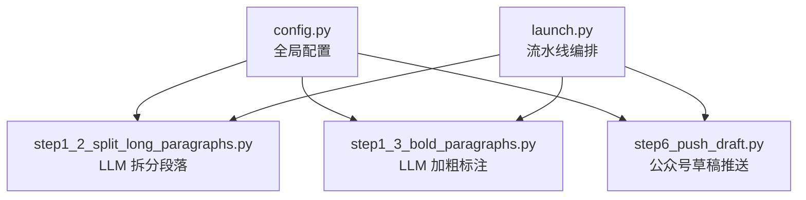
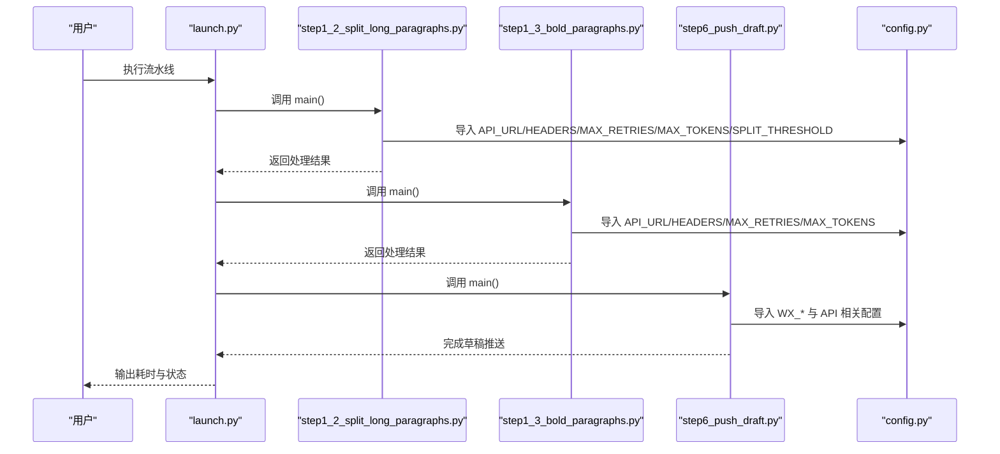
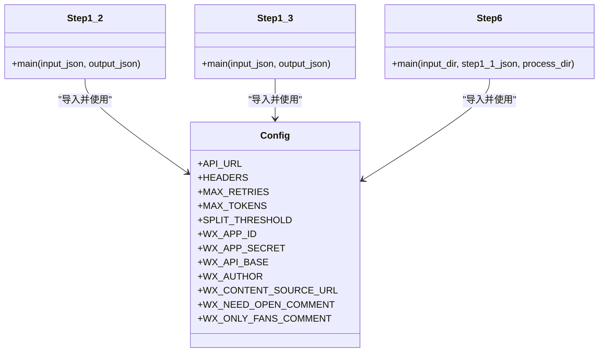

# 配置管理

<cite>
**本文引用的文件**   
- [config.py](file://config.py)
- [launch.py](file://launch.py)
- [step1_2_split_long_paragraphs.py](file://step1_2_split_long_paragraphs.py)
- [step1_3_bold_paragraphs.py](file://step1_3_bold_paragraphs.py)
- [step6_push_draft.py](file://step6_push_draft.py)
</cite>

## 目录
1. [简介](#简介)
2. [项目结构](#项目结构)
3. [核心组件](#核心组件)
4. [架构总览](#架构总览)
5. [详细组件分析](#详细组件分析)
6. [依赖关系分析](#依赖关系分析)
7. [性能与容量特性](#性能与容量特性)
8. [故障诊断与排错](#故障诊断与排错)
9. [结论](#结论)
10. [附录：配置项清单与示例](#附录配置项清单与示例)

## 简介
本技术文档围绕项目的“配置管理”主题，系统化梳理全局配置的组织结构、加载机制、安全实践、参数说明、部署示例、热重载与运行时调整策略，以及验证与错误诊断方法。当前仓库采用集中式模块级配置（Python 常量），由多个流水线步骤按需导入使用；尚未实现环境变量覆盖、配置文件优先级或热重载能力。本文在忠实于现有代码的基础上，给出可落地的改进建议与最佳实践。

## 项目结构
与配置相关的核心文件如下：
- config.py：集中定义 API 认证、通用参数、段落拆分阈值、微信公众号相关配置等。
- launch.py：编排整个处理流水线的入口脚本，不直接读取配置，但通过调用各 step 间接使用配置。
- step1_2_split_long_paragraphs.py：从 config 中导入 API_URL、HEADERS、MAX_RETRIES、MAX_TOKENS、SPLIT_THRESHOLD 用于 LLM 分段。
- step1_3_bold_paragraphs.py：从 config 中导入 API_URL、HEADERS、MAX_RETRIES、MAX_TOKENS 用于 LLM 加粗标注。
- step6_push_draft.py：从 config 中导入 WX_APP_ID、WX_APP_SECRET、WX_API_BASE、WX_AUTHOR、WX_CONTENT_SOURCE_URL、WX_NEED_OPEN_COMMENT、WX_ONLY_FANS_COMMENT，以及 API_URL、HEADERS、MAX_RETRIES、MAX_TOKENS 用于草稿推送与摘要生成。

图表来源
- [config.py:1-39](file://config.py#L1-L39)
- [step1_2_split_long_paragraphs.py:26-27](file://step1_2_split_long_paragraphs.py#L26-L27)
- [step1_3_bold_paragraphs.py:25-26](file://step1_3_bold_paragraphs.py#L25-L26)
- [step6_push_draft.py:31-36](file://step6_push_draft.py#L31-L36)
- [launch.py:1-201](file://launch.py#L1-L201)

章节来源
- [config.py:1-39](file://config.py#L1-L39)
- [launch.py:1-201](file://launch.py#L1-L201)
- [step1_2_split_long_paragraphs.py:1-311](file://step1_2_split_long_paragraphs.py#L1-L311)
- [step1_3_bold_paragraphs.py:1-340](file://step1_3_bold_paragraphs.py#L1-L340)
- [step6_push_draft.py:1-404](file://step6_push_draft.py#L1-L404)

## 核心组件
- 全局配置模块（config.py）
  - API 认证与请求头：API_URL、HEADERS
  - 通用参数：MAX_RETRIES、MAX_TOKENS
  - 文本处理参数：SPLIT_THRESHOLD
  - 微信公众号配置：WX_APP_ID、WX_APP_SECRET、WX_API_BASE、WX_AUTHOR、WX_CONTENT_SOURCE_URL、WX_NEED_OPEN_COMMENT、WX_ONLY_FANS_COMMENT
- 流水线入口（launch.py）
  - 负责按顺序调用各 step，控制跳过标志与输出路径，间接消费配置。
- 配置消费者
  - step1_2_split_long_paragraphs.py：读取并应用 SPLIT_THRESHOLD、MAX_RETRIES、MAX_TOKENS、API_URL、HEADERS
  - step1_3_bold_paragraphs.py：读取并应用 MAX_RETRIES、MAX_TOKENS、API_URL、HEADERS
  - step6_push_draft.py：读取并应用 WX_* 系列与 API 相关配置

章节来源
- [config.py:1-39](file://config.py#L1-L39)
- [step1_2_split_long_paragraphs.py:26-27](file://step1_2_split_long_paragraphs.py#L26-L27)
- [step1_3_bold_paragraphs.py:25-26](file://step1_3_bold_paragraphs.py#L25-L26)
- [step6_push_draft.py:31-36](file://step6_push_draft.py#L31-L36)

## 架构总览
配置在启动时以 Python 模块常量的形式被各步骤导入，运行期无动态加载或热更新。整体流程如下：

图表来源
- [launch.py:42-193](file://launch.py#L42-L193)
- [step1_2_split_long_paragraphs.py:198-301](file://step1_2_split_long_paragraphs.py#L198-L301)
- [step1_3_bold_paragraphs.py:207-330](file://step1_3_bold_paragraphs.py#L207-L330)
- [step6_push_draft.py:276-397](file://step6_push_draft.py#L276-L397)
- [config.py:1-39](file://config.py#L1-L39)

## 详细组件分析

### 配置模块（config.py）
- 组织方式
  - 将 API 认证、通用参数、文本处理阈值、微信公众号相关配置集中在单一模块中，便于统一维护。
- 关键类别
  - API 认证与请求头：API_URL、HEADERS
  - 通用参数：MAX_RETRIES、MAX_TOKENS
  - 文本处理参数：SPLIT_THRESHOLD
  - 微信公众号配置：WX_APP_ID、WX_APP_SECRET、WX_API_BASE、WX_AUTHOR、WX_CONTENT_SOURCE_URL、WX_NEED_OPEN_COMMENT、WX_ONLY_FANS_COMMENT
- 影响范围
  - API_URL、HEADERS、MAX_RETRIES、MAX_TOKENS 被 step1_2、step1_3、step6 共同使用。
  - SPLIT_THRESHOLD 仅被 step1_2 使用。
  - WX_* 系列仅被 step6 使用。

章节来源
- [config.py:1-39](file://config.py#L1-L39)

### 配置加载机制与环境变量支持
- 现状
  - 所有配置均为模块级常量，通过 import 直接引用。
  - 未检测到 os.environ/getenv 的使用，也未发现 .env 或 YAML/JSON 配置文件加载逻辑。
- 默认值
  - 所有参数均有硬编码默认值，若未显式覆盖则沿用默认。
- 优先级
  - 当前不存在多源合并与优先级规则。
- 环境变量支持
  - 当前未实现。建议在后续版本引入环境变量覆盖（例如 WX_APP_ID、WX_APP_SECRET、API_URL 等）。

章节来源
- [config.py:1-39](file://config.py#L1-L39)
- [step1_2_split_long_paragraphs.py:26-27](file://step1_2_split_long_paragraphs.py#L26-L27)
- [step1_3_bold_paragraphs.py:25-26](file://step1_3_bold_paragraphs.py#L25-L26)
- [step6_push_draft.py:31-36](file://step6_push_draft.py#L31-L36)

### 安全最佳实践
- 敏感信息现状
  - API_KEY、client_id、client_secret、WX_APP_SECRET 等敏感字段以明文常量形式存在于配置文件中。
- 风险与建议
  - 避免将密钥提交到版本库；建议使用环境变量或密钥管理服务注入。
  - 对访问进行最小权限控制，限制对外网调用的网络策略。
  - 日志脱敏：确保不打印完整密钥或 token。
  - 传输加密：已使用 HTTPS 端点，保持该策略。
  - 存储加密：如需持久化缓存（如 media_id），应评估是否需加密存储。

章节来源
- [config.py:1-39](file://config.py#L1-L39)
- [step6_push_draft.py:276-397](file://step6_push_draft.py#L276-L397)

### 配置参数详细说明
以下为当前仓库中实际使用的配置项及其用途、类型与影响范围（基于源码分析）：

- API_URL
  - 类型：字符串（URL）
  - 用途：大模型接口地址
  - 影响范围：step1_2、step1_3、step6
- HEADERS
  - 类型：字典（HTTP 请求头）
  - 用途：包含 client_id、client_secret、api-key 等认证信息
  - 影响范围：step1_2、step1_3、step6
- MAX_RETRIES
  - 类型：整数
  - 用途：外部请求失败重试次数
  - 影响范围：step1_2、step1_3、step6
- MAX_TOKENS
  - 类型：整数
  - 用途：最大生成长度（max_completion_tokens）
  - 影响范围：step1_2、step1_3、step6
- SPLIT_THRESHOLD
  - 类型：整数
  - 用途：段落拆分触发阈值（run.text 长度超过此值才拆分）
  - 影响范围：step1_2
- WX_APP_ID / WX_APP_SECRET
  - 类型：字符串
  - 用途：微信公众号凭证
  - 影响范围：step6
- WX_API_BASE
  - 类型：字符串（URL）
  - 用途：微信 API 基础地址
  - 影响范围：step6
- WX_AUTHOR
  - 类型：字符串
  - 用途：草稿作者名
  - 影响范围：step6
- WX_CONTENT_SOURCE_URL
  - 类型：字符串（可选 URL）
  - 用途：创作来源链接
  - 影响范围：step6
- WX_NEED_OPEN_COMMENT / WX_ONLY_FANS_COMMENT
  - 类型：整数（0/1）
  - 用途：评论开关与粉丝限定
  - 影响范围：step6

章节来源
- [config.py:1-39](file://config.py#L1-L39)
- [step1_2_split_long_paragraphs.py:26-27](file://step1_2_split_long_paragraphs.py#L26-L27)
- [step1_3_bold_paragraphs.py:25-26](file://step1_3_bold_paragraphs.py#L25-L26)
- [step6_push_draft.py:31-36](file://step6_push_draft.py#L31-L36)

### 配置热重载与运行时参数调整
- 现状
  - 配置为模块常量，程序启动后不可热更新。
- 运行时调整
  - 可在单个脚本内临时覆盖导入的常量（不推荐在生产环境使用）。
- 建议方案
  - 引入配置中心或环境变量，并在需要时提供 reload_config() 函数，供长驻进程在特定信号下刷新配置。
  - 对关键参数（如 MAX_RETRIES、MAX_TOKENS、SPLIT_THRESHOLD）增加校验与边界检查，防止异常值导致资源耗尽。

章节来源
- [config.py:1-39](file://config.py#L1-L39)

### 配置验证规则与错误诊断工具
- 现状
  - 未发现统一的配置校验逻辑。
  - 部分步骤存在输入文件缺失、网络异常、解析失败的错误处理与提示。
- 建议
  - 在启动阶段集中校验必填项（如 WX_APP_ID、WX_APP_SECRET、API_URL、HEADERS 关键字段）。
  - 对数值型参数进行范围校验（如 MAX_RETRIES > 0，MAX_TOKENS 合理区间，SPLIT_THRESHOLD > 0）。
  - 提供诊断命令或日志聚合，快速定位配置问题。

章节来源
- [step6_push_draft.py:276-397](file://step6_push_draft.py#L276-L397)
- [step1_2_split_long_paragraphs.py:198-301](file://step1_2_split_long_paragraphs.py#L198-L301)
- [step1_3_bold_paragraphs.py:207-330](file://step1_3_bold_paragraphs.py#L207-L330)

## 依赖关系分析
配置在各步骤中的依赖关系如下：

图表来源
- [config.py:1-39](file://config.py#L1-L39)
- [step1_2_split_long_paragraphs.py:26-27](file://step1_2_split_long_paragraphs.py#L26-L27)
- [step1_3_bold_paragraphs.py:25-26](file://step1_3_bold_paragraphs.py#L25-L26)
- [step6_push_draft.py:31-36](file://step6_push_draft.py#L31-L36)

章节来源
- [config.py:1-39](file://config.py#L1-L39)
- [step1_2_split_long_paragraphs.py:1-311](file://step1_2_split_long_paragraphs.py#L1-L311)
- [step1_3_bold_paragraphs.py:1-340](file://step1_3_bold_paragraphs.py#L1-L340)
- [step6_push_draft.py:1-404](file://step6_push_draft.py#L1-L404)

## 性能与容量特性
- 外部请求超时与重试
  - 大模型调用设置超时时间并重试，受 MAX_RETRIES 与 MAX_TOKENS 影响。
- 文本处理阈值
  - SPLIT_THRESHOLD 控制段落拆分触发条件，过大可能减少拆分次数，过小可能增加 LLM 调用成本。
- 标题与摘要长度限制
  - 标题截断至 UTF-8 字节上限；摘要长度有上限保护，避免超出平台限制。

章节来源
- [step1_2_split_long_paragraphs.py:80-103](file://step1_2_split_long_paragraphs.py#L80-L103)
- [step1_3_bold_paragraphs.py:73-96](file://step1_3_bold_paragraphs.py#L73-L96)
- [step6_push_draft.py:85-102](file://step6_push_draft.py#L85-L102)
- [step6_push_draft.py:227-246](file://step6_push_draft.py#L227-L246)

## 故障诊断与排错
- 常见错误场景
  - 配置文件缺失或无效：如 WX_APP_ID/WX_APP_SECRET 为空，step6 会终止并提示。
  - 网络异常：大模型或微信 API 调用失败，会打印警告并按 MAX_RETRIES 重试。
  - 数据不一致：step1_2 对拆分结果进行拼接一致性校验，不一致则回退原段落。
- 诊断建议
  - 启用更详细的日志级别，记录请求头与响应码（注意脱敏）。
  - 对关键路径添加断言与校验，尽早失败。
  - 提供一键诊断脚本，汇总配置、网络连通性与依赖文件完整性。

章节来源
- [step6_push_draft.py:276-397](file://step6_push_draft.py#L276-L397)
- [step1_2_split_long_paragraphs.py:247-272](file://step1_2_split_long_paragraphs.py#L247-L272)

## 结论
当前配置管理采用集中式模块常量，结构简单直观，适合小型脚本与本地开发。但在生产环境中，建议引入环境变量覆盖、配置校验、敏感信息管理与热重载能力，以提升安全性、可运维性与可扩展性。

## 附录：配置项清单与示例

### 配置项清单
- API 认证与请求头
  - API_URL：字符串，大模型接口地址
  - HEADERS：字典，包含 client_id、client_secret、api-key 等
- 通用参数
  - MAX_RETRIES：整数，请求重试次数
  - MAX_TOKENS：整数，最大生成长度
- 文本处理参数
  - SPLIT_THRESHOLD：整数，段落拆分阈值
- 微信公众号配置
  - WX_APP_ID：字符串，公众号 AppID
  - WX_APP_SECRET：字符串，公众号 AppSecret
  - WX_API_BASE：字符串，微信 API 基础地址
  - WX_AUTHOR：字符串，作者名
  - WX_CONTENT_SOURCE_URL：字符串，创作来源链接（可为空）
  - WX_NEED_OPEN_COMMENT：整数（0/1），评论开关
  - WX_ONLY_FANS_COMMENT：整数（0/1），仅粉丝评论

章节来源
- [config.py:1-39](file://config.py#L1-L39)

### 不同部署环境的配置示例（概念性）
- 本地开发
  - 直接在 config.py 中填写测试用凭据与调试参数。
- 预发布/生产
  - 通过环境变量注入 WX_APP_ID、WX_APP_SECRET、API_URL、HEADERS 等敏感项，避免写入代码库。
  - 使用只读挂载或密钥管理服务获取配置，禁止写权限。
- 多租户隔离
  - 为每个租户准备独立的环境变量前缀或命名空间，避免交叉污染。

[本节为概念性指导，不涉及具体代码文件]

### 配置热重载与运行时调整（概念性）
- 设计要点
  - 提供 reload_config() 函数，监听系统信号或配置变更事件。
  - 对关键参数做边界校验与降级策略。
  - 在长驻进程中谨慎切换，避免并发读写冲突。

[本节为概念性指导，不涉及具体代码文件]