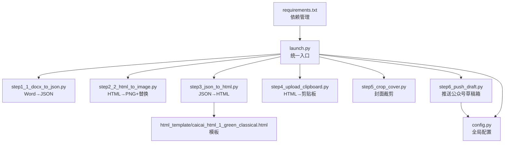
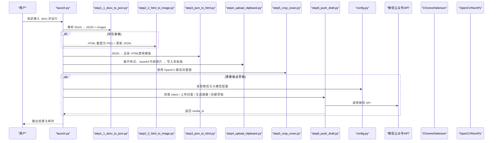
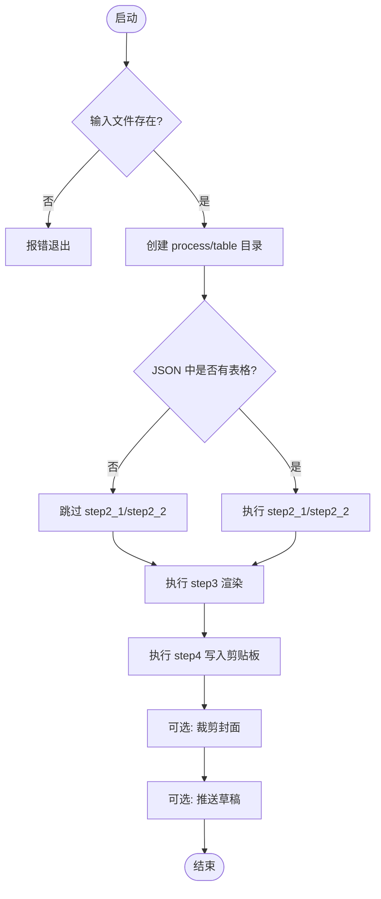

# 快速开始

<cite>
**本文引用的文件**   
- [launch.py](file://launch.py)
- [config.py](file://config.py)
- [requirements.txt](file://requirements.txt)
- [step1_1_docx_to_json.py](file://step1_1_docx_to_json.py)
- [step2_2_html_to_image.py](file://step2_2_html_to_image.py)
- [step3_json_to_html.py](file://step3_json_to_html.py)
- [step4_upload_clipboard.py](file://step4_upload_clipboard.py)
- [step5_crop_cover.py](file://step5_crop_cover.py)
- [step6_push_draft.py](file://step6_push_draft.py)
- [caicai_html_1_green_classical.html](file://html_template/caicai_html_1_green_classical.html)
</cite>

## 更新摘要
**所做更改**   
- 更新了依赖安装部分，添加了 requirements.txt 统一管理
- 新增了 OpenCV-Python 和 NumPy 依赖说明（用于封面图片裁剪）
- 完善了系统依赖要求，包括 Chrome 浏览器配置
- 增强了故障排除指南，涵盖新的图像处理依赖问题

## 目录
1. [简介](#简介)
2. [项目结构](#项目结构)
3. [核心组件](#核心组件)
4. [架构总览](#架构总览)
5. [详细组件分析](#详细组件分析)
6. [依赖与安装](#依赖与安装)
7. [首次运行流程](#首次运行流程)
8. [常见使用场景示例](#常见使用场景示例)
9. [故障排除指南](#故障排除指南)
10. [结论](#结论)

## 简介
本指南面向新手，帮助你在 10 分钟内完成环境准备、配置修改并成功运行第一个处理任务。内容覆盖 Python 版本要求、依赖安装、API 密钥与微信配置、首次运行步骤、跳过特定步骤、调试模式以及常见问题排查。

## 项目结构
本项目采用"流水线 + 模块化"的组织方式：
- launch.py：统一入口，串联各步骤，支持按标志位跳过任意步骤
- step1_1_docx_to_json.py：解析 Word（段落/表格/图片）→ JSON
- step2_2_html_to_image.py：将表格 HTML 截图为 PNG，并回写 JSON 引用
- step3_json_to_html.py：JSON → 渲染到 HTML 模板
- step4_upload_clipboard.py：HTML → Windows 剪贴板（内联 base64 图片）
- step5_crop_cover.py：封面图片裁剪为 2.35:1 比例
- step6_push_draft.py：推送到微信公众号草稿箱（需配置 AppID/AppSecret）
- config.py：全局配置（大模型 API、微信公众号参数等）
- html_template：HTML 模板文件
- requirements.txt：Python 依赖包统一管理



图表来源
- [launch.py:42-193](file://launch.py#L42-L193)
- [step1_1_docx_to_json.py:190-233](file://step1_1_docx_to_json.py#L190-L233)
- [step2_2_html_to_image.py:1-44](file://step2_2_html_to_image.py#L1-L44)
- [step3_json_to_html.py:121-149](file://step3_json_to_html.py#L121-L149)
- [step4_upload_clipboard.py:1-44](file://step4_upload_clipboard.py#L1-L44)
- [step5_crop_cover.py:1-203](file://step5_crop_cover.py#L1-L203)
- [step6_push_draft.py:1-36](file://step6_push_draft.py#L1-L36)
- [caicai_html_1_green_classical.html:1-200](file://html_template/caicai_html_1_green_classical.html#L1-L200)
- [config.py:1-39](file://config.py#L1-L39)
- [requirements.txt:1-28](file://requirements.txt#L1-L28)

章节来源
- [launch.py:1-201](file://launch.py#L1-L201)
- [config.py:1-39](file://config.py#L1-L39)
- [requirements.txt:1-28](file://requirements.txt#L1-L28)

## 核心组件
- 流水线编排器（launch.py）
  - 负责创建输出目录、计算中间产物路径、顺序调用各步骤、打印进度与耗时
  - 提供 SKIP_STEP* 开关，可按需跳过任意步骤
- 文档解析器（step1_1_docx_to_json.py）
  - 读取 .docx，提取段落、表格、图片，输出结构化 JSON 与图片文件
- 表格截图器（step2_2_html_to_image.py）
  - 使用 Selenium + Chrome 将 table HTML 截图为 PNG，并更新 JSON 中的引用
- 模板渲染器（step3_json_to_html.py）
  - 读取 JSON，按规则生成正文 HTML，替换模板占位符后输出完整页面
- 剪贴板写入器（step4_upload_clipboard.py）
  - 展开样式类、内联化、本地图片转 base64，写入 Windows 剪贴板多格式数据
- 封面裁剪器（step5_crop_cover.py）
  - 使用 OpenCV + NumPy 将图片裁剪为 2.35:1 比例，自动压缩至 10MB 以内
- 公众号推送器（step6_push_draft.py）
  - 获取 access_token、上传封面图、生成摘要、创建草稿；标题自动截断至字节限制
- 全局配置（config.py）
  - 大模型 API URL、请求头、重试次数、令牌上限、段落拆分阈值
  - 微信公众号 AppID/AppSecret、基础 API 地址、作者名、评论开关等

章节来源
- [launch.py:28-38](file://launch.py#L28-L38)
- [step1_1_docx_to_json.py:190-233](file://step1_1_docx_to_json.py#L190-L233)
- [step2_2_html_to_image.py:1-44](file://step2_2_html_to_image.py#L1-L44)
- [step3_json_to_html.py:121-149](file://step3_json_to_html.py#L121-L149)
- [step4_upload_clipboard.py:1-44](file://step4_upload_clipboard.py#L1-L44)
- [step5_crop_cover.py:1-203](file://step5_crop_cover.py#L1-L203)
- [step6_push_draft.py:1-36](file://step6_push_draft.py#L1-L36)
- [config.py:1-39](file://config.py#L1-L39)

## 架构总览
下图展示了从 Word 到剪贴板再到公众号草稿的端到端流程，以及关键中间产物与外部依赖。



图表来源
- [launch.py:42-193](file://launch.py#L42-L193)
- [step1_1_docx_to_json.py:190-233](file://step1_1_docx_to_json.py#L190-L233)
- [step2_2_html_to_image.py:1-44](file://step2_2_html_to_image.py#L1-L44)
- [step3_json_to_html.py:121-149](file://step3_json_to_html.py#L121-L149)
- [step4_upload_clipboard.py:1-44](file://step4_upload_clipboard.py#L1-L44)
- [step5_crop_cover.py:1-203](file://step5_crop_cover.py#L1-L203)
- [step6_push_draft.py:1-36](file://step6_push_draft.py#L1-L36)
- [config.py:1-39](file://config.py#L1-L39)

## 详细组件分析

### 流水线编排器（launch.py）
- 功能要点
  - 根据输入文件派生 process 与 table 目录
  - 通过 SKIP_STEP* 控制是否执行对应步骤
  - 自动检测 JSON 中是否存在表格元素，决定是否执行表格相关步骤
  - 汇总耗时并打印最终状态
- 关键路径
  - 输入路径设置位于 __main__ 块
  - 步骤间依赖通过 active_json 与 step3_input 动态选择上游产物



图表来源
- [launch.py:42-193](file://launch.py#L42-L193)

章节来源
- [launch.py:28-38](file://launch.py#L28-L38)
- [launch.py:196-201](file://launch.py#L196-L201)

### 文档解析器（step1_1_docx_to_json.py）
- 功能要点
  - 识别标题（# 或 ## 前缀），合并相邻相同加粗状态的 run
  - 提取表格行列结构与单元格加粗信息
  - 提取内联图片并保存为 PNG，记录相对路径
- 输出产物
  - process/step1_1_docx_to_json.json
  - process/images/image_{n}.png

章节来源
- [step1_1_docx_to_json.py:190-233](file://step1_1_docx_to_json.py#L190-L233)

### 表格截图器（step2_2_html_to_image.py）
- 功能要点
  - 遍历 process/table/*.html，使用 Selenium + Chrome 截图为 PNG
  - 将 JSON 中的 table 元素替换为 image 引用，输出 step2_table_to_image.json
- 依赖
  - selenium（系统需已安装 Chrome）

章节来源
- [step2_2_html_to_image.py:1-44](file://step2_2_html_to_image.py#L1-L44)

### 模板渲染器（step3_json_to_html.py）
- 功能要点
  - 读取 JSON elements，按 heading_level 与类型生成 HTML
  - 将生成的正文片段插入模板 {{BODY_PLACEHOLDER}}，输出 step3_json_to_html.html
- 模板位置
  - html_template/caicai_html_1_green_classical.html

章节来源
- [step3_json_to_html.py:121-149](file://step3_json_to_html.py#L121-L149)
- [caicai_html_1_green_classical.html:1-200](file://html_template/caicai_html_1_green_classical.html#L1-L200)

### 剪贴板写入器（step4_upload_clipboard.py）
- 功能要点
  - 提取 article#clipboard-content 片段
  - 将简化 class 标签展开为内联样式
  - 去除格式化空白，本地图片转为 base64 data URI
  - 构建 Windows 剪贴板多格式数据并写入
- 平台
  - Windows（使用 ctypes 调用 user32/kernel32）

章节来源
- [step4_upload_clipboard.py:1-44](file://step4_upload_clipboard.py#L1-L44)

### 封面裁剪器（step5_crop_cover.py）
- 功能要点
  - 使用 OpenCV + NumPy 读取图片文件
  - 计算当前宽高比，中心裁剪为目标 2.35:1 比例
  - 自动压缩图片大小，确保不超过 10MB 限制
  - 支持多种图片格式（jpg、jpeg、png、bmp、webp、tiff）
- 依赖
  - opencv-python、numpy

章节来源
- [step5_crop_cover.py:1-203](file://step5_crop_cover.py#L1-L203)

### 公众号推送器（step6_push_draft.py）
- 功能要点
  - 通过 AppID/AppSecret 获取 access_token
  - 上传封面图（永久素材）获取 media_id
  - 从 step1_1 JSON 提取一级标题（UTF-8 字节数限制截断）
  - 调用大模型生成摘要（复用 config 中的 API_URL/HEADERS/MAX_TOKENS）
  - 创建草稿并返回 media_id
- 前置条件
  - 在 config.py 正确填写 WX_APP_ID/WX_APP_SECRET

章节来源
- [step6_push_draft.py:1-36](file://step6_push_draft.py#L1-L36)
- [config.py:29-39](file://config.py#L29-L39)

## 依赖与安装
**新增** 项目现已提供统一的依赖管理文件 requirements.txt，简化安装过程。

### Python 版本要求
- 建议使用 Python 3.9 及以上版本
- 确保兼容所有第三方库的最新版本

### 一键安装依赖
在项目根目录下执行：
```bash
pip install -r requirements.txt
```

这将自动安装以下核心依赖：
- **selenium==4.46.0**：网页自动化和截图
- **python-docx==1.2.0**：Word 文档解析
- **opencv-python==5.0.0.93**：图像处理（封面裁剪）
- **numpy==2.5.1**：数值计算（图像处理支持）
- **requests==2.34.2**：HTTP 请求（微信 API 调用）

### 系统依赖要求
- **Google Chrome 浏览器**：必须安装，用于 Selenium 截图功能
- **ChromeDriver**：selenium 会自动管理或使用服务，无需手动下载
- **Windows 系统**：剪贴板操作仅在 Windows 环境下支持

### 间接依赖说明
requirements.txt 中注释了所有间接依赖，这些包会由上述核心包自动拉取，包括：
- lxml（HTML 解析）
- urllib3（HTTP 客户端）
- websocket-client（WebSocket 通信）
- 以及其他安全相关的依赖包

**注意**：如果遇到网络问题，可以配置 pip 镜像源加速下载：
```bash
pip install -r requirements.txt -i https://pypi.tuna.tsinghua.edu.cn/simple
```

章节来源
- [requirements.txt:1-28](file://requirements.txt#L1-L28)
- [step2_2_html_to_image.py:16-18](file://step2_2_html_to_image.py#L16-L18)

## 首次运行流程
- 准备输入文件
  - 准备一个 .docx 文件，建议放在 content_instance 下某个子目录（如 content_instance/content_xxxx_yy\）
- 修改输入路径
  - 打开 launch.py，找到 __main__ 块，将 input_path 指向你的 .docx 文件路径
- 运行主程序
  - 在命令行进入项目根目录，执行：python launch.py
- 查看处理结果
  - 在输入文件所在目录下会生成 process 文件夹，包含：
    - step1_1_docx_to_json.json（解析产物）
    - step2_table_to_image.json（含表格截图引用）
    - step3_json_to_html.html（渲染后的文章页面）
    - step5_crop_cover.*（封面裁剪产物）
    - table/ 与 images/ 下的中间产物
  - 若未跳过 step4，Windows 剪贴板中将包含可直接粘贴的富文本（图片已内联）
  - 若未跳过 step6，草稿箱中将新增一条草稿（需正确配置微信参数）

章节来源
- [launch.py:196-201](file://launch.py#L196-L201)
- [launch.py:42-193](file://launch.py#L42-L193)

## 常见使用场景示例
- 基本文档转换（仅生成 HTML 预览）
  - 在 launch.py 中设置：
    - SKIP_STEP1_1 = False（解析 Word）
    - SKIP_STEP3 = False（渲染 HTML）
    - 其他 SKIP_STEP* 设为 True（跳过其余步骤）
  - 运行后查看 process/step3_json_to_html.html
- 跳过特定步骤（只生成剪贴板内容）
  - 若已有 JSON 产物，可设置：
    - SKIP_STEP1_1 = True
    - SKIP_STEP2_1 = True
    - SKIP_STEP2_2 = True
    - SKIP_STEP3 = False
    - SKIP_STEP4 = False
  - 运行后将 HTML 直接写入剪贴板
- 完整流水线处理
  - 保持默认设置（SKIP_STEP4/5/6 = False），执行完整流程
  - 自动生成封面图并尝试推送到公众号草稿箱
- 调试模式运行
  - 逐步执行：每次只关闭一个 SKIP_STEP*，观察控制台输出与产物变化
  - 检查 process 目录中间文件，确认每一步是否符合预期
  - 对于表格截图问题，可单独运行 step2_2_html_to_image.py 并观察日志
  - 对于封面裁剪问题，可单独运行 step5_crop_cover.py 测试图像处理

章节来源
- [launch.py:28-38](file://launch.py#L28-L38)
- [launch.py:196-201](file://launch.py#L196-L201)

## 故障排除指南
- 找不到输入文件
  - 现象：启动时报错提示文件不存在
  - 解决：确认 launch.py 中 input_path 指向正确的 .docx 绝对或相对路径
- 仅支持 .docx 格式
  - 现象：非 .docx 文件被拒绝
  - 解决：将输入文件转换为 .docx 后再运行
- 无表格却执行了表格步骤
  - 现象：step2_1/step2_2 仍被执行
  - 说明：launch.py 会根据 active_json 的元素类型自动判断；若无表格应跳过
- 表格截图失败
  - 现象：step2_2 报错或超时
  - 排查：
    - 确认已安装 Chrome 且版本与 selenium 兼容
    - 检查网络与代理设置（如需）
    - 增大 CHROME_TIMEOUT（脚本内部常量）
    - 检查 Chrome 是否以管理员权限运行
- 封面裁剪失败
  - 现象：step5 报错无法读取图片或裁剪失败
  - 排查：
    - 确认 opencv-python 和 numpy 依赖已正确安装
    - 检查输入图片文件格式是否受支持（jpg、jpeg、png、bmp、webp、tiff）
    - 确认图片文件未被占用或损坏
    - 检查磁盘空间是否充足
- 剪贴板写入失败（Windows）
  - 现象：写入剪贴板报错
  - 排查：
    - 确认当前进程有权限访问剪贴板
    - 检查 HTML 中 article#clipboard-content 是否存在
    - 确认本地图片路径有效且可被 base64 编码
- 无法推送草稿
  - 现象：step6 报错或提示缺少配置
  - 排查：
    - 在 config.py 中填写 WX_APP_ID 与 WX_APP_SECRET
    - 确认网络可达微信 API
    - 检查封面图是否存在（step5 裁剪产物）
    - 验证 requests 库是否正常安装
- 大模型调用失败
  - 现象：step1_2/step1_3/step6 中调用 API 失败
  - 排查：
    - 检查 config.py 中的 API_URL 与 HEADERS 是否正确
    - 确认 MAX_RETRIES 与 MAX_TOKENS 合理
    - 检查网络与代理设置
- 依赖安装问题
  - 现象：pip install 失败或导入模块错误
  - 排查：
    - 确认 Python 版本 >= 3.9
    - 检查网络连接，考虑使用国内镜像源
    - 尝试升级 pip：pip install --upgrade pip
    - 重新安装依赖：pip install -r requirements.txt --force-reinstall

章节来源
- [step1_1_docx_to_json.py:190-196](file://step1_1_docx_to_json.py#L190-L196)
- [step2_2_html_to_image.py:1-44](file://step2_2_html_to_image.py#L1-L44)
- [step5_crop_cover.py:1-203](file://step5_crop_cover.py#L1-L203)
- [step4_upload_clipboard.py:1-44](file://step4_upload_clipboard.py#L1-L44)
- [step6_push_draft.py:285-306](file://step6_push_draft.py#L285-L306)
- [config.py:6-17](file://config.py#L6-L17)
- [requirements.txt:1-28](file://requirements.txt#L1-L28)

## 结论
通过以上步骤，你可以在 10 分钟内完成环境准备、配置修改并成功运行第一个处理任务。建议先从"仅生成 HTML 预览"的场景入手，熟悉产物结构后再逐步启用剪贴板与草稿推送能力。遇到问题时，优先检查配置文件与中间产物，再结合本指南的故障排除部分定位原因。

**重要提醒**：项目现已提供统一的依赖管理，请始终使用 `pip install -r requirements.txt` 进行安装，确保所有依赖包的版本兼容性。特别是 OpenCV-Python 和 NumPy 这两个图像处理依赖，对封面裁剪功能至关重要。