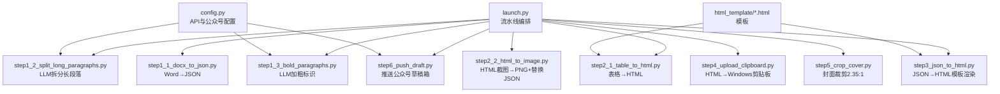
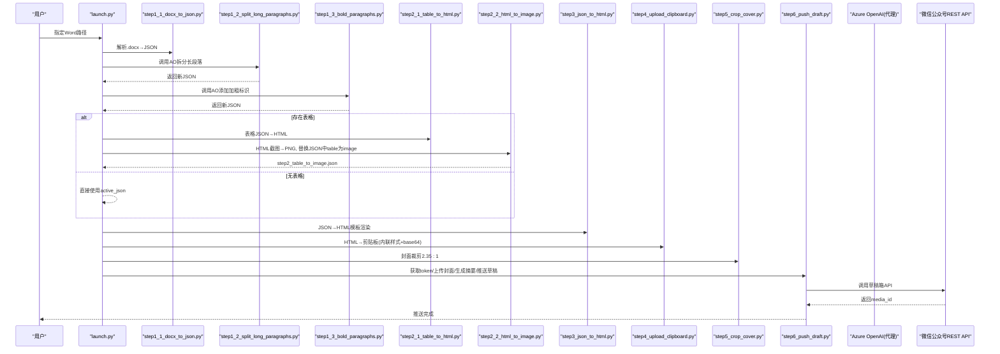
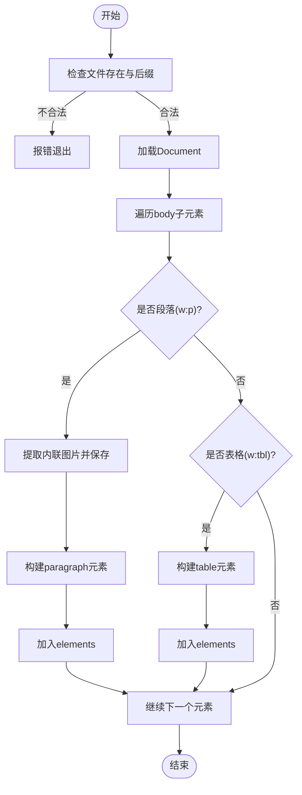
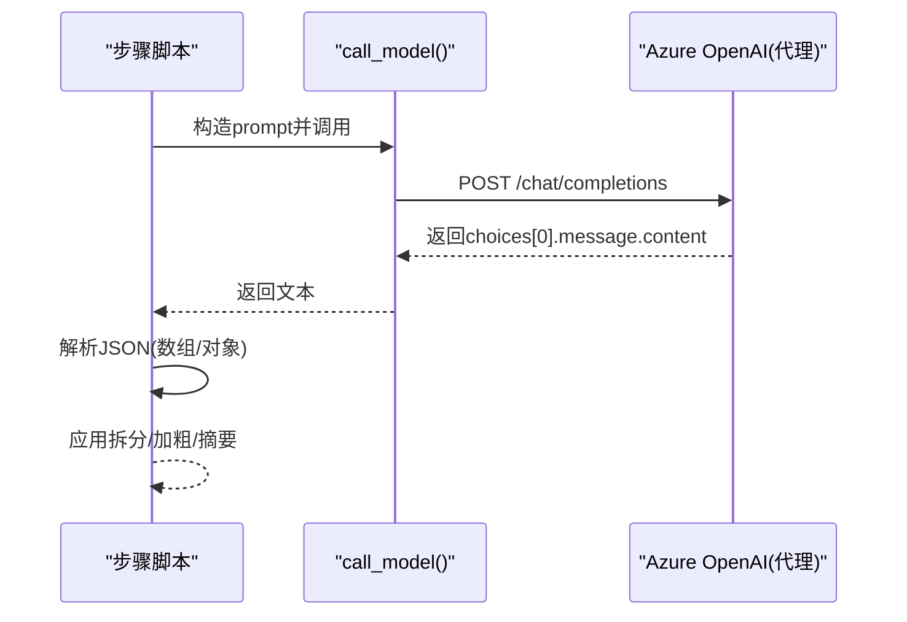
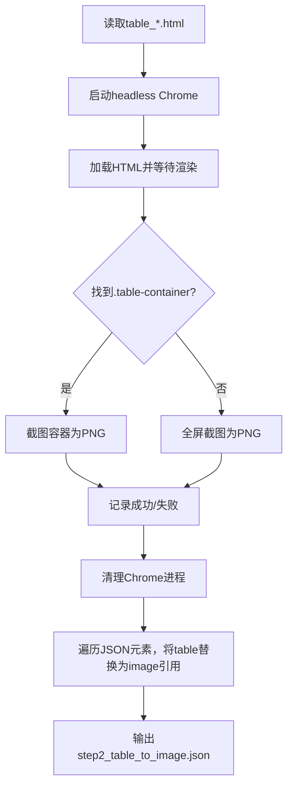
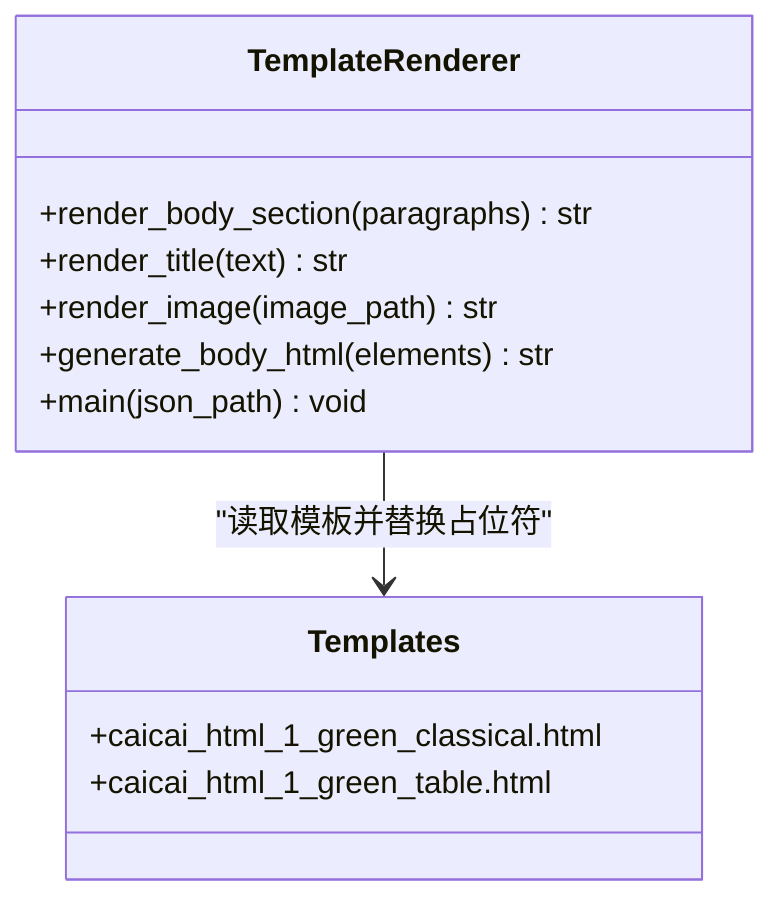
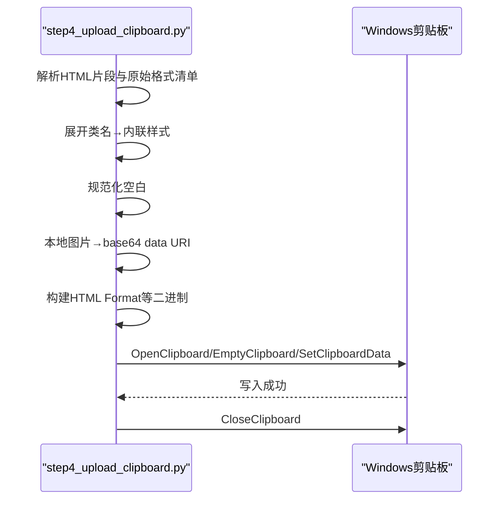
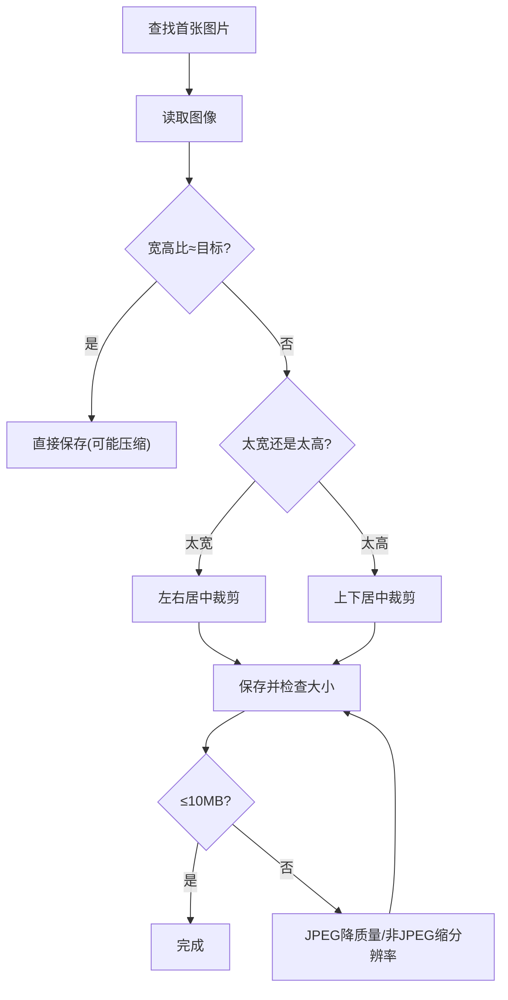
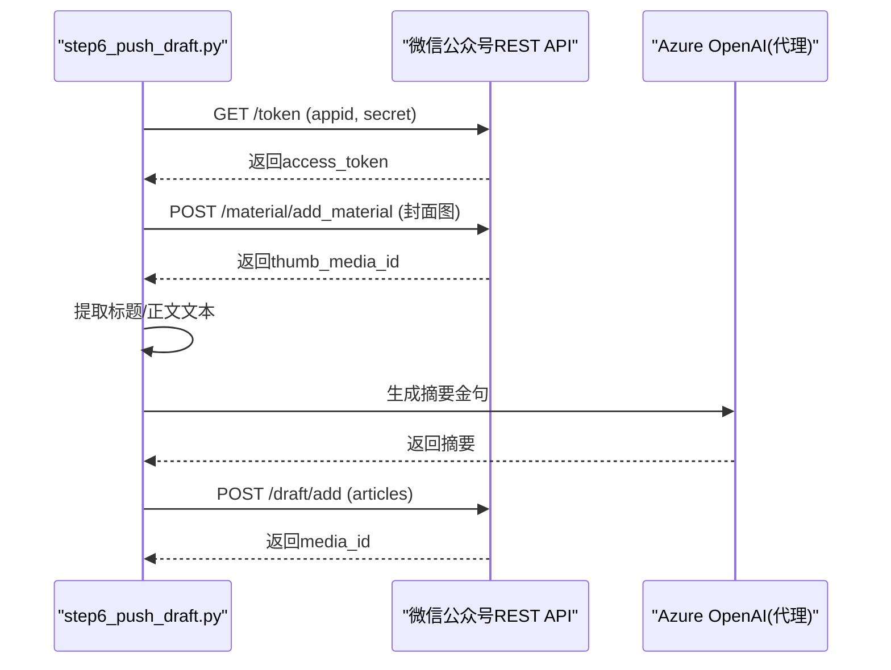
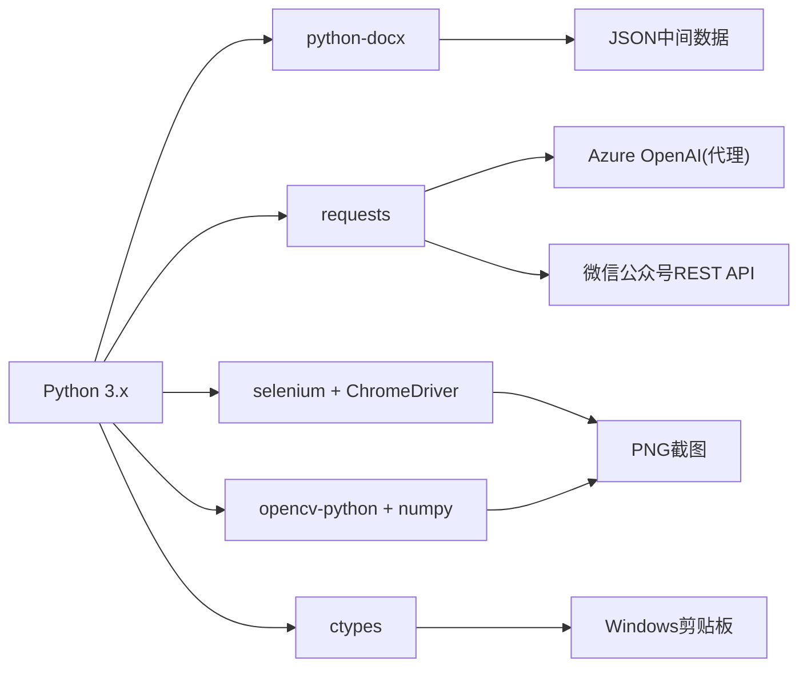

# 技术栈概览

<cite>
**本文引用的文件**   
- [config.py](file://config.py)
- [launch.py](file://launch.py)
- [step1_1_docx_to_json.py](file://step1_1_docx_to_json.py)
- [step1_2_split_long_paragraphs.py](file://step1_2_split_long_paragraphs.py)
- [step1_3_bold_paragraphs.py](file://step1_3_bold_paragraphs.py)
- [step2_1_table_to_html.py](file://step2_1_table_to_html.py)
- [step2_2_html_to_image.py](file://step2_2_html_to_image.py)
- [step3_json_to_html.py](file://step3_json_to_html.py)
- [step4_upload_clipboard.py](file://step4_upload_clipboard.py)
- [step5_crop_cover.py](file://step5_crop_cover.py)
- [step6_push_draft.py](file://step6_push_draft.py)
- [caicai_html_1_green_classical.html](file://html_template/caicai_html_1_green_classical.html)
- [caicai_html_1_green_table.html](file://html_template/caicai_html_1_green_table.html)
</cite>

## 目录
1. [简介](#简介)
2. [项目结构](#项目结构)
3. [核心组件](#核心组件)
4. [架构总览](#架构总览)
5. [详细组件分析](#详细组件分析)
6. [依赖关系分析](#依赖关系分析)
7. [性能与稳定性考量](#性能与稳定性考量)
8. [故障排查指南](#故障排查指南)
9. [结论](#结论)
10. [附录：技术选型说明](#附录技术选型说明)

## 简介
本技术栈概览面向 content_board 项目的开发者与维护者，系统梳理了从 Word 文档到微信公众号草稿箱的自动化流水线所采用的核心技术、关键库与外部服务。重点覆盖以下方面：
- Python 生态与版本要求
- python-docx 用于解析 .docx（段落、表格、图片）
- Azure OpenAI SDK/HTTP 接口用于 AI 内容处理（拆分长段落、加粗标识、摘要金句）
- Pillow/OpenCV 图像处理（封面裁剪与压缩）
- ctypes 实现 Windows 剪贴板多格式写入（HTML Format、纯文本等）
- requests 进行 HTTP 请求（Azure OpenAI 代理、微信公众号 REST API）
- HTML/CSS 模板引擎（字符串替换）、JSON 数据交换格式
- 微信公众号 REST API（access_token、永久素材上传、草稿箱新增）

## 项目结构
项目采用“步骤脚本 + 模板 + 配置”的分层组织方式：
- 顶层为可编排的流水线入口与各步骤脚本
- html_template 存放 HTML 模板
- config.py 集中管理 API 地址、认证头与公众号参数
- content_instance 下按文章实例组织中间产物与输出

图表来源
- [launch.py:42-193](file://launch.py#L42-L193)
- [config.py:6-39](file://config.py#L6-L39)
- [step2_1_table_to_html.py:26-27](file://step2_1_table_to_html.py#L26-L27)
- [step3_json_to_html.py:28-29](file://step3_json_to_html.py#L28-L29)

章节来源
- [launch.py:1-201](file://launch.py#L1-L201)
- [config.py:1-39](file://config.py#L1-L39)

## 核心组件
- 流水线编排器：统一调度各步骤，支持跳过任意步骤，自动检测是否存在表格以决定是否执行表格相关步骤。
- 文档解析器：基于 python-docx 提取段落、表格、内嵌图片，并生成结构化 JSON。
- AI 增强器：通过 HTTP 调用 Azure OpenAI 代理接口，完成段落拆分、总结性加粗标记、摘要金句抽取。
- 表格渲染与截图：将表格 JSON 渲染为带样式的 HTML，使用 Selenium + Chrome 无头模式截图为 PNG，并在 JSON 中将 table 元素替换为 image 引用。
- 模板渲染器：读取 HTML 模板，将 JSON 中的段落、标题、图片渲染为最终 HTML。
- 剪贴板写入器：将 HTML 片段展开为内联样式，本地图片转 base64 data URI，构建 Windows 剪贴板多格式数据并通过 ctypes 写入。
- 封面处理器：查找首张封面图，按 2.35:1 比例中心裁剪，必要时压缩或缩放以满足微信限制。
- 公众号推送器：获取 access_token，上传封面图，生成摘要，推送草稿至公众号草稿箱。

章节来源
- [launch.py:42-193](file://launch.py#L42-L193)
- [step1_1_docx_to_json.py:145-184](file://step1_1_docx_to_json.py#L145-L184)
- [step1_2_split_long_paragraphs.py:80-103](file://step1_2_split_long_paragraphs.py#L80-L103)
- [step1_3_bold_paragraphs.py:73-96](file://step1_3_bold_paragraphs.py#L73-L96)
- [step2_1_table_to_html.py:39-68](file://step2_1_table_to_html.py#L39-L68)
- [step2_2_html_to_image.py:40-101](file://step2_2_html_to_image.py#L40-L101)
- [step3_json_to_html.py:84-115](file://step3_json_to_html.py#L84-L115)
- [step4_upload_clipboard.py:228-268](file://step4_upload_clipboard.py#L228-L268)
- [step5_crop_cover.py:133-171](file://step5_crop_cover.py#L133-L171)
- [step6_push_draft.py:42-79](file://step6_push_draft.py#L42-L79)

## 架构总览
整体流程遵循“输入 → 结构化 → 增强 → 渲染 → 平台适配 → 发布”的链路，数据在步骤间以 JSON 和 HTML 作为主要载体。

图表来源
- [launch.py:70-188](file://launch.py#L70-L188)
- [step1_2_split_long_paragraphs.py:80-103](file://step1_2_split_long_paragraphs.py#L80-L103)
- [step1_3_bold_paragraphs.py:73-96](file://step1_3_bold_paragraphs.py#L73-L96)
- [step2_1_table_to_html.py:74-118](file://step2_1_table_to_html.py#L74-L118)
- [step2_2_html_to_image.py:120-172](file://step2_2_html_to_image.py#L120-L172)
- [step3_json_to_html.py:121-142](file://step3_json_to_html.py#L121-L142)
- [step4_upload_clipboard.py:436-475](file://step4_upload_clipboard.py#L436-L475)
- [step5_crop_cover.py:174-196](file://step5_crop_cover.py#L174-L196)
- [step6_push_draft.py:276-396](file://step6_push_draft.py#L276-L396)

## 详细组件分析

### 组件一：文档解析（python-docx）
- 功能要点
  - 遍历 body 元素，识别 w:p（段落）、w:tbl（表格），并提取内联图片。
  - 段落 runs 合并相邻且 bold 状态相同的片段；标题通过 #/## 前缀识别 heading_level。
  - 表格行/列统计，单元格文本与加粗标记。
  - 输出 elements 列表，包含 type、heading_level、runs、row_count、col_count、data、image_path 等字段。
- 复杂度与边界
  - 时间复杂度 O(N)（N 为文档元素数），空间复杂度取决于元素数量与图片大小。
  - 空段落过滤；图片 rId 不存在时跳过。
- 错误处理
  - 文件不存在或格式非 .docx 直接退出。
  - XML 节点缺失时安全跳过。

图表来源
- [step1_1_docx_to_json.py:145-184](file://step1_1_docx_to_json.py#L145-L184)
- [step1_1_docx_to_json.py:190-226](file://step1_1_docx_to_json.py#L190-L226)

章节来源
- [step1_1_docx_to_json.py:1-233](file://step1_1_docx_to_json.py#L1-L233)

### 组件二：AI 内容增强（requests + Azure OpenAI 代理）
- 功能要点
  - 拆分过长段落：按语义切分，保证拼接后与原文一致。
  - 总结性加粗：识别总结/判断/序列表达，仅标记 bold，不改写文字。
  - 摘要金句：从正文中提取精炼语句作为微信摘要。
- 重试与健壮性
  - 统一的 call_model 封装，指数退避重试，超时保护。
  - 对模型响应进行 JSON 数组/对象解析，兼容代码块包裹与正则提取。
- 提示词工程
  - 明确约束：只能在句号/问号/感叹号/分号后拆分；每段不少于若干字符；不得增删改原文。
  - 加粗频率控制：约每 4~5 段一处，避免过密。

图表来源
- [step1_2_split_long_paragraphs.py:80-103](file://step1_2_split_long_paragraphs.py#L80-L103)
- [step1_3_bold_paragraphs.py:73-96](file://step1_3_bold_paragraphs.py#L73-L96)
- [step6_push_draft.py:188-211](file://step6_push_draft.py#L188-L211)

章节来源
- [step1_2_split_long_paragraphs.py:1-311](file://step1_2_split_long_paragraphs.py#L1-L311)
- [step1_3_bold_paragraphs.py:1-340](file://step1_3_bold_paragraphs.py#L1-L340)
- [step6_push_draft.py:188-246](file://step6_push_draft.py#L188-L246)

### 组件三：表格渲染与截图（HTML模板 + Selenium + Chrome）
- 功能要点
  - 将表格 JSON 渲染为绿色主题 HTML，第一行为 thead，其余为 tbody。
  - 使用 headless Chrome 截图为 PNG，设置高清缩放与窗口位置。
  - 将 JSON 中的 table 元素顺序替换为 image 引用，输出 step2_table_to_image.json。
- 异常与清理
  - 截图超时强制终止 chrome/chromedriver 进程。
  - 无表格时原样复制 JSON 供下游继续使用。

图表来源
- [step2_1_table_to_html.py:39-68](file://step2_1_table_to_html.py#L39-L68)
- [step2_2_html_to_image.py:40-101](file://step2_2_html_to_image.py#L40-L101)
- [step2_2_html_to_image.py:175-210](file://step2_2_html_to_image.py#L175-L210)

章节来源
- [step2_1_table_to_html.py:1-125](file://step2_1_table_to_html.py#L1-L125)
- [step2_2_html_to_image.py:1-218](file://step2_2_html_to_image.py#L1-L218)

### 组件四：模板渲染（HTML/CSS 模板 + 字符串替换）
- 功能要点
  - 读取主模板 caicai_html_1_green_classical.html，将 {{BODY_PLACEHOLDER}} 替换为生成的正文 HTML。
  - 渲染规则：h1 跳过、h2 转为标题 p.title、连续正文合入 section，bold run 用 span.hl 高亮，图片居中。
- 模板与样式
  - 表格模板 caicai_html_1_green_table.html 提供绿色主题与行高同步脚本。

图表来源
- [step3_json_to_html.py:38-115](file://step3_json_to_html.py#L38-L115)
- [caicai_html_1_green_classical.html:187-208](file://html_template/caicai_html_1_green_classical.html#L187-L208)
- [caicai_html_1_green_table.html:59-62](file://html_template/caicai_html_1_green_table.html#L59-L62)

章节来源
- [step3_json_to_html.py:1-149](file://step3_json_to_html.py#L1-L149)
- [caicai_html_1_green_classical.html:1-278](file://html_template/caicai_html_1_green_classical.html#L1-L278)
- [caicai_html_1_green_table.html:1-81](file://html_template/caicai_html_1_green_table.html#L1-L81)

### 组件五：剪贴板写入（ctypes + Windows API）
- 功能要点
  - 解析 <article id="clipboard-content"> 片段，展开简化类名到 Xiumi 风格内联样式。
  - 去除格式化空白，本地图片转 base64 data URI。
  - 构建 HTML Format、CF_UNICODETEXT、CF_TEXT、CF_OEMTEXT、CF_LOCALE 等多格式二进制，通过 user32/kernell32 写入剪贴板。
- 关键点
  - HTML Format 头部字节偏移迭代计算。
  - 运行时注册自定义格式 ID。
  - 打开剪贴板失败重试，内存分配与释放严格配对。

图表来源
- [step4_upload_clipboard.py:72-109](file://step4_upload_clipboard.py#L72-L109)
- [step4_upload_clipboard.py:115-172](file://step4_upload_clipboard.py#L115-L172)
- [step4_upload_clipboard.py:228-268](file://step4_upload_clipboard.py#L228-L268)
- [step4_upload_clipboard.py:371-430](file://step4_upload_clipboard.py#L371-L430)

章节来源
- [step4_upload_clipboard.py:1-480](file://step4_upload_clipboard.py#L1-L480)

### 组件六：封面裁剪与压缩（OpenCV + numpy）
- 功能要点
  - 查找首个图片文件，按 2.35:1 比例中心裁剪。
  - JPEG 质量二分搜索压缩，非 JPEG 则逐步缩小分辨率，确保不超过微信 10MB 限制。
- 健壮性
  - 中文/emoji 路径安全处理，GBK 终端打印 fallback。

图表来源
- [step5_crop_cover.py:133-171](file://step5_crop_cover.py#L133-L171)
- [step5_crop_cover.py:59-107](file://step5_crop_cover.py#L59-L107)

章节来源
- [step5_crop_cover.py:1-203](file://step5_crop_cover.py#L1-L203)

### 组件七：公众号草稿推送（requests + 微信公众号 REST API）
- 功能要点
  - 获取 access_token（client_credential）。
  - 上传永久素材（封面图）获取 media_id。
  - 从 step1_1 JSON 提取 h1 标题（UTF-8 字节截断保护）。
  - 从正文 JSON 提取纯文本，调用大模型生成摘要（最多 128 字）。
  - 调用草稿箱 API 新增草稿，返回 media_id。
- 配置项
  - AppID/AppSecret、作者、评论开关、来源链接等来自 config.py。

图表来源
- [step6_push_draft.py:42-79](file://step6_push_draft.py#L42-L79)
- [step6_push_draft.py:105-127](file://step6_push_draft.py#L105-L127)
- [step6_push_draft.py:146-182](file://step6_push_draft.py#L146-L182)
- [step6_push_draft.py:252-270](file://step6_push_draft.py#L252-L270)

章节来源
- [step6_push_draft.py:1-404](file://step6_push_draft.py#L1-L404)
- [config.py:29-39](file://config.py#L29-L39)

## 依赖关系分析
- 语言与运行时
  - Python 3.x（建议使用 3.9+，便于类型注解与稳定库支持）
- 核心第三方库
  - python-docx：解析 .docx 文档结构与样式
  - requests：HTTP 客户端（Azure OpenAI 代理、微信公众号 API）
  - selenium + ChromeDriver：无头浏览器截图
  - opencv-python + numpy：图像处理（裁剪、压缩、缩放）
  - ctypes：调用 Windows 用户态 API（剪贴板）
- 模板与数据格式
  - HTML/CSS 模板（字符串替换）
  - JSON 作为中间数据交换格式
- 外部服务
  - Azure OpenAI 代理接口（Chat Completions）
  - 微信公众号开放平台 REST API（Token、素材、草稿）

图表来源
- [step1_1_docx_to_json.py:25-28](file://step1_1_docx_to_json.py#L25-L28)
- [step1_2_split_long_paragraphs.py:25-27](file://step1_2_split_long_paragraphs.py#L25-L27)
- [step2_2_html_to_image.py:28-31](file://step2_2_html_to_image.py#L28-L31)
- [step5_crop_cover.py:15-16](file://step5_crop_cover.py#L15-L16)
- [step4_upload_clipboard.py:26-27](file://step4_upload_clipboard.py#L26-L27)
- [config.py:6-17](file://config.py#L6-L17)
- [config.py:32-39](file://config.py#L32-L39)

章节来源
- [config.py:6-39](file://config.py#L6-L39)
- [step1_1_docx_to_json.py:25-28](file://step1_1_docx_to_json.py#L25-L28)
- [step1_2_split_long_paragraphs.py:25-27](file://step1_2_split_long_paragraphs.py#L25-L27)
- [step2_2_html_to_image.py:28-31](file://step2_2_html_to_image.py#L28-L31)
- [step5_crop_cover.py:15-16](file://step5_crop_cover.py#L15-L16)
- [step4_upload_clipboard.py:26-27](file://step4_upload_clipboard.py#L26-L27)

## 性能与稳定性考量
- 网络与重试
  - Azure OpenAI 代理与微信公众号 API 均具备超时与重试机制，建议根据网络状况调整 MAX_RETRIES 与超时时间。
- 截图稳定性
  - 截图过程引入线程定时器，超时强制终止 Chrome 进程，避免僵尸进程占用资源。
- 图片体积控制
  - 封面裁剪后自动压缩，JPEG 质量二分搜索，非 JPEG 通过缩放满足 10MB 限制。
- 剪贴板兼容性
  - 同时写入多种格式（HTML Format、Unicode/ANSI 文本、区域设置），提升粘贴到不同平台的兼容性。
- 模板渲染效率
  - 字符串替换与正则展开开销较低，适合中等规模文章；超大文章建议分段处理或优化正则表达式。

## 故障排查指南
- 无法解析 .docx
  - 确认文件路径正确且后缀为 .docx；检查 python-docx 安装与环境变量。
- AI 调用失败
  - 检查 API_URL、HEADERS 是否正确；查看网络连通性与代理鉴权；关注重试日志。
- 截图失败或超时
  - 确认已安装 Chrome 与 chromedriver；检查 headless 模式是否被安全策略阻止；观察进程清理情况。
- 剪贴板写入失败
  - 确认运行环境为 Windows；检查是否有其他程序独占剪贴板；查看 SetClipboardData 返回值。
- 公众号推送失败
  - 校验 WX_APP_ID/WX_APP_SECRET；检查 access_token 有效期；确认封面图尺寸与大小符合限制；核对草稿字段长度。

章节来源
- [step1_1_docx_to_json.py:190-196](file://step1_1_docx_to_json.py#L190-L196)
- [step1_2_split_long_paragraphs.py:96-103](file://step1_2_split_long_paragraphs.py#L96-L103)
- [step2_2_html_to_image.py:90-114](file://step2_2_html_to_image.py#L90-L114)
- [step4_upload_clipboard.py:371-430](file://step4_upload_clipboard.py#L371-L430)
- [step6_push_draft.py:285-287](file://step6_push_draft.py#L285-L287)

## 结论
content_board 通过清晰的步骤化设计与稳健的错误处理，实现了从 Word 到微信公众号草稿箱的一键式内容生产流水线。其技术选型兼顾易用性与扩展性：python-docx 负责结构化解析，requests 对接外部服务，Selenium 解决复杂渲染截图，OpenCV 保障图片合规，ctypes 打通 Windows 剪贴板，HTML/CSS 模板与 JSON 数据格式贯穿全链路。建议在后续迭代中持续优化提示词工程、截图稳定性与网络重试策略，以提升整体鲁棒性与吞吐能力。

## 附录：技术选型说明
- Python 生态
  - 选择理由：跨平台、丰富的数据处理与 Web 生态、良好的 Windows 集成能力。
  - 版本建议：3.9+（类型注解、稳定库支持）。
- python-docx
  - 选择理由：原生支持 .docx 解析，能准确提取段落、表格、图片与样式信息。
- Azure OpenAI 代理（HTTP）
  - 选择理由：通过统一代理访问 Chat Completions，便于企业级鉴权与流量治理。
- requests
  - 选择理由：简洁易用的 HTTP 客户端，广泛适用于各类 REST API 调用。
- Selenium + Chrome
  - 选择理由：无头浏览器可精确渲染复杂 HTML/CSS，适合高质量截图。
- OpenCV + numpy
  - 选择理由：高性能图像处理，支持裁剪、缩放、压缩与多格式编码。
- ctypes
  - 选择理由：直接调用 Windows 用户态 API，实现多格式剪贴板写入。
- HTML/CSS 模板
  - 选择理由：轻量、直观、易于维护；通过占位符快速注入动态内容。
- JSON
  - 选择理由：结构化、可读性强，适合作为步骤间的数据交换格式。
- 微信公众号 REST API
  - 选择理由：官方标准接口，支持 Token 管理、素材上传与草稿箱操作。