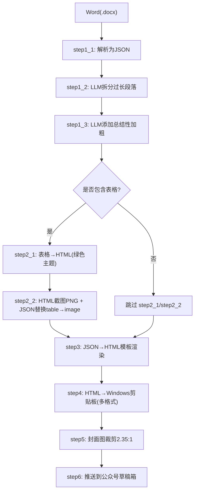
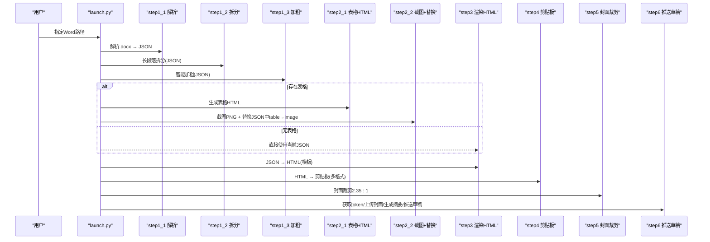
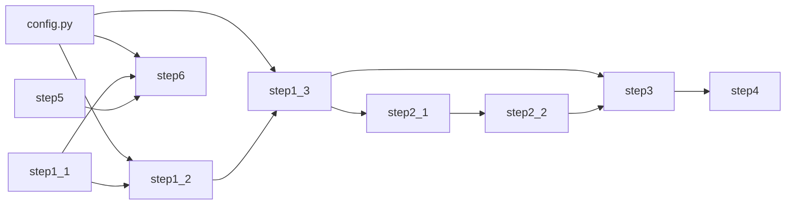

# 核心功能特性

<cite>
**本文引用的文件**
- [config.py](file://config.py)
- [launch.py](file://launch.py)
- [step1_1_docx_to_json.py](file://step1_1_docx_to_json.py)
- [step1_2_split_long_paragraphs.py](file://step1_2_split_long_paragraphs.py)
- [step1_3_bold_paragraphs.py](file://step1_3_bold_paragraphs.py)
- [step2_1_table_to_html.py](file://step2_1_table_to_html.py)
- [step2_2_html_to_image.py](file://step2_2_html_to_image.py)
- [step3_json_to_html.py](file://step3_json_to_html.py)
- [step4_upload_clipboard.py](file://step4_upload_clipboard.py)
- [step5_crop_cover.py](file://step5_crop_cover.py)
- [step6_push_draft.py](file://step6_push_draft.py)
- [caicai_html_1_green_classical.html](file://html_template/caicai_html_1_green_classical.html)
- [caicai_html_1_green_table.html](file://html_template/caicai_html_1_green_table.html)
</cite>

## 目录
1. [简介](#简介)
2. [项目结构](#项目结构)
3. [核心组件](#核心组件)
4. [架构总览](#架构总览)
5. [详细组件分析](#详细组件分析)
6. [依赖关系分析](#依赖关系分析)
7. [性能与稳定性](#性能与稳定性)
8. [故障排查指南](#故障排查指南)
9. [结论](#结论)
10. [附录：使用示例与效果展示](#附录使用示例与效果展示)

## 简介
content_board 是一套面向微信公众号内容生产的自动化流水线，支持从 Word 文档一键生成可粘贴到公众号编辑器的富文本，并可选自动推送至草稿箱。其核心能力包括：
- Word 文档自动解析与结构化转换
- Azure OpenAI 驱动的 AI 内容增强（智能段落拆分、自动加粗标注）
- 表格数据处理与图像生成
- HTML 模板渲染与样式适配
- Windows 剪贴板多格式集成
- 微信公众号草稿箱自动推送

## 项目结构
项目采用“按步骤拆分”的模块化设计，每个处理环节独立为脚本，通过统一入口 launch.py 串联执行。数据以 JSON 在步骤间流转，HTML 作为最终产物用于剪贴板与微信推送。

图表来源
- [launch.py:42-193](file://launch.py#L42-L193)
- [step1_1_docx_to_json.py:190-233](file://step1_1_docx_to_json.py#L190-L233)
- [step1_2_split_long_paragraphs.py:198-301](file://step1_2_split_long_paragraphs.py#L198-L301)
- [step1_3_bold_paragraphs.py:207-330](file://step1_3_bold_paragraphs.py#L207-L330)
- [step2_1_table_to_html.py:74-118](file://step2_1_table_to_html.py#L74-L118)
- [step2_2_html_to_image.py:120-210](file://step2_2_html_to_image.py#L120-L210)
- [step3_json_to_html.py:121-143](file://step3_json_to_html.py#L121-L143)
- [step4_upload_clipboard.py:436-476](file://step4_upload_clipboard.py#L436-L476)
- [step5_crop_cover.py:174-196](file://step5_crop_cover.py#L174-L196)
- [step6_push_draft.py:276-397](file://step6_push_draft.py#L276-L397)

章节来源
- [launch.py:1-201](file://launch.py#L1-L201)

## 核心组件
- 配置中心：集中管理 API 地址、请求头、重试策略、阈值与公众号参数
- 编排器：统一调度各步骤，支持按需跳过，自动检测表格存在与否
- 解析器：将 .docx 的结构化元素（段落、表格、图片）抽取为 JSON
- 增强器：调用大模型进行语义拆分与加粗标注
- 渲染器：基于模板将 JSON 渲染为 HTML，并适配剪贴板与微信生态
- 平台集成：Windows 剪贴板多格式写入；微信公众号草稿箱上传与推送

章节来源
- [config.py:1-39](file://config.py#L1-L39)
- [launch.py:28-38](file://launch.py#L28-L38)

## 架构总览
整体采用“输入→中间态(JSON)→输出(HTML/图片/剪贴板/草稿)”的分层流水线，关键节点如下：
- 输入：Word 文档
- 中间态：step1_x / step2_x JSON
- 输出：HTML、PNG、剪贴板、公众号草稿

图表来源
- [launch.py:42-193](file://launch.py#L42-L193)
- [step1_1_docx_to_json.py:190-233](file://step1_1_docx_to_json.py#L190-L233)
- [step1_2_split_long_paragraphs.py:198-301](file://step1_2_split_long_paragraphs.py#L198-L301)
- [step1_3_bold_paragraphs.py:207-330](file://step1_3_bold_paragraphs.py#L207-L330)
- [step2_1_table_to_html.py:74-118](file://step2_1_table_to_html.py#L74-L118)
- [step2_2_html_to_image.py:120-210](file://step2_2_html_to_image.py#L120-L210)
- [step3_json_to_html.py:121-143](file://step3_json_to_html.py#L121-L143)
- [step4_upload_clipboard.py:436-476](file://step4_upload_clipboard.py#L436-L476)
- [step5_crop_cover.py:174-196](file://step5_crop_cover.py#L174-L196)
- [step6_push_draft.py:276-397](file://step6_push_draft.py#L276-L397)

## 详细组件分析

### 功能一：Word 文档自动解析和结构化转换
- 技术实现原理
  - 使用 python-docx 遍历 body 中的段落、表格、内联图片，提取 runs 的 bold 状态与文本
  - 识别标题前缀 #/##，映射 heading_level
  - 将图片二进制保存到 images 目录，并在 JSON 中以 image 元素引用
- 输入/输出格式
  - 输入：.docx 文件路径
  - 输出：process/step1_1_docx_to_json.json；process/images/image_{n}.png
  - JSON 元素类型：paragraph（含 heading_level、runs）、table（行列数与单元格数据）、image（文件名与相对路径）
- 配置选项
  - 无额外参数，默认输出到输入文件同目录 process 子文件夹
- 使用场景
  - 批量将排版好的 Word 文章转为结构化 JSON，便于后续 AI 增强与模板渲染
- 效果展示
  - 可在 content_instance 下查看生成的 JSON 与图片目录，确认段落、表格、图片顺序一致

章节来源
- [step1_1_docx_to_json.py:190-233](file://step1_1_docx_to_json.py#L190-L233)
- [content_instance/content_20260710_1/process/step1_1_docx_to_json.json:1-200](file://content_instance/content_20260710_1/process/step1_1_docx_to_json.json#L1-L200)

### 功能二：Azure OpenAI 驱动的 AI 内容增强（智能段落拆分、自动加粗标注）
- 技术实现原理
  - 调用 Azure OpenAI 兼容接口，发送提示词，返回 JSON 数组或对象
  - 拆分：对超长 run 按语义切分，要求拼接后与原文完全一致
  - 加粗：按标题分段，识别总结/判断/序列表达，仅标记 bold，不改动文字
- 输入/输出格式
  - 输入：step1_1 JSON（或上一步输出）
  - 输出：step1_2_split_paragraphs.json、step1_3_bold_paragraphs.json
- 配置选项
  - API_URL、HEADERS、MAX_RETRIES、MAX_TOKENS、SPLIT_THRESHOLD（见 config.py）
- 使用场景
  - 提升可读性与排版质量，减少长段，突出关键句
- 效果展示
  - 对比 step1_1 与 step1_2/step1_3 JSON，观察新增段落与 bold 标记

章节来源
- [config.py:6-24](file://config.py#L6-L24)
- [step1_2_split_long_paragraphs.py:198-301](file://step1_2_split_long_paragraphs.py#L198-L301)
- [step1_3_bold_paragraphs.py:207-330](file://step1_3_bold_paragraphs.py#L207-L330)

### 功能三：表格数据处理和图像生成
- 技术实现原理
  - 读取 JSON 中的 table 元素，按绿色主题模板生成独立 HTML
  - 使用 Selenium + Chrome 无头模式截图为 PNG，带超时保护与进程清理
  - 将 JSON 中的 table 元素替换为 image 引用，供后续渲染
- 输入/输出格式
  - 输入：step1_* JSON；模板 caicai_html_1_green_table.html
  - 输出：process/table/table_{n}.html、process/table/table_{n}.png、process/step2_table_to_image.json
- 配置选项
  - 模板占位符 {{TABLE_PLACEHOLDER}}；Chrome 截图超时 CHROME_TIMEOUT
- 使用场景
  - 复杂表格在公众号编辑器中稳定显示，避免跨平台渲染差异
- 效果展示
  - 打开 table_{n}.html 预览样式；PNG 可直接嵌入文章

章节来源
- [step2_1_table_to_html.py:74-118](file://step2_1_table_to_html.py#L74-L118)
- [step2_2_html_to_image.py:120-210](file://step2_2_html_to_image.py#L120-L210)
- [caicai_html_1_green_table.html:1-81](file://html_template/caicai_html_1_green_table.html#L1-L81)

### 功能四：HTML 模板渲染和样式适配
- 技术实现原理
  - 根据 JSON elements 生成正文片段：标题、正文段落、高亮 span、图片居中
  - 插入到主模板 caicai_html_1_green_classical.html 的 {{BODY_PLACEHOLDER}} 位置
  - 后续剪贴板步骤会将 class 展开为内联样式，确保粘贴兼容性
- 输入/输出格式
  - 输入：step2_table_to_image.json（若无表格则用 step1_* JSON）
  - 输出：process/step3_json_to_html.html
- 配置选项
  - 模板路径、正文 section 样式常量
- 使用场景
  - 快速产出符合公众号风格的富文本页面
- 效果展示
  - 打开 step3_json_to_html.html 即可预览最终排版

章节来源
- [step3_json_to_html.py:121-143](file://step3_json_to_html.py#L121-L143)
- [caicai_html_1_green_classical.html:187-208](file://html_template/caicai_html_1_green_classical.html#L187-L208)

### 功能五：Windows 剪贴板多格式集成
- 技术实现原理
  - 解析 HTML 片段，展开 class 为内联样式，去除格式化空白
  - 本地图片转 base64 data URI，构建 Windows 剪贴板所需的多格式二进制（HTML Format、CF_UNICODETEXT、CF_TEXT/OEMTEXT、CF_LOCALE 等）
  - 通过 ctypes 调用 user32/kernel32 写入系统剪贴板
- 输入/输出格式
  - 输入：step3_json_to_html.html
  - 输出：系统剪贴板（同时保存内联样式 HTML 到 step4_upload_clipboard.html）
- 配置选项
  - 无显式参数，自动定位图片路径并内嵌
- 使用场景
  - 一键复制富文本到公众号编辑器，保留样式与图片
- 效果展示
  - 运行后直接在公众号编辑器 Ctrl+V 粘贴，所见即所得

章节来源
- [step4_upload_clipboard.py:436-476](file://step4_upload_clipboard.py#L436-L476)

### 功能六：微信公众号草稿箱自动推送
- 技术实现原理
  - 通过 AppID/AppSecret 获取 access_token
  - 上传永久素材（封面图），缓存 media_id
  - 从 JSON 提取标题与正文，调用大模型生成摘要金句
  - 调用草稿箱 API 创建草稿（content 可为空占位）
- 输入/输出格式
  - 输入：step1_1 JSON（标题）、step1_3/step1_2 JSON（正文）、step5_crop_cover.*（封面）
  - 输出：公众号草稿（返回 media_id）
- 配置选项
  - WX_APP_ID、WX_APP_SECRET、WX_API_BASE、WX_AUTHOR、WX_CONTENT_SOURCE_URL、评论开关等（见 config.py）
- 使用场景
  - 半自动化发布流程，减少重复操作
- 效果展示
  - 登录公众号后台草稿箱可见新建条目

章节来源
- [config.py:29-39](file://config.py#L29-L39)
- [step6_push_draft.py:276-397](file://step6_push_draft.py#L276-L397)

## 依赖关系分析
- 外部依赖
  - requests：HTTP 客户端（AI 接口、微信 API）
  - selenium + Chrome：表格 HTML 截图
  - opencv-python/numpy：封面图裁剪与压缩
  - python-docx：Word 解析
  - ctypes：Windows 剪贴板写入
- 内部模块耦合
  - launch.py 作为编排器，强依赖各 step 的 main 函数签名与输出路径约定
  - step1_x 系列共享 config 中的 API 与阈值
  - step2_x 依赖 step1 的输出与模板文件
  - step3 依赖 step2 的最终 JSON 与主模板
  - step4 依赖 step3 的 HTML 结构与图片路径
  - step6 依赖 step1/step5 产物与 config 的公众号配置

图表来源
- [config.py:1-39](file://config.py#L1-L39)
- [launch.py:42-193](file://launch.py#L42-L193)

章节来源
- [launch.py:1-201](file://launch.py#L1-L201)
- [config.py:1-39](file://config.py#L1-L39)

## 性能与稳定性
- 网络与并发
  - AI 接口具备重试机制与指数退避，建议合理设置 MAX_RETRIES 与 MAX_TOKENS
  - 微信 API 需关注 token 有效期与频率限制
- 截图稳定性
  - 提供超时保护与进程强制终止，避免 Chrome 卡死
  - 建议在服务器环境安装 headless Chrome 并关闭 GPU
- 图像处理
  - 封面裁剪支持 JPEG quality 二分搜索与非 JPEG 分辨率缩放，确保不超过 10MB
- 剪贴板写入
  - 多次尝试打开剪贴板，失败时给出明确错误信息

[本节为通用指导，无需代码来源]

## 故障排查指南
- AI 接口失败
  - 检查 API_URL、HEADERS 是否正确；确认网络可达与鉴权有效
  - 查看日志中的重试与等待时间
- 段落拆分不一致
  - 若拼接校验失败，会回退原段落；请检查 prompt 与原文本编码（NBSP 处理）
- 表格截图失败
  - 确认已安装 Chrome 与 selenium；检查 CHROME_TIMEOUT 与系统权限
- 剪贴板写入失败
  - 确认以管理员权限运行；检查是否有其他程序占用剪贴板
- 微信推送失败
  - 核对 WX_APP_ID/WX_APP_SECRET；检查封面图是否存在且大小合规；查看草稿 API 返回码

章节来源
- [step1_2_split_long_paragraphs.py:247-272](file://step1_2_split_long_paragraphs.py#L247-L272)
- [step2_2_html_to_image.py:64-115](file://step2_2_html_to_image.py#L64-L115)
- [step4_upload_clipboard.py:371-431](file://step4_upload_clipboard.py#L371-L431)
- [step6_push_draft.py:42-79](file://step6_push_draft.py#L42-L79)

## 结论
content_board 通过清晰的步骤化设计与稳定的中间态 JSON，实现了从 Word 到公众号发布的端到端自动化。借助 Azure OpenAI 的内容增强与模板渲染，显著提升了内容生产的质量与效率；结合剪贴板与微信 API 的集成，进一步降低了人工操作成本。

[本节为总结，无需代码来源]

## 附录：使用示例与效果展示
- 一键流水线
  - 修改 launch.py 末尾 input_path 指向目标 .docx，直接运行
  - 可通过 SKIP_STEP* 控制是否执行某一步骤
- 单独运行某步
  - 例如：python step1_1_docx_to_json.py 仅做解析
  - 例如：python step3_json_to_html.py 仅做渲染
- 效果验证
  - 打开 content_instance 对应实例的 process 目录，查看 JSON、HTML、PNG 产物
  - 在公众号编辑器中粘贴 step4 输出的剪贴板内容，验证样式与图片

章节来源
- [launch.py:196-201](file://launch.py#L196-L201)
- [content_instance/content_20260710_1/process/step3_json_to_html.html:1-200](file://content_instance/content_20260710_1/process/step3_json_to_html.html#L1-L200)