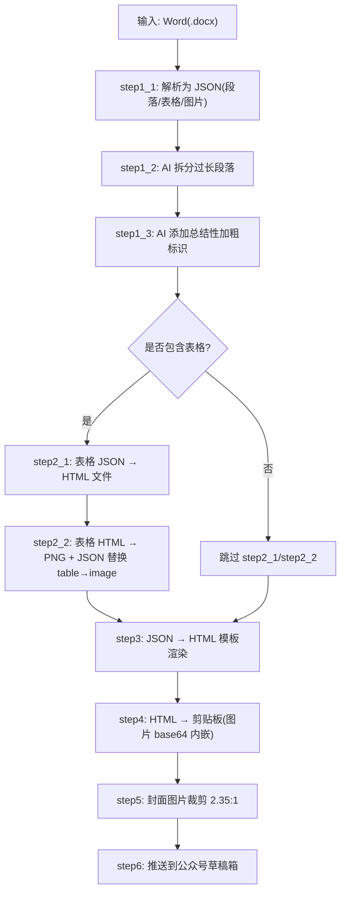
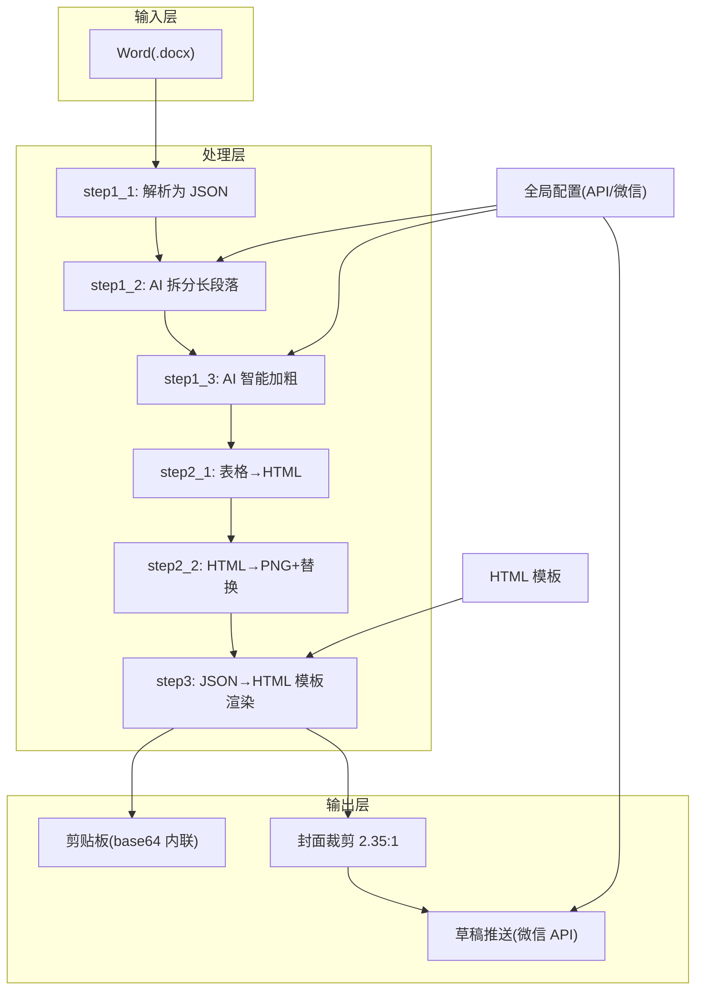
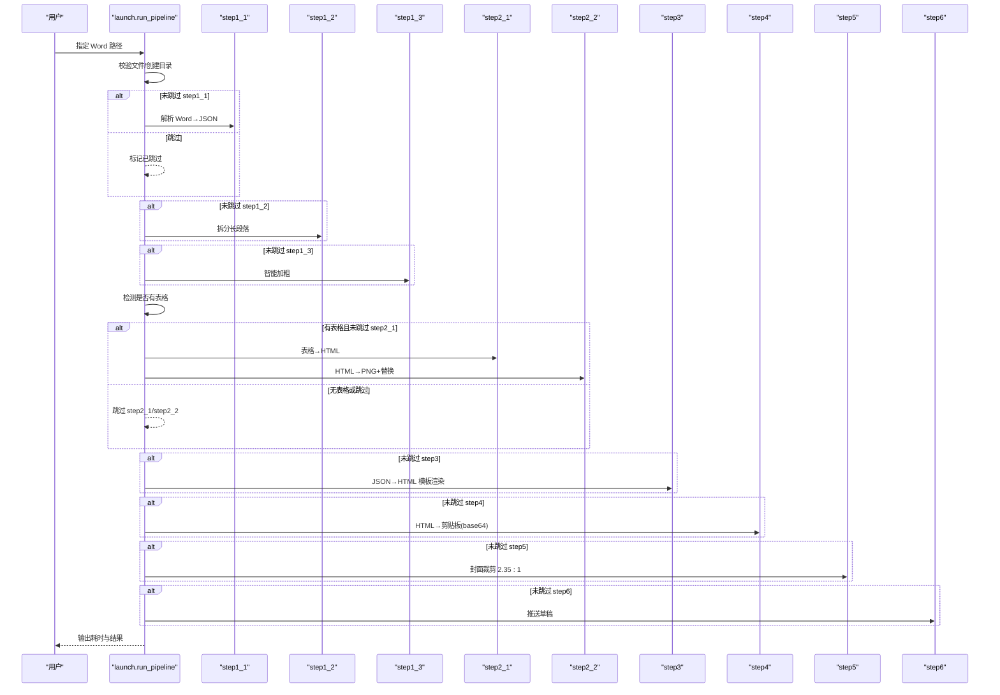
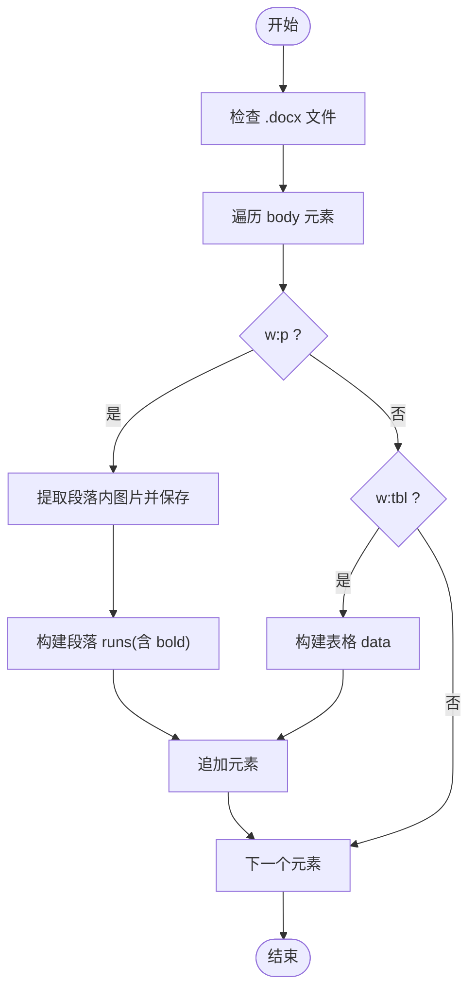
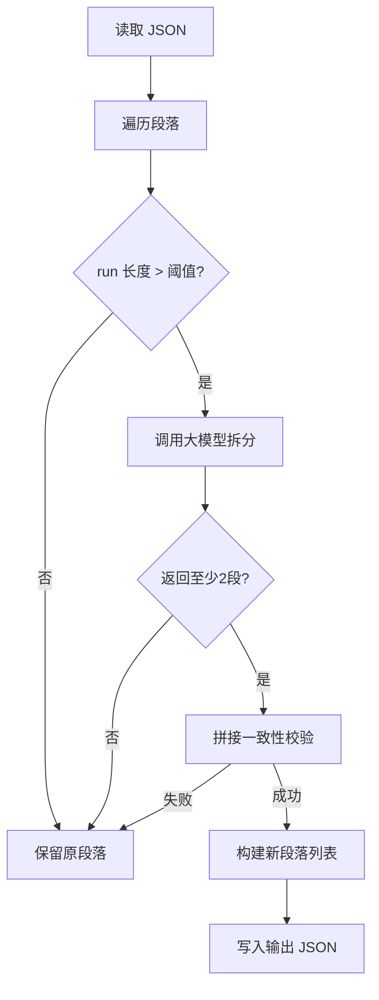
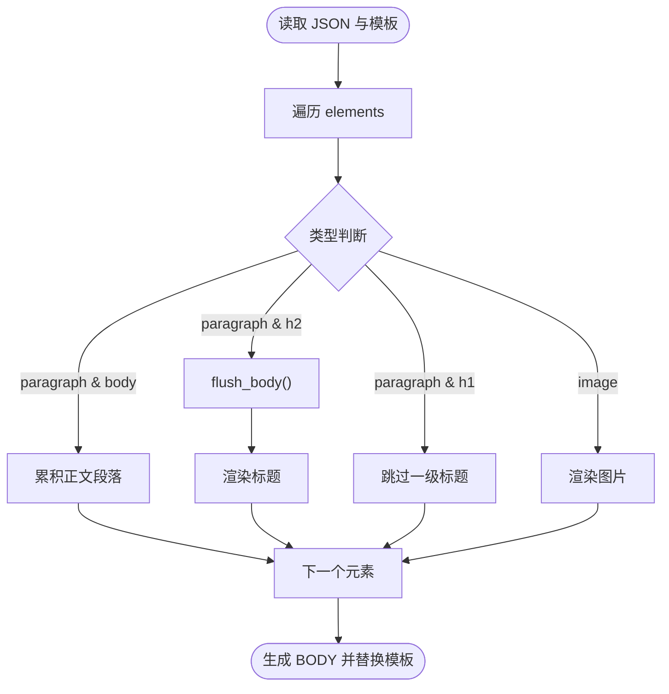
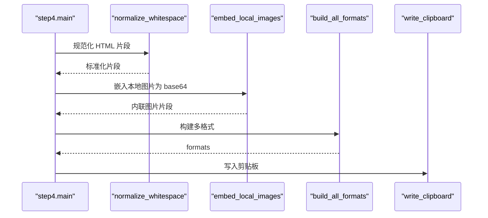
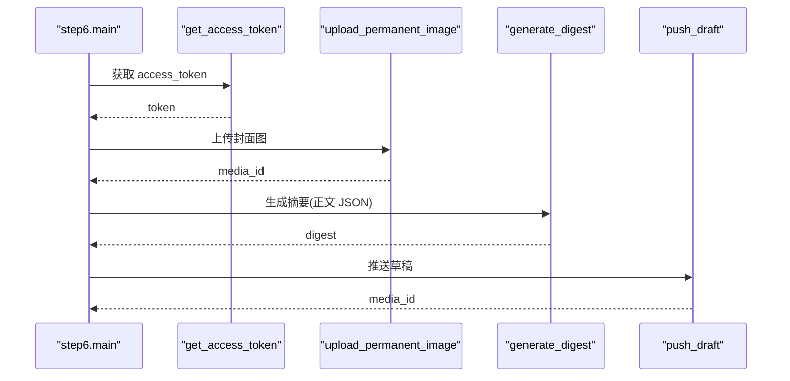
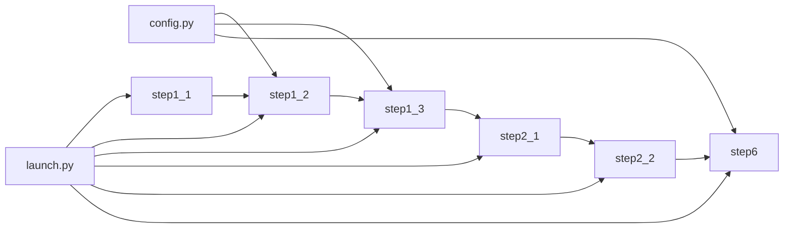

# 项目介绍

<cite>
**本文引用的文件**   
- [launch.py](file://launch.py)
- [config.py](file://config.py)
- [step1_1_docx_to_json.py](file://step1_1_docx_to_json.py)
- [step1_2_split_long_paragraphs.py](file://step1_2_split_long_paragraphs.py)
- [step1_3_bold_paragraphs.py](file://step1_3_bold_paragraphs.py)
- [step2_1_table_to_html.py](file://step2_1_table_to_html.py)
- [step2_2_html_to_image.py](file://step2_2_html_to_image.py)
- [step3_json_to_html.py](file://step3_json_to_html.py)
- [step4_upload_clipboard.py](file://step4_upload_clipboard.py)
- [step5_crop_cover.py](file://step5_crop_cover.py)
- [step6_push_draft.py](file://step6_push_draft.py)
- [caicai_html_1_green_classical.html](file://html_template/caicai_html_1_green_classical.html)
</cite>

## 目录
1. [引言](#引言)
2. [项目结构](#项目结构)
3. [核心组件](#核心组件)
4. [架构总览](#架构总览)
5. [详细组件分析](#详细组件分析)
6. [依赖关系分析](#依赖关系分析)
7. [性能与体验优化建议](#性能与体验优化建议)
8. [故障排查指南](#故障排查指南)
9. [结论](#结论)

## 引言
content_board 是一个面向微信公众号内容生产的 Python 工具系统，核心目标是将 Word 文档一键自动化转换为可直接粘贴到公众号编辑器的富文本格式，并支持后续封面裁剪、草稿推送等完整发布流程。它致力于解决传统手动复制粘贴到公众号编辑器时效率低下、格式丢失、图片处理繁琐、排版不一致等痛点，通过“结构化解析 + AI 智能优化 + 模板渲染 + 剪贴板/接口集成”的一体化流水线，显著降低人工成本，提升内容产出质量与一致性。

主要优势：
- 一键式自动化处理：从 Word 到剪贴板或草稿箱的端到端流水线，减少重复劳动
- AI 智能内容优化：自动拆分过长段落、智能识别需要加粗的关键句，提升可读性
- 多格式支持：Word（.docx）、HTML 模板、PNG/JPG 图片、JSON 中间态
- 完整的发布流程集成：自动生成正文 HTML、内嵌图片 base64、封面图裁剪、推送到公众号草稿箱

## 项目结构
项目采用“按步骤拆分 + 统一编排”的结构化设计，每个处理环节独立为脚本，便于单独调试与复用；顶层 launch.py 负责串联所有步骤，形成可配置的可跳过流水线。

图表来源
- [launch.py:1-200](file://launch.py#L1-L200)
- [step1_1_docx_to_json.py:1-200](file://step1_1_docx_to_json.py#L1-L200)
- [step1_2_split_long_paragraphs.py:198-278](file://step1_2_split_long_paragraphs.py#L198-L278)
- [step1_3_bold_paragraphs.py:207-339](file://step1_3_bold_paragraphs.py#L207-L339)
- [step2_1_table_to_html.py](file://step2_1_table_to_html.py)
- [step2_2_html_to_image.py](file://step2_2_html_to_image.py)
- [step3_json_to_html.py:1-149](file://step3_json_to_html.py#L1-L149)
- [step4_upload_clipboard.py:445-479](file://step4_upload_clipboard.py#L445-L479)
- [step5_crop_cover.py](file://step5_crop_cover.py)
- [step6_push_draft.py:268-306](file://step6_push_draft.py#L268-L306)

章节来源
- [launch.py:1-200](file://launch.py#L1-L200)
- [config.py:1-39](file://config.py#L1-L39)

## 核心组件
- 入口编排器：提供可配置的步骤开关，自动派生路径、检测表格存在与否、串联各步骤并输出耗时统计
- 数据解析器：将 Word 文档中的段落、表格、图片提取为结构化 JSON，保留标题层级与加粗信息
- AI 增强器：调用大模型对长段落进行语义拆分，并对关键句进行智能加粗标注
- 渲染器：将 JSON 元素渲染为符合公众号阅读体验的 HTML，套用主题模板
- 剪贴板集成：将最终 HTML 转为剪贴板可用格式，自动内联图片为 base64，确保粘贴后样式不丢失
- 发布集成：上传封面图、生成摘要、推送至公众号草稿箱，完成发布前最后一步

章节来源
- [launch.py:42-193](file://launch.py#L42-L193)
- [step1_1_docx_to_json.py:145-200](file://step1_1_docx_to_json.py#L145-L200)
- [step1_2_split_long_paragraphs.py:198-278](file://step1_2_split_long_paragraphs.py#L198-L278)
- [step1_3_bold_paragraphs.py:207-339](file://step1_3_bold_paragraphs.py#L207-L339)
- [step3_json_to_html.py:84-149](file://step3_json_to_html.py#L84-L149)
- [step4_upload_clipboard.py:445-479](file://step4_upload_clipboard.py#L445-L479)
- [step6_push_draft.py:268-306](file://step6_push_draft.py#L268-L306)

## 架构总览
整体架构围绕“输入 → 结构化 → 增强 → 渲染 → 输出/发布”的主线展开，AI 能力贯穿内容优化阶段，模板与剪贴板/接口作为输出通道。

图表来源
- [launch.py:1-200](file://launch.py#L1-L200)
- [step3_json_to_html.py:1-149](file://step3_json_to_html.py#L1-L149)
- [caicai_html_1_green_classical.html:1-200](file://html_template/caicai_html_1_green_classical.html#L1-L200)
- [config.py:1-39](file://config.py#L1-L39)

## 详细组件分析

### 入口编排器（launch.py）
- 功能要点
  - 定义步骤开关，支持选择性执行
  - 自动创建 process 与 table 目录
  - 动态检测 JSON 中是否存在表格，决定是否执行表格相关步骤
  - 根据已执行步骤选择正确的输入 JSON 供下游使用
  - 打印每步进度与总耗时
- 关键流程
  - 校验输入文件存在且为 .docx
  - 顺序调用 step1_1 → step1_2 → step1_3 → step2_1 → step2_2 → step3 → step4 → step5 → step6
  - 若某步被跳过，则回退到上一个有效 JSON 作为输入

图表来源
- [launch.py:42-193](file://launch.py#L42-L193)

章节来源
- [launch.py:1-200](file://launch.py#L1-L200)

### 数据解析器（step1_1_docx_to_json.py）
- 功能要点
  - 解析段落、表格、图片，输出结构化 JSON
  - 标题识别：以 # 或 ## 开头识别 heading_level=1/2
  - 合并相邻且加粗状态相同的 run，减少冗余片段
  - 提取内联图片并保存到 images 目录
- 数据结构
  - 段落：type, heading_level, runs[{text,bold}]
  - 表格：type, row_count, col_count, data[[{text,bold}]]
  - 图片：type, file_name, image_path

图表来源
- [step1_1_docx_to_json.py:145-200](file://step1_1_docx_to_json.py#L145-L200)

章节来源
- [step1_1_docx_to_json.py:1-200](file://step1_1_docx_to_json.py#L1-L200)

### AI 增强器（step1_2 / step1_3）
- 长段落拆分（step1_2）
  - 基于阈值检测超长 run，调用大模型返回合理分段数组
  - 拼接一致性校验，确保拆分前后原文一致
  - 将原段落拆分为多个新段落元素，保持 index 关联
- 智能加粗（step1_3）
  - 分组读取正文段落，构造提示词，让模型返回需加粗的文本片段
  - 应用加粗时避免重复标注已有加粗的段落
  - 记录调用次数与加粗位置，便于审计

图表来源
- [step1_2_split_long_paragraphs.py:198-278](file://step1_2_split_long_paragraphs.py#L198-L278)
- [step1_3_bold_paragraphs.py:207-339](file://step1_3_bold_paragraphs.py#L207-L339)

章节来源
- [step1_2_split_long_paragraphs.py:198-278](file://step1_2_split_long_paragraphs.py#L198-L278)
- [step1_3_bold_paragraphs.py:207-339](file://step1_3_bold_paragraphs.py#L207-L339)

### 渲染器（step3_json_to_html.py）
- 功能要点
  - 读取 JSON elements，按规则生成正文 HTML
  - 标题处理：heading_level=1 跳过，heading_level=2 渲染为小标题
  - 正文段落合并入 <section>，空行分隔，加粗用 
  - 图片居中显示，路径统一为正斜杠
  - 替换模板中的占位符，输出完整页面

图表来源
- [step3_json_to_html.py:84-149](file://step3_json_to_html.py#L84-L149)
- [caicai_html_1_green_classical.html:1-200](file://html_template/caicai_html_1_green_classical.html#L1-L200)

章节来源
- [step3_json_to_html.py:1-149](file://step3_json_to_html.py#L1-L149)
- [caicai_html_1_green_classical.html:1-200](file://html_template/caicai_html_1_green_classical.html#L1-L200)

### 剪贴板集成（step4_upload_clipboard.py）
- 功能要点
  - 将生成的 HTML 片段扩展为 Xiumi 兼容的内联样式
  - 规范化空白字符，去除多余格式化空格
  - 本地图片嵌入为 base64 data URI，保证剪贴板粘贴后图片不丢失
  - 构建多种格式写入剪贴板，提高兼容性

图表来源
- [step4_upload_clipboard.py:445-479](file://step4_upload_clipboard.py#L445-L479)

章节来源
- [step4_upload_clipboard.py:445-479](file://step4_upload_clipboard.py#L445-L479)

### 发布集成（step6_push_draft.py）
- 功能要点
  - 获取 access_token（AppID/Secret）
  - 从 step1_1 JSON 提取标题
  - 从正文 JSON 生成摘要（AI），限制 128 字
  - 上传封面图获取 media_id
  - 调用草稿箱 API 新增草稿，返回 media_id
- 配置项
  - WX_APP_ID、WX_APP_SECRET、WX_API_BASE
  - WX_AUTHOR、WX_CONTENT_SOURCE_URL、评论开关等

图表来源
- [step6_push_draft.py:268-306](file://step6_push_draft.py#L268-L306)
- [config.py:29-39](file://config.py#L29-L39)

章节来源
- [step6_push_draft.py:268-306](file://step6_push_draft.py#L268-L306)
- [config.py:1-39](file://config.py#L1-L39)

## 依赖关系分析
- 模块耦合
  - launch.py 作为编排器，低耦合地调用各步骤 main 函数
  - 各步骤之间通过 JSON 中间态解耦，便于单独运行与调试
- 外部依赖
  - AI 服务：通过 config.py 中的 API_URL 与 HEADERS 访问大模型
  - 微信 API：通过 requests 调用 token、素材上传、草稿新增接口
- 潜在循环依赖
  - 当前设计为单向流水线，未见循环导入
- 接口契约
  - JSON 结构在各步骤间保持一致（elements 列表、type 字段）
  - HTML 模板通过 {{BODY_PLACEHOLDER}} 占位符注入正文

图表来源
- [launch.py:1-200](file://launch.py#L1-L200)
- [config.py:1-39](file://config.py#L1-L39)

章节来源
- [launch.py:1-200](file://launch.py#L1-L200)
- [config.py:1-39](file://config.py#L1-L39)

## 性能与体验优化建议
- 并行与缓存
  - 对 AI 调用增加重试与超时控制，避免单次失败阻塞整条流水线
  - 对图片处理与 HTML 渲染引入缓存机制，避免重复计算
- 资源管理
  - 控制图片尺寸与数量，避免剪贴板过大导致粘贴失败
  - 对长文章分块处理，降低单次请求负载
- 用户体验
  - 在控制台输出更详细的进度与错误定位信息
  - 提供预览模式，仅渲染 HTML 不写入剪贴板，便于快速验证

[本节为通用指导，无需源码引用]

## 故障排查指南
- 常见错误
  - 文件不存在或格式不支持：确认输入为 .docx 且路径正确
  - AI 调用失败：检查 API_URL、HEADERS 与网络连通性
  - 微信接口报错：核对 WX_APP_ID、WX_APP_SECRET 与权限
  - 剪贴板粘贴异常：检查图片是否成功内联为 base64
- 定位方法
  - 逐步启用 SKIP 标志，隔离问题步骤
  - 查看 process 目录下的中间 JSON/HTML 文件，比对结构与内容
  - 关注控制台输出的调用次数、长度与错误码

章节来源
- [launch.py:42-193](file://launch.py#L42-L193)
- [step6_push_draft.py:268-306](file://step6_push_draft.py#L268-L306)
- [config.py:1-39](file://config.py#L1-L39)

## 结论
content_board 通过清晰的模块化设计与可配置的流水线编排，将 Word 文档到微信公众号发布的复杂流程简化为“一键操作”。借助 AI 智能优化与模板渲染，既保证了内容质量与一致性，又大幅提升了生产效率。对于初学者而言，只需理解“输入 → 结构化 → 增强 → 渲染 → 输出/发布”的主线，即可快速上手并根据自己的需求调整步骤与模板。