# 项目概述

<cite>
**本文引用的文件列表**
- [config.py](file://config.py)
- [launch.py](file://launch.py)
- [step1_1_docx_to_json.py](file://step1_1_docx_to_json.py)
- [step1_2_split_long_paragraphs.py](file://step1_2_split_long_paragraphs.py)
- [step1_3_bold_paragraphs.py](file://step1_3_bold_paragraphs.py)
- [step2_1_table_to_html.py](file://step2_1_table_to_html.py)
- [step2_2_html_to_image.py](file://step2_2_html_to_image.py)
- [step3_json_to_html.py](file://step3_json_to_html.py)
- [step4_upload_clipboard.py](file://step4_upload_clipboard.py)
- [step5_crop_cover.py](file://step5_crop_cover.py)
- [step6_push_draft.py](file://step6_push_draft.py)
- [caicai_html_1_green_classical.html](file://html_template/caicai_html_1_green_classical.html)
- [caicai_html_1_green_table.html](file://html_template/caicai_html_1_green_table.html)
</cite>

## 目录
1. [简介](#简介)
2. [项目结构](#项目结构)
3. [核心组件](#核心组件)
4. [架构总览](#架构总览)
5. [详细组件分析](#详细组件分析)
6. [依赖关系分析](#依赖关系分析)
7. [性能与稳定性考量](#性能与稳定性考量)
8. [故障排查指南](#故障排查指南)
9. [结论](#结论)
10. [附录：快速开始](#附录快速开始)

## 简介
content_board 是一个基于 Python 的自动化内容处理流水线系统，目标是将 Word 文档（.docx）一键转换为微信公众号文章格式。系统采用模块化、可跳步的流水线设计，结合大模型能力进行段落拆分与加粗标注，并通过 Windows 剪贴板与微信公众号 API 完成最终发布准备。

整体设计理念：
- 模块化架构：每个处理步骤独立为脚本，便于单独调试与复用
- 流水线模式：通过统一入口编排执行顺序，支持选择性跳过步骤
- 配置驱动：全局参数集中管理，包括大模型 API、公众号凭据与默认行为
- 中间产物持久化：JSON/HTML/图片等中间结果落盘，便于回溯与排障

核心技术栈：
- python-docx：解析 .docx 文档结构与样式
- Azure OpenAI API：用于智能段落拆分与总结性加粗标注
- Windows 剪贴板集成：将渲染后的 HTML 写入剪贴板，兼容微信公众号粘贴
- 微信公众号 API：上传封面图、生成摘要、推送草稿到公众号后台

## 项目结构
根目录包含流水线脚本、模板与示例数据目录。关键组织方式如下：
- 顶层脚本：按 stepN 命名，表示流水线阶段
- html_template：存放文章与表格的 HTML 模板
- content_instance：示例文章实例及其 process 中间产物
- board_history：剪贴板历史导出与恢复工具（可选）
- tool：辅助小工具（如剪贴板替换图片等）

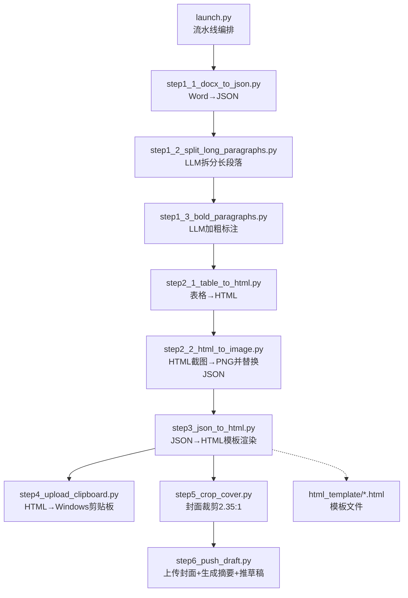

图表来源
- [launch.py:42-193](file://launch.py#L42-L193)
- [step1_1_docx_to_json.py:190-226](file://step1_1_docx_to_json.py#L190-L226)
- [step1_2_split_long_paragraphs.py:198-301](file://step1_2_split_long_paragraphs.py#L198-L301)
- [step1_3_bold_paragraphs.py:207-330](file://step1_3_bold_paragraphs.py#L207-L330)
- [step2_1_table_to_html.py:74-118](file://step2_1_table_to_html.py#L74-L118)
- [step2_2_html_to_image.py:120-210](file://step2_2_html_to_image.py#L120-L210)
- [step3_json_to_html.py:121-142](file://step3_json_to_html.py#L121-L142)
- [step4_upload_clipboard.py:436-475](file://step4_upload_clipboard.py#L436-L475)
- [step5_crop_cover.py:174-196](file://step5_crop_cover.py#L174-L196)
- [step6_push_draft.py:276-397](file://step6_push_draft.py#L276-L397)

章节来源
- [launch.py:1-201](file://launch.py#L1-L201)
- [config.py:1-39](file://config.py#L1-L39)

## 核心组件
- 配置中心（config.py）
  - 统一管理大模型 API 地址、请求头、重试次数、最大 token、段落拆分阈值
  - 微信公众号 AppID/AppSecret、API 基础路径、草稿默认作者与评论开关等
- 流水线编排器（launch.py）
  - 定义各步骤 SKIP 标志，自动派生输入输出路径，检测是否存在表格以决定是否执行表格相关步骤
  - 串联 step1_1 → step1_2 → step1_3 → step2_1 → step2_2 → step3 → step4 → step5 → step6
- 文档解析（step1_1_docx_to_json.py）
  - 使用 python-docx 遍历段落、表格、内联图片，构建结构化 JSON（elements）
  - 标题识别（# / ##），合并相邻同 bold 状态的 run，提取图片二进制并落盘
- 智能拆分（step1_2_split_long_paragraphs.py）
  - 调用大模型对超长 run 进行语义拆分，要求拼接一致性校验，失败则回退原段落
- 智能加粗（step1_3_bold_paragraphs.py）
  - 按标题分段，分组调用大模型识别总结/判断/序列表达，精准标记 bold，不改动原文
- 表格渲染（step2_1_table_to_html.py + step2_2_html_to_image.py）
  - 将表格 JSON 渲染为带样式的 HTML，再用 Selenium + Chrome 无头截图生成 PNG，并将 JSON 中 table 元素替换为 image 引用
- 正文渲染（step3_json_to_html.py）
  - 读取 JSON，按规则渲染标题、正文段、高亮、图片，填充至主模板占位符
- 剪贴板写入（step4_upload_clipboard.py）
  - 展开简化 class 标签为内联样式，本地图片转 base64 data URI，构造 Windows 剪贴板多格式数据并写入
- 封面裁剪（step5_crop_cover.py）
  - 从文章实例目录取首张图片，按 2.35:1 比例居中裁剪，必要时压缩或缩放以满足微信限制
- 草稿推送（step6_push_draft.py）
  - 获取 access_token，上传封面图得到 media_id，从正文 JSON 提取文本调用大模型生成摘要，最后推送草稿

章节来源
- [config.py:1-39](file://config.py#L1-L39)
- [launch.py:28-193](file://launch.py#L28-L193)
- [step1_1_docx_to_json.py:145-226](file://step1_1_docx_to_json.py#L145-L226)
- [step1_2_split_long_paragraphs.py:198-301](file://step1_2_split_long_paragraphs.py#L198-L301)
- [step1_3_bold_paragraphs.py:207-330](file://step1_3_bold_paragraphs.py#L207-L330)
- [step2_1_table_to_html.py:74-118](file://step2_1_table_to_html.py#L74-L118)
- [step2_2_html_to_image.py:120-210](file://step2_2_html_to_image.py#L120-L210)
- [step3_json_to_html.py:121-142](file://step3_json_to_html.py#L121-L142)
- [step4_upload_clipboard.py:436-475](file://step4_upload_clipboard.py#L436-L475)
- [step5_crop_cover.py:174-196](file://step5_crop_cover.py#L174-L196)
- [step6_push_draft.py:276-397](file://step6_push_draft.py#L276-L397)

## 架构总览
系统遵循“输入→中间产物→输出”的流水线范式，每步仅关注单一职责，通过 JSON 作为通用数据契约。

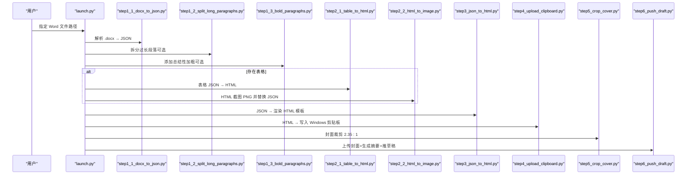

图表来源
- [launch.py:42-193](file://launch.py#L42-L193)
- [step1_1_docx_to_json.py:190-226](file://step1_1_docx_to_json.py#L190-L226)
- [step1_2_split_long_paragraphs.py:198-301](file://step1_2_split_long_paragraphs.py#L198-L301)
- [step1_3_bold_paragraphs.py:207-330](file://step1_3_bold_paragraphs.py#L207-L330)
- [step2_1_table_to_html.py:74-118](file://step2_1_table_to_html.py#L74-L118)
- [step2_2_html_to_image.py:120-210](file://step2_2_html_to_image.py#L120-L210)
- [step3_json_to_html.py:121-142](file://step3_json_to_html.py#L121-L142)
- [step4_upload_clipboard.py:436-475](file://step4_upload_clipboard.py#L436-L475)
- [step5_crop_cover.py:174-196](file://step5_crop_cover.py#L174-L196)
- [step6_push_draft.py:276-397](file://step6_push_draft.py#L276-L397)

## 详细组件分析

### 文档解析（step1_1_docx_to_json.py）
- 功能要点
  - 遍历 body 中的 w:p（段落）、w:tbl（表格）、w:drawing（图片）
  - 标题识别：以 # 或 ## 前缀判定 heading_level，去除前缀并重置 runs 的 bold
  - 普通段落：合并相邻且 bold 状态一致的 run，减少冗余片段
  - 图片提取：根据 rId 定位 rel.target_part，保存为 images/image_n.ext
- 数据结构
  - elements 数组包含 paragraph/table/image 三类对象，统一 index 字段保持顺序
- 复杂度
  - 时间 O(N) 线性扫描文档元素；run 合并为常数级操作
  - 空间 O(E) 存储 elements 与图片二进制

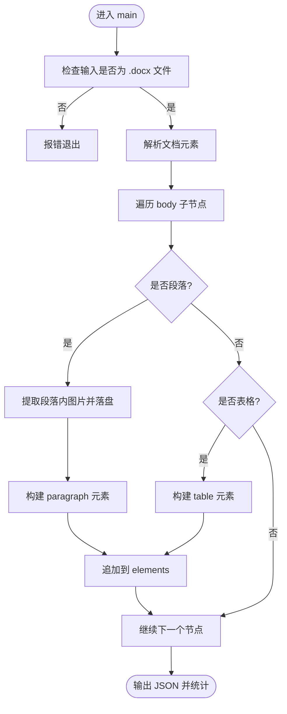

图表来源
- [step1_1_docx_to_json.py:145-226](file://step1_1_docx_to_json.py#L145-L226)

章节来源
- [step1_1_docx_to_json.py:1-233](file://step1_1_docx_to_json.py#L1-L233)

### 智能拆分（step1_2_split_long_paragraphs.py）
- 功能要点
  - 遍历所有 paragraph 的 runs，超过阈值的 run 触发大模型拆分
  - 提示词强调语义完整、句末切分、拼接一致性校验
  - 失败或无效返回时保留原段落，确保鲁棒性
- 错误处理
  - 网络异常指数退避重试；JSON 解析容错（代码块包裹、正则提取）
  - 拼接不一致直接回退，避免污染下游

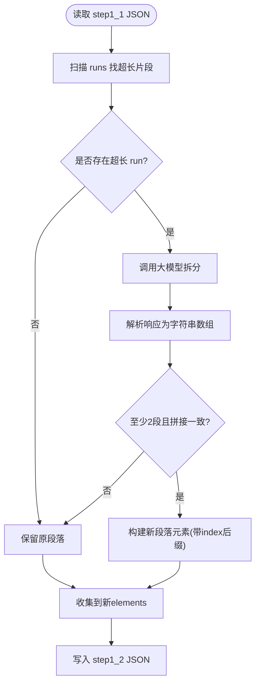

图表来源
- [step1_2_split_long_paragraphs.py:198-301](file://step1_2_split_long_paragraphs.py#L198-L301)

章节来源
- [step1_2_split_long_paragraphs.py:1-311](file://step1_2_split_long_paragraphs.py#L1-L311)

### 智能加粗（step1_3_bold_paragraphs.py）
- 功能要点
  - 按标题分段，每组正文交由大模型识别总结/判断/序列表达
  - 只修改 bold 字段，严格匹配原文，不增删改文字
  - 已有加粗的段落跳过，避免重复
- 算法细节
  - 在 runs 中按字符位置计算交集，拆分为前缀/交集/后缀三段，交集强制 bold=true

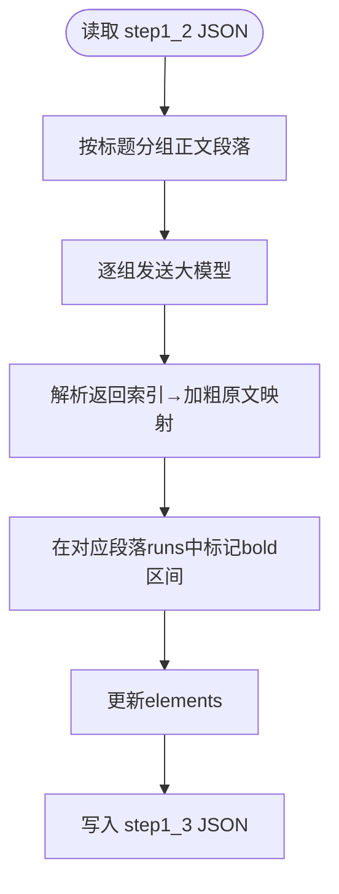

图表来源
- [step1_3_bold_paragraphs.py:207-330](file://step1_3_bold_paragraphs.py#L207-L330)

章节来源
- [step1_3_bold_paragraphs.py:1-340](file://step1_3_bold_paragraphs.py#L1-L340)

### 表格渲染与截图（step2_1_table_to_html.py + step2_2_html_to_image.py）
- 渲染流程
  - 读取 JSON 中 table 元素，按绿色主题模板生成 table_{n}.html
  - 第一行作为 thead，其余为 tbody，单元格 bold 映射为 CSS 类
- 截图流程
  - 使用 Selenium + Chrome headless 截图，设置高清缩放与窗口移出屏幕
  - 超时保护线程强制终止残留进程，提升健壮性
  - 将 JSON 中 table 元素替换为 image 引用，输出 step2_table_to_image.json

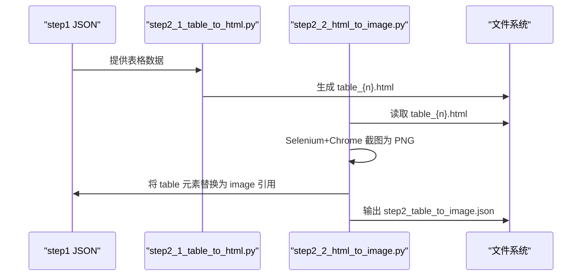

图表来源
- [step2_1_table_to_html.py:74-118](file://step2_1_table_to_html.py#L74-L118)
- [step2_2_html_to_image.py:120-210](file://step2_2_html_to_image.py#L120-L210)

章节来源
- [step2_1_table_to_html.py:1-125](file://step2_1_table_to_html.py#L1-L125)
- [step2_2_html_to_image.py:1-218](file://step2_2_html_to_image.py#L1-L218)

### 正文渲染（step3_json_to_html.py）
- 渲染规则
  - heading_level=1 的大标题不渲染到正文区
  - heading_level=2 的小标题渲染为 

  - 连续正文段落合并在 <section> 中，每段 

  - bold run 渲染为 
  - image 渲染为居中的 
- 模板注入
  - 读取主模板 caicai_html_1_green_classical.html，替换 {{BODY_PLACEHOLDER}}

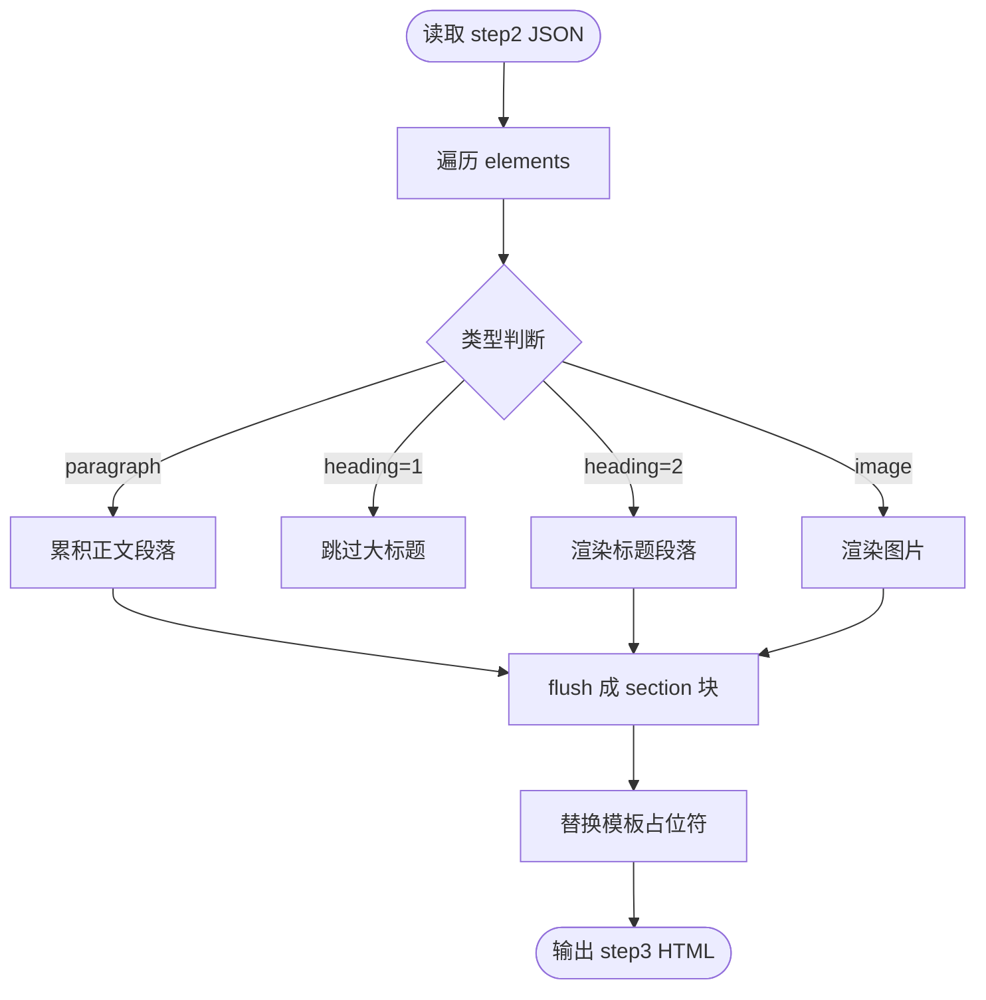

图表来源
- [step3_json_to_html.py:84-142](file://step3_json_to_html.py#L84-L142)

章节来源
- [step3_json_to_html.py:1-149](file://step3_json_to_html.py#L1-L149)
- [caicai_html_1_green_classical.html:187-208](file://html_template/caicai_html_1_green_classical.html#L187-L208)

### 剪贴板写入（step4_upload_clipboard.py）
- 处理流程
  - 解析 HTML 中的 article#clipboard-content 片段
  - 将简化 class 标签展开为 Xiumi 风格的内联样式
  - 清理格式化空白，本地图片转为 base64 data URI
  - 构造 Windows 剪贴板多格式数据（HTML Format、CF_UNICODETEXT、CF_TEXT/OEMTEXT、CF_LOCALE 等）并写入
- 关键点
  - 使用 ctypes 调用 user32/kernel32 实现跨平台安全的内存分配与剪贴板写入
  - 支持 Chromium 内部格式回写，保证粘贴兼容性

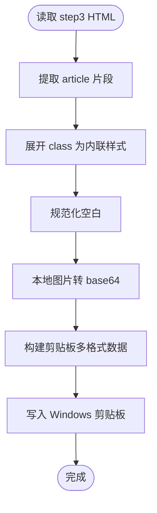

图表来源
- [step4_upload_clipboard.py:436-475](file://step4_upload_clipboard.py#L436-L475)

章节来源
- [step4_upload_clipboard.py:1-480](file://step4_upload_clipboard.py#L1-L480)

### 封面裁剪（step5_crop_cover.py）
- 功能要点
  - 在文章实例目录查找首个图片文件
  - 按 2.35:1 比例居中裁剪，若已满足比例则直接保存
  - 针对 JPEG 使用质量二分搜索压缩，非 JPEG 逐步缩小分辨率，确保不超过 10MB
- 输出
  - 保存到 process/step5_crop_cover.<ext>

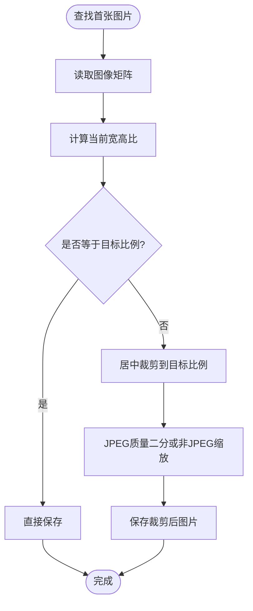

图表来源
- [step5_crop_cover.py:133-196](file://step5_crop_cover.py#L133-L196)

章节来源
- [step5_crop_cover.py:1-203](file://step5_crop_cover.py#L1-L203)

### 草稿推送（step6_push_draft.py）
- 功能要点
  - 获取 access_token（AppID/Secret）
  - 上传封面图（process/step5_crop_cover.*）获得 thumb_media_id
  - 从 step1_3/step1_2/step1_1 JSON 中提取正文文本，调用大模型生成摘要金句
  - 组装草稿字段（title、author、thumb_media_id、digest、comment 开关等）并推送
- 边界处理
  - 标题 UTF-8 字节数截断保护
  - 摘要长度上限 128 字
  - 封面缓存 media_id 到文件，避免重复上传

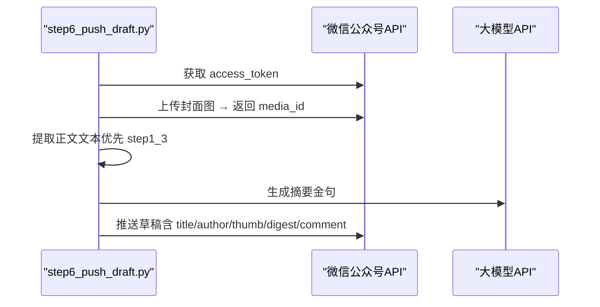

图表来源
- [step6_push_draft.py:276-397](file://step6_push_draft.py#L276-L397)

章节来源
- [step6_push_draft.py:1-404](file://step6_push_draft.py#L1-L404)
- [config.py:29-39](file://config.py#L29-L39)

## 依赖关系分析
- 模块耦合
  - launch.py 强耦合于各 step 的 main 函数签名与输出路径约定
  - step2_1/step2_2 共享 table 目录与 JSON 契约
  - step3 依赖模板文件与 JSON 结构
  - step4 依赖 step3 输出的 HTML 结构与图片路径
  - step6 依赖 step1_1/step1_2/step1_3 JSON 与 step5 输出
- 外部依赖
  - requests：HTTP 客户端（大模型 API、微信公众号 API）
  - selenium + Chrome：无头浏览器截图
  - numpy + opencv-python：图像处理（封面裁剪与压缩）
  - python-docx：Word 解析
  - ctypes：Windows 剪贴板原生 API 调用

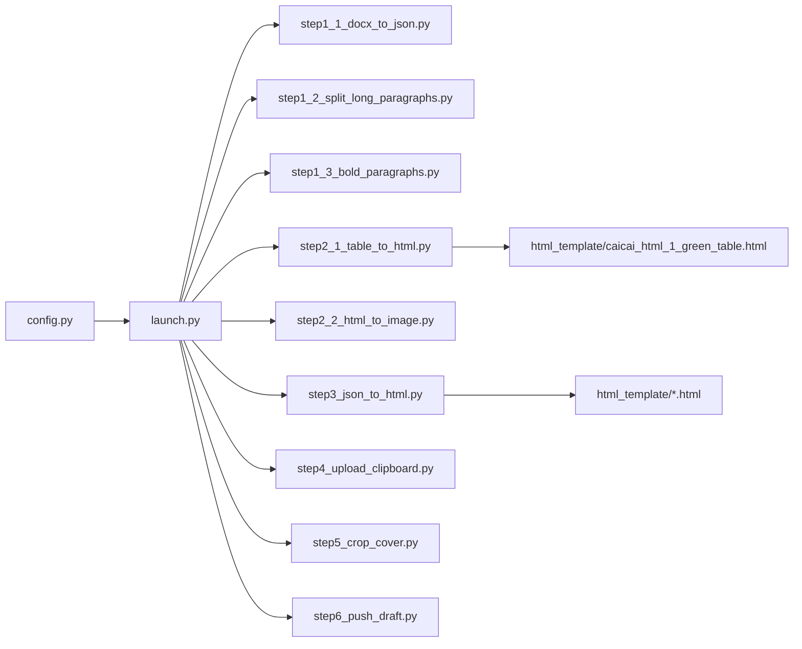

图表来源
- [launch.py:42-193](file://launch.py#L42-L193)
- [step3_json_to_html.py:121-142](file://step3_json_to_html.py#L121-L142)
- [step2_1_table_to_html.py:74-118](file://step2_1_table_to_html.py#L74-L118)

章节来源
- [launch.py:1-201](file://launch.py#L1-L201)
- [config.py:1-39](file://config.py#L1-L39)

## 性能与稳定性考量
- 大模型调用
  - 统一 MAX_RETRIES 与指数退避策略，降低瞬时失败影响
  - MAX_TOKENS 控制上下文大小，避免超限
- 截图稳定性
  - 超时保护线程强制终止 Chrome/chromedriver，防止僵尸进程
  - 隐藏控制台窗口与禁用扩展，减少干扰
- 图片处理
  - JPEG 质量二分搜索与分辨率缩放双保险，确保小于 10MB
- 剪贴板写入
  - 多次尝试打开剪贴板，空数据跳过，避免写入失败导致崩溃

[本节为通用指导，无需具体文件引用]

## 故障排查指南
- 无法解析 .docx
  - 确认输入文件扩展名为 .docx，且文件存在
  - 参考：[step1_1_docx_to_json.py:190-226](file://step1_1_docx_to_json.py#L190-L226)
- 大模型调用失败
  - 检查 config.py 中 API_URL、HEADERS 是否正确
  - 观察日志中的重试信息，必要时调整 MAX_RETRIES/MAX_TOKENS
  - 参考：[step1_2_split_long_paragraphs.py:80-103](file://step1_2_split_long_paragraphs.py#L80-L103)、[step1_3_bold_paragraphs.py:73-96](file://step1_3_bold_paragraphs.py#L73-L96)、[step6_push_draft.py:188-211](file://step6_push_draft.py#L188-L211)
- 表格截图失败
  - 确认已安装 Chrome 与 selenium，且 chromedriver 可用
  - 查看超时与进程清理日志
  - 参考：[step2_2_html_to_image.py:40-115](file://step2_2_html_to_image.py#L40-L115)
- 剪贴板写入失败
  - 检查是否有权限访问剪贴板，或是否被其他程序占用
  - 参考：[step4_upload_clipboard.py:371-431](file://step4_upload_clipboard.py#L371-L431)
- 封面未找到或过大
  - 确认文章实例目录存在图片文件，且 step5 已运行
  - 参考：[step5_crop_cover.py:174-196](file://step5_crop_cover.py#L174-L196)、[step6_push_draft.py:310-327](file://step6_push_draft.py#L310-L327)

章节来源
- [step1_1_docx_to_json.py:190-226](file://step1_1_docx_to_json.py#L190-L226)
- [step1_2_split_long_paragraphs.py:80-103](file://step1_2_split_long_paragraphs.py#L80-L103)
- [step1_3_bold_paragraphs.py:73-96](file://step1_3_bold_paragraphs.py#L73-L96)
- [step2_2_html_to_image.py:40-115](file://step2_2_html_to_image.py#L40-L115)
- [step4_upload_clipboard.py:371-431](file://step4_upload_clipboard.py#L371-L431)
- [step5_crop_cover.py:174-196](file://step5_crop_cover.py#L174-L196)
- [step6_push_draft.py:310-327](file://step6_push_draft.py#L310-L327)

## 结论
content_board 通过清晰的流水线设计与稳健的错误处理，实现了从 Word 到微信公众号文章的端到端自动化。其模块化与配置驱动特性使得扩展与维护成本较低，同时借助大模型提升了内容可读性与排版质量。对于初学者，可按快速开始指南逐步体验；对于有经验的开发者，可在现有契约基础上扩展新的处理步骤或优化渲染模板。

[本节为总结性内容，无需具体文件引用]

## 附录：快速开始
- 环境准备
  - 安装依赖：requests、python-docx、selenium、opencv-python、numpy
  - 安装 Chrome 并确保 chromedriver 可用
- 配置
  - 在 config.py 中填写微信公众号 AppID/AppSecret 与大模型 API 凭据
- 运行
  - 修改 launch.py 中 input_path 指向你的 .docx 文件
  - 根据需要调整 SKIP_STEP* 标志，选择性地跳过某些步骤
  - 运行 python launch.py，等待流水线完成
- 验证
  - 查看 process 目录下的中间产物（JSON/HTML/PNG）
  - 在微信公众号编辑器中粘贴剪贴板内容，检查排版效果
  - 如需直接推草稿，确保 step5 已完成并配置了公众号凭据

章节来源
- [launch.py:196-201](file://launch.py#L196-L201)
- [config.py:1-39](file://config.py#L1-L39)